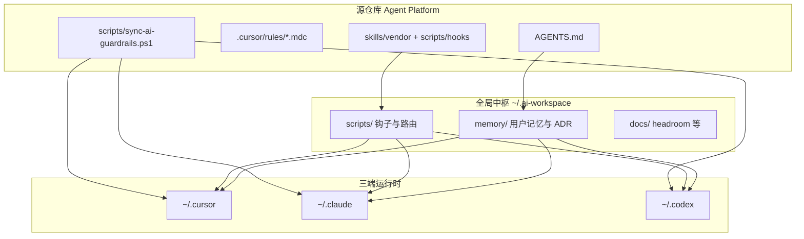

# 三端 AI 全局配置与避坑梳理

> **范围**：2026-05-28 ~ 2026-06-12  
> **最后核对**：2026-06-12（宪章 ADR-G004；always-on rules 9；Codex medium + persistent_instructions）  
> **用途**：Cursor / Codex / Claude Code 全局配置、Skills、记忆与避坑的常驻参考。  
> **维护**：重大变更后更新本文件；源 ADR 见 `~/.ai-workspace/memory/global-decisions-log.md` 与项目 `decisions-log.md`。

---

## 1.1 效果差 / 烧钱根因（2026-06-12）

| 根因 | 对策（ADR-G004） |
|------|------------------|
| 16 条 always-on + common-testing 与 karpathy 冲突 | 9 条 ECC common-* 改按需；核心 9 条 always-on |
| 原则分散、无单一入口 | `~/.claude/AGENTS.md` § Engineering Assistant Charter |
| Codex 无 persistent_instructions + high reasoning + 插件泛滥 | medium + 短指令 + 禁用 bulk curated 插件 |
| 项目记忆不可见 | `SESSION.md` / `TASK.md` 模板 + `.github/agent/memory/` 映射 |

**宪章全文：** `~/.ai-workspace/templates/engineering-charter.md`  
**模板：** `~/.ai-workspace/templates/project/` · 仓库 `docs/agent-templates/`

---

## 一、整体架构：一套中枢、三端消费



**核心原则（ADR-G001 / ADR-G002 / ADR-004）**

| 层级 | 路径 | 作用 |
|------|------|------|
| 全局记忆 | `~/.ai-workspace/memory/` | 跨项目 PDCA：用户偏好、全局 ADR、任务历史 |
| Skills 正本 | `~/.cursor/skills/` | 306 个 skill（索引 `~/.claude/global-skills-index.md`） |
| Claude 镜像 | `~/.claude/skills` | junction 指向 Cursor skills |
| Codex 镜像 | `~/.codex/skills` | 已与 Cursor 全量对齐（2026-06-03 TASK-G004） |
| 钩子脚本 | `~/.ai-workspace/scripts/` | 三端共用；repo `scripts/hooks/` 为 canonical source |
| 全局规则 | `~/.claude/AGENTS.md` | 无 repo 级 AGENTS 时的默认工程规则 |
| 项目覆盖 | `Agent Platform/AGENTS.md` | 原型 verify-all、ADR-003 导航等 **覆盖** 全局 |

---

## 二、Cursor 配置现状

### 2.1 Always-on Rules（每次会话自动加载）

`~/.cursor/rules/` 中 `alwaysApply: true` 的规则共 **9 条**（ADR-G004，原 16）：

**门禁 + 宪章**

| 规则文件 | 作用 |
|----------|------|
| `engineering-assistant-charter.mdc` | 三端宪章薄层入口（SSOT: ~/.claude/AGENTS.md） |
| `global-session-core.mdc` | 会话启动读 skill、记忆路径、交付前验证 |
| `requirement-clarifier.mdc` | 模糊需求先澄清；C 类禁止完整 §1–§12 |
| `zero-to-one-gate.mdc` | 新模块须方案 + ADR + 用户确认 |
| `maximum-permission-scope.mdc` | 「最大权限」≠ 可删配置/跑卸载脚本 |
| `mandatory-verification-workflow.mdc` | 声称完成前必须跑验证命令 |
| `ai-engineering-guardrails.mdc` | 禁止假完成、prototype 须 verify-all 5 步 |
| `karpathy-guidelines.mdc` | 简洁、精准 diff、目标驱动 |
| `global-document-writing-style.mdc` | 文档写作风格 |

**按需加载（原 ECC common-*，9 条）**：`common-agents`、`common-coding-style`、`common-development-workflow`、`common-git-workflow`、`common-hooks`、`common-patterns`、`common-performance`、`common-security`、`common-testing` — `alwaysApply: false`

**非 always-on 补充**：`books-clean-code.mdc`、`books-ddd.mdc`（按需引用）

### 2.2 项目级 RTK

`Agent Platform/.cursorrules` — shell 命令前缀 `rtk` 以节省 token（Headroom 注入）

### 2.3 Hooks（`~/.cursor/hooks.json`）

| 事件 | 脚本 | 行为 |
|------|------|------|
| `sessionStart` | `scan-global-skills.ps1` | 注入全局 skill 索引 + always-on 正文 |
| `beforeSubmitPrompt` | 同上 | 按用户输入 Top 8 匹配 skill |
| `preToolUse` (Write\|Edit) | `clarification-hard-gate.ps1` | B 类模糊任务 **硬拦** 写文件，须用户确认词解锁 |

### 2.4 MCP 服务器（`~/.cursor/mcp.json`）

已接入：**codegraph**、**context7**、**exa**、**github**、**memory**、**playwright**、**sequential-thinking**、**vibearound**、**agentmemory**、**headroom**

> MCP 越多启动越慢；见 `~/.ai-workspace/memory/supplement-tools-installed.md` — 卡顿时可裁剪。

---

## 三、Codex 配置现状

### 3.1 主配置（`~/.codex/config.toml`）

| 项 | 值 |
|----|-----|
| 默认模型 | `gpt-5.5`，reasoning **`medium`**（架构/疑难 debug 可临时 high） |
| 持久指令 | `persistent_instructions` → 读 Charter；复述目标/验收；模糊先 Mini-Spec |
| 沙箱 | `workspace-write` |
| 审批 | `on-request` |
| 持久指令 | 模糊需求走 requirement-clarifier；须确认后再 Write |
| 自定义 Provider | `hcai`（`https://ai.hctopup.com/v1`，key `HCAI_API_KEY`） |
| 子 Agent | explorer / reviewer / docs_researcher（max_threads=3） |
| Profiles | `strict`（只读）、`yolo`（免审批）、`hcai` |

### 3.2 MCP（精简集）

github、context7、codegraph、vibearound、agentmemory、headroom — 刻意不装全 Cursor 那套 npx 服务，减少启动内存

### 3.3 Hooks（`~/.codex/hooks.json`）

与 Cursor/Claude **同脚本、同逻辑**：SessionStart + UserPromptSubmit 扫 skills；PreToolUse 澄清硬拦（matcher 含 `apply_patch`）

### 3.4 AGENTS

`~/.codex/AGENTS.md` 指向全局 workspace；ECC 补充在 `AGENTS.ecc-supplement.md`（勿与 full profile 叠装）

---

## 四、Claude Code 配置现状

### 4.1 设置（`~/.claude/settings.json`）

| 项 | 值 |
|----|-----|
| 默认模型 | `sonnet` |
| API 路由 | `ANTHROPIC_BASE_URL=http://127.0.0.1:15721`（CC Switch 等本地代理，**勿被 Headroom 自动覆盖**） |
| MCP | vibearound、headroom |
| Hooks | 与 Cursor/Codex 同套三钩子 |
| Marketplace | ecc、karpathy-skills、understand-anything（插件需手动 `/plugin install`） |
| CodeGraph MCP | 已 allowlist 6 个工具 |

### 4.2 全局 AGENTS

`~/.claude/AGENTS.md` — PDCA 流程、0→1 链、最大权限边界、交付格式

---

## 五、Skills 体系梳理

### 5.1 规模与来源

- **总计 306** skills（见 `global-skills-index.md` 扫描时间戳）
- **正本**：`~/.cursor/skills/`
- **项目 vendor**：`Agent Platform/skills/`（figma、ui-ux、pm-*、ECC 等）
- **同步**：`Agent Platform/scripts/sync-ai-guardrails.ps1 -Force`

### 5.2 Always-on Skills（`skills-sync.config.json`）

| Skill | 何时加载 |
|-------|----------|
| `global-session-core` | 每次会话 |
| `requirement-clarifier` | 每次会话 |
| `karpathy-guidelines` | 每次会话 |
| `ai-coding-ok` | 检测到 repo 有 AGENTS.md 或 `.github/agent/memory/` |

**设计约束**：always-on ≤ 4 个正文；其余靠 UserPromptSubmit **Top 8 关键词路由**

### 5.3 关键工作流 Skills

| 场景 | Skill 链 |
|------|----------|
| 模糊需求 / vibe coding | `requirement-clarifier` → Mini-Spec → 用户确认 |
| 新模块 / 0→1 | `zero-to-one-gate` → `brainstorming` → ADR → `writing-plans` |
| 编码任务 | `ai-coding-ok` |
| Agent Platform 原型交付 | `ai-delivery-gate` + `verify-all.js` 5 步 |
| 大任务自治 | `ouro-loop` |
| 前端审美 | `design-taste-frontend`；Codex 高动效用 `gpt-taste` |
| Figma 转代码 | `figma2code` + 项目 `figma-workflow` |
| 声称完成前 | `global-delivery-gate` / `verification-before-completion` |

### 5.4 第二批补缺（2026-06-03）

见 `~/.ai-workspace/memory/batch2-skills-installed.md`。刻意未装：antigravity 全库、VoltAgent 1000+、claude-skills 337+ 全量、ECC full profile

### 5.5 Skills 质量审计（ADR-007）

- `audit-skills-quality.ps1` → `docs/skills-audit/`
- Agent Platform DAILY 24 项（`agent-sort-agent-platform.ps1`）
- 新 skill：任务卡 → CSO description → intent/keyword → 压测命中率 ≥90%

---

## 六、用户记忆与决策记录

### 6.1 全局用户记忆

`~/.ai-workspace/memory/user-memory.md` — 偏好、工作流、跨项目教训

### 6.2 全局 ADR

`~/.ai-workspace/memory/global-decisions-log.md`

| ADR | 日期 | 要点 |
|-----|------|------|
| G001 | 06-01 | 记忆中枢在 `~/.ai-workspace/memory/` |
| G002 | 06-01 | Skills 正本 `~/.cursor/skills`，hooks 只扫不全量灌 |
| G003 | 06-03 | **最大权限 ≠ 破坏性授权**（CC Switch 误删事件） |

### 6.3 Agent Platform 项目记忆

`Agent Platform/.github/agent/memory/project-memory.md` — 30 页原型、verify-all 硬约束、禁止 `__*Wired`

### 6.4 项目 ADR 要点

`Agent Platform/.github/agent/memory/decisions-log.md` — ADR-001~007（验证、导航、澄清硬拦、Skills 审计等）

### 6.5 任务历史

- 全局：`~/.ai-workspace/memory/global-task-history.md`
- 项目：`Agent Platform/.github/agent/memory/task-history.md`

---

## 七、吸取的教训与必避之坑

### 7.1 交付与验证类

| 坑 | 现象 | 对策 |
|----|------|------|
| **grep/smoke 假绿** | `proto.js` 语法坏了但 smoke 仍 PASS | 完整 `verify-all.js` **5 步**，含 navigation-journey |
| **导航二进宫** | index→05→回→再进 05 Skills 空、Tab 死 | 禁止 `__protoSkillBindWired`；`firstConfig` 仅 `?new=1`；人工 spot-check |
| **声称完成无证据** | Agent 说「已修复」未跑命令 | **Completed / Verified / Remaining Risks** |
| **假完成** | TODO/mock 冒充功能 | 交付前 grep TODO/FIXME |

### 7.2 权限与配置类

| 坑 | 现象 | 对策 |
|----|------|------|
| **最大权限越权**（ADR-G003） | 修 Codex 401 时误跑 `_remove-cc-switch.ps1` | 破坏性操作须单独确认；保护 CC Switch、OAuth |
| **Headroom 覆盖代理** | 全流量 proxy 断登录/路由 | 仅 MCP 已启用；全流量见 `headroom-setup-zh.md` |
| **JSON BOM** | 钩子 settings 解析失败 | UTF-8 **无 BOM** |
| **Hooks 未生效** | 改 hooks 后行为不变 | 重启三端会话 |
| **ECC 叠装** | full profile 与 hooks 冲突 | 仅 minimal |

### 7.3 Skills 与需求类

| 坑 | 现象 | 对策 |
|----|------|------|
| **Skills 全量安装** | 上下文稀释、路由失灵 | always-on ≤4；见 `skills-gap-analysis.md` |
| **澄清软提醒无效** | B 类仍直接写代码 | ADR-006 硬拦；须「确认/直接做」解锁 |
| **0→1 跳过架构** | 「帮我做一个…」直接开写 | brainstorming → ADR → 用户确认 → plan |
| **用户端按后台扩写** | 聊天页变管理后台 | 服务聊天主体验；以截图/产品形态为准 |

### 7.4 编码与合并类

| 坑 | 现象 | 对策 |
|----|------|------|
| **合并时丢函数头** | `wireDevPlatformRows` 被吃掉 → Proto 全挂 | `node --check` + verify-all |
| **状态写散** | 新功能乱写 proto.js | 声明 state owner；运营用 `ops-*.js` |
| **figma2code 编码损坏** | frontmatter 乱码不触发 | UTF-8 修复；走审计流水线 |

---

## 七点五、DeepSeek / 第三方 API 缓存（2026-06-17）

| 现象 | 根因 | 对策 |
|------|------|------|
| token 暴涨、缓存命中≈0 | Claude Code ≥2.1.36 每请求 `x-anthropic-billing-header` 中 `cch` 变化；第三方代理按 system prompt 算 cache key | `CLAUDE_CODE_ATTRIBUTION_HEADER=0` |

**配置位置：**

- `~/.claude/settings.json` → `env.CLAUDE_CODE_ATTRIBUTION_HEADER`
- Cursor：`%APPDATA%\Cursor\User\settings.json` → `claudeCode.environmentVariables`
- `cc-sync-all.ps1` preserve env 白名单（换 provider 不丢）

**应用：** `scripts/global-workspace/apply-tri-end-env.ps1`

**二期（缓存对齐代理，2026-06-17）：**

- 客户端仍 `15721`；CC Switch DeepSeek provider 上游 → `http://127.0.0.1:18789/anthropic`
- `scripts/deepseek-cache/deepseek-cc-proxy.mjs`：剥 header、tools 按 name 排序
- 校验：`scripts/global-workspace/verify-deepseek-cache.ps1`
- Playbook：`Agent Platform/docs/tri-end-deepseek-cache-playbook-zh.md`

---

## 七点六、Windows Shell 重复失败（2026-06-17）

| 现象 | 对策 |
|------|------|
| RTK 不能跑 PS cmdlet | `rtk powershell -NoProfile -ExecutionPolicy Bypass -Command "..."` |
| hooks 失效 / RTK stub | `repair-tri-end-hooks.ps1` + `verify-tri-end-config.ps1` |
| 盲目 pip install | `ensure-python-env.ps1` → `~/.ai-workspace/runtime/python-env.json` |
| Superpowers 选应用弹窗 | SessionStart 自动 `repair-cursor-plugin-hooks.ps1` |

**全局规则：** `~/.cursor/rules/windows-agent-shell.mdc`

---

## 七点七、Node 项目交付门禁（2026-06-17）

| 项目 | verify |
|------|--------|
| Agent Platform | `node prototype/scripts/verify-all.js`（根无 npm lint） |
| program1-main / demo1 | `npm run verify` |

**规则：** `node-project-delivery.mdc` · 登记：`projects-registry.md`

---

## 八、补充工具（2026-06-03）

见 `~/.ai-workspace/memory/supplement-tools-installed.md`

| 工具 | 三端 | 注意 |
|------|------|------|
| ECC | minimal | 插件手动 install；hooks scan-only |
| CodeGraph | MCP 三端 | 改代码前 `codegraph_explore` |
| Understand-Anything | junction + marketplace | `/understand` |
| Headroom | MCP 0.20.15 | `headroom-setup-zh.md` |
| VibeAround | MCP :12358 | 手机续聊 / 预览 |
| agentmemory | MCP :3111 | recall/remember |

---

## 九、日常维护命令

```powershell
# 从 Agent Platform 同步 rules/skills 到三端
powershell "C:\Users\win\Desktop\Agent Platform\scripts\sync-ai-guardrails.ps1" -Force

# 三端避坑一键校验
powershell "C:\Users\win\Desktop\Agent Platform\scripts\global-workspace\verify-tri-end-config.ps1"

# 三端 env + hooks 修复
powershell "C:\Users\win\Desktop\Agent Platform\scripts\global-workspace\apply-tri-end-env.ps1"
powershell "C:\Users\win\Desktop\Agent Platform\scripts\hooks\repair-tri-end-hooks.ps1"

# 重扫全局 skill 索引
powershell "$env:USERPROFILE\.ai-workspace\scripts\scan-global-skills.ps1"

# 原型交付验证（Agent Platform）
node "C:\Users\win\Desktop\Agent Platform\prototype\scripts\verify-all.js"

# 澄清门控紧急绕过（慎用）
$env:CLARIFICATION_GATE_OFF = "1"

# taste-skills 重装
powershell "C:\Users\win\Desktop\Agent Platform\scripts\hooks\install-taste-skills.ps1" -RefreshFromGitHub -Force
```

---

## 十、当前状态评估

**已成型**

- 三端 hooks 统一、澄清硬拦、Skills 路由、全局 PDCA 记忆
- Agent Platform 五层验证 + 导航 postmortem 已制度化
- Codex 与 Cursor skills 已对齐；全局 ADR 记录关键决策

**需留意**

- Skills 306 项多数为 LIBRARY，靠 Top 8 命中 — 未触发时查 `intent-profiles.json`
- Cursor MCP 较多可能影响启动
- Claude marketplace 插件（ECC、Understand-Anything）可能需手动 install
- 项目登记见 `projects-registry.md`（随任务更新）
- **Ops v1.1 迭代**：禁止重写导航/卡片菜单；`AGENTS.md` § Ops v1.1 UX Contract + ADR-010 + `postmortem-ops-v11-2026-06-09.md`；改后跑 `v11-ops-check.js` 并在浏览器点侧栏

**相关文档索引**

| 文档 | 路径 |
|------|------|
| 本梳理 | `~/.ai-workspace/docs/tri-end-ai-config-inventory-zh.md` |
| Headroom | `~/.ai-workspace/docs/headroom-setup-zh.md` |
| Skills 补缺评估 | `~/.ai-workspace/memory/skills-gap-analysis.md` |
| 导航 postmortem | `Agent Platform/.github/agent/memory/postmortem-navigation-2026-05-28.md` |
| Ops v1.1 postmortem | `Agent Platform/.github/agent/memory/postmortem-ops-v11-2026-06-09.md` |
| Ops v1.1 UX 契约 | `Agent Platform/AGENTS.md`（§ Ops v1.1 UX Contract）、ADR-010 |
