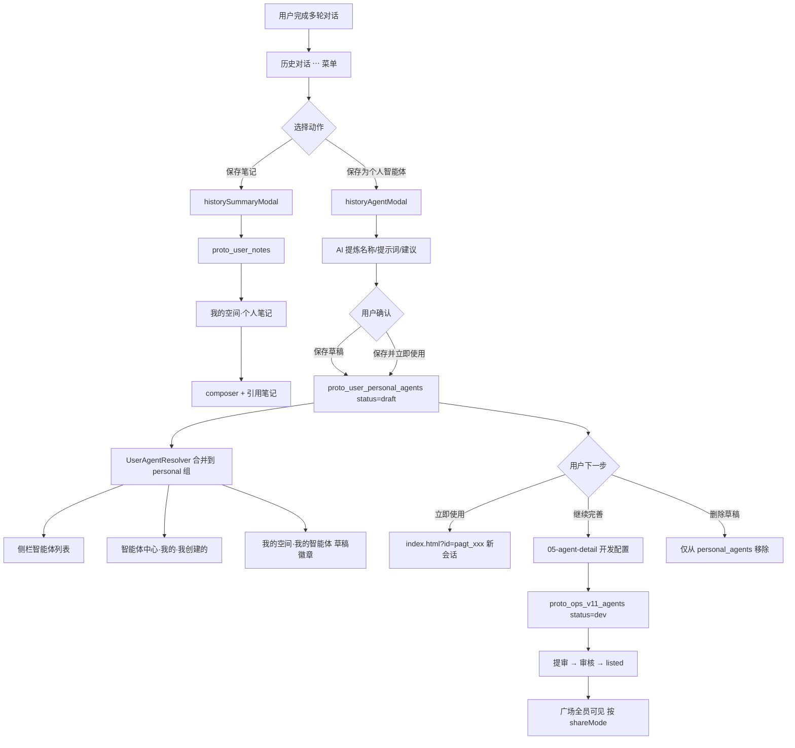
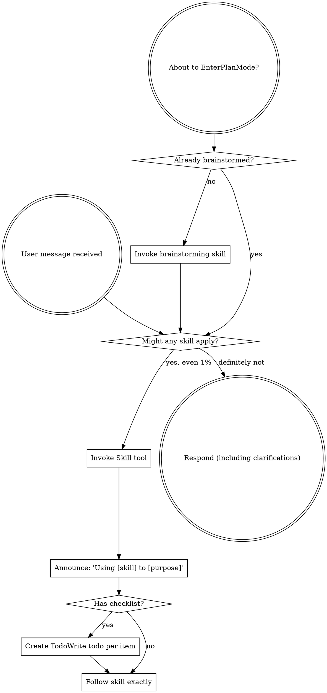

User: <user_query>
 历史对话这部分加个添加个人智能体的需求，将会话添加成个人智能体，这个功能你研究一下应该怎么做，做成什么样，后续的流转和流程应该是什么样的
</user_query>

Assistant: Skills: global-session-core, requirement-clarifier, zero-to-one-gate, brainstorming。先梳理现有「历史对话」与「个人智能体」相关实现，再给出功能形态与流转方案。

[REDACTED]

Assistant: [REDACTED]

Assistant: [REDACTED]

Assistant: [REDACTED]

Assistant: [REDACTED]

Assistant: [REDACTED]

Assistant: [REDACTED]

Assistant: Skills: global-session-core, requirement-clarifier, brainstorming

你想在「历史对话」里补「将会话保存为个人智能体」——我先对照了 ADR-015、现有原型和产品文档，下面是一份可落地的方案研究。

---

## 1. 现状：已设计、未实现

ADR-015 已写明历史记录应有两个动作：

- **保存为笔记** — 已实现
- **沉淀为智能体** — 尚未实现

当前历史 `⋯` 菜单只有三项：

```59:69:c:\Users\win\Desktop\Agent Platform\prototype\assets\user-portal-bridge.js
  function historyMoreMenuHtml(id, mode) {
    var summaryAttr = mode === 'modal' ? 'data-history-summary' : 'data-history-summary-sidebar';
    // ...
        '<button type="button" role="menuitem" ' + summaryAttr + '="' + escapeHtml(id) + '">' + ICON_NOTE + '<span>保存笔记</span></button>' +
        '<button type="button" role="menuitem" ' + renameAttr + '="' + escapeHtml(id) + '">' + ICON_RENAME + '<span>重命名</span></button>' +
        '<button type="button" role="menuitem" class="is-danger" ' + deleteAttr + '="' + escapeHtml(id) + '">' + ICON_DELETE + '<span>删除</span></button>' +
```

另外有个架构缺口：

| 模块 | 现状 |
|------|------|
| `proto_user_personal_agents` | key 存在，但无 `savePersonalAgent` API，始终为空 |
| 我的空间「我的智能体」 | 实际读的是 `UserAgentResolver`（运营端 `proto_ops_v11_agents`），**不是**上面的 key |
| `web-portal-check.js` | 明确断言「不存在沉淀为智能体」——说明这是**有意延后**的功能 |

结论：不是从零设计，而是把 ADR-015 里规划的第二半补齐，并理顺数据归属。

---

## 2. 功能定位：和「保存笔记」怎么区分

两者入口相近，但产物不同：

| 维度 | 保存笔记 | 沉淀为个人智能体 |
|------|----------|------------------|
| 用户意图 | 留住结论、材料、过程记录 | 把这段对话里的「做事方式」固化下来，下次直接复用 |
| 产物形态 | 静态笔记（标题 + 短总结 + 全文在 modal） | 可对话的智能体配置（名称、简介、系统提示、开场建议等） |
| 后续使用 | 在 composer `+` 里引用笔记 | 在侧栏 / 广场 / 我的空间选这个智能体开新对话 |
| 是否进运营 | 否 | 默认仅本人；可选「继续完善 → 提审上架」 |

一句话：**笔记记「说了什么」，个人智能体记「怎么帮你做这类事」。**

---

## 3. 推荐交互：镜像「保存笔记」modal

沿用 `#historySummaryModal` 的模式，新增 `#historyAgentModal`，降低学习成本。

### 3.1 入口

1. **主入口**：历史对话 modal / 侧栏最近对话 → `⋯` → **保存为个人智能体**
2. **可选二期**：当前对话页顶栏或回答区，在会话 ≥2 轮后出现「沉淀此对话」

### 3.2 Modal 结构（建议）

```
┌─ 保存为个人智能体 ─────────────────────────────┐
│ 来源：差旅报销材料清单 · 差旅报销助手 · 4 轮    │
│                                                │
│ 智能体名称  [差旅报销材料清单助手        ]      │
│ 一句话简介  [帮用户整理报销材料与缺失说明 ]      │
│ 系统提示词  [AI 根据对话提炼，可编辑...   ]      │
│ 开场建议    [报销流程有哪些] [材料缺失怎么办]    │
│              [帮我写一段报销说明]  (+ 添加)      │
│                                                │
│ 继承配置（只读/可改）                           │
│  · 来源智能体：差旅报销助手                     │
│  · 默认模型：DeepSeek-V4-Pro 模型              │
│  · 知识库：企业知识库（继承会话选择）            │
│                                                │
│ [取消]              [保存草稿] [保存并立即使用]  │
└────────────────────────────────────────────────┘
```

与笔记 modal 的差异：

- 笔记 modal 展示**轮次 transcript**（ADR-015 v5）
- 智能体 modal 展示**可编辑的配置字段**，transcript 折叠为「查看来源对话」

### 3.3 从会话自动提炼什么

基于现有 `history` 条目结构（`agentId`、`agentName`、`model`、`messages`、`rounds`）：

| 字段 | 提炼规则 |
|------|----------|
| `name` | 默认 = 对话标题；可 AI 建议更短的业务名 |
| `intro` | 首条用户问题 + 末轮助手回答摘要（≤80 字） |
| `systemPrompt` | 从多轮 Q&A 归纳角色、约束、输出格式（mock 阶段可用模板拼接） |
| `suggestions` | 取用户真实提问 Top 3（已有 `SUGGESTION_CATALOG` 模式可复用） |
| `sourceAgentId` / `sourceSessionId` | 血缘追溯 |
| `model` / `knowledgeBase` / `skillIds` | 继承来源智能体 + 会话当时选择 |
| `shareMode` | 固定 `private`（仅本人） |
| `status` | `draft`（会话沉淀草稿） |

**门槛**：少于 2 轮有效对话时提示「内容太少，建议先多聊几轮或改用保存笔记」。

---

## 4. 数据模型与状态归属（关键架构决策）

### 推荐方案（原型一期）

**Owner：`user-personal-space.js`**，扩展 `savePersonalAgent()`，写入 `proto_user_personal_agents`。

```javascript
{
  id: 'pagt_hist_xxx',           // 个人智能体 ID，区别于运营 agt_*
  name: '差旅报销材料清单助手',
  intro: '...',
  systemPrompt: '...',
  suggestions: ['...', '...'],
  status: 'draft',               // draft | dev | listed（后两者走运营）
  shareMode: 'private',
  sourceType: 'history_session',
  sourceSessionId: 'hist_demo_2',
  sourceAgentId: 'agt_travel',
  model: 'DeepSeek-V4-Pro 模型',
  knowledgeBaseId: 'kb_enterprise',
  skillIds: [],
  ownerId: 'user_zhang',
  createdAt, updatedAt
}
```

**同时改 `UserAgentResolver`**：把 `proto_user_personal_agents` 中 `status === 'draft'` 的条目合并进 `grouped.personal`，并打标 `isSessionDraft: true`。

这样：

- 符合 ADR-015「用户资产不反写运营平台」
- 「我的空间 / 广场·我的 / 侧栏」能立刻看到草稿
- 运营端 `proto_ops_v11_agents` 不被污染

### 二期（用户点「继续完善」）

跳 `05-agent-detail.html?id=...&from=session`，在运营端创建正式 `dev` 记录，并把草稿字段灌入 `firstConfig`。提审后走现有 v1.1 链路：`dev → 待审核 → listed`。

---

## 5. 完整流转图



### 保存后的三种用户路径

1. **立即复用（主路径）**  
   `index.html?id=pagt_xxx` → 用沉淀的 `systemPrompt` + `suggestions` 开新对话，**不**自动加载原 transcript。

2. **继续打磨（进阶路径）**  
   草稿卡片操作「继续完善」→ 运营开发页补 Skills、知识库、工作流 → 提审上架。

3. **仅收藏场景（轻量路径）**  
   只保存草稿，在「我的」里管理；类似「私人快捷助手」，不上架、不共享。

---

## 6. 各触点应呈现成什么样

### 历史对话列表

`⋯` 菜单四项（建议顺序）：

1. 保存笔记  
2. **保存为个人智能体**（新）  
3. 重命名  
4. 删除  

图标建议：机器人 / 魔法棒，与笔记图标区分。

### 我的空间 · 我的智能体

分区展示：

- **会话沉淀（草稿）** — `status=draft`，徽章「草稿」
- **我创建的（已完善）** — 来自运营 `dev/listed`
- **组织授权给我的** — 保持现状

草稿卡片操作：**立即使用** | **继续完善** | **删除**

### 智能体中心 · 我的 Tab

在「我创建的」上方或内部增加 **「从对话沉淀」** 子区（有草稿才显示），避免和正式上架智能体混在一起。

### 侧栏智能体列表

草稿智能体可出现在列表，带小灰标「草稿」；`⋯` 支持置顶 / 移除（复用现有 `data-agent-pin` 逻辑）。

---

## 7. 与产品文档里「个人智能体开发」的关系

`智能体综合运营平台-产品设计文档.md` 描述的是**完整低代码开发**（工作流编排、提审、上架），链路较重。

建议分层：

| 层级 | 能力 | 对应用户 |
|------|------|----------|
| L1 会话沉淀 | 历史 → 一键草稿，5 个字段可编辑 | 普通业务用户 |
| L2 配置完善 | 跳转 05/06 补 Skills、知识库 | 进阶用户 |
| L3 正式开发 | 低代码编排 + 版本 + 提审 | 智能体开发者 |

**「将会话添加成个人智能体」应落在 L1**，不要一上来就要求工作流编排。

---

## 8. 待你确认的 3 个产品决策

实现前建议先定口径：

1. **默认保存形态**  
   - A（推荐）：仅保存草稿，默认「保存并立即使用」为次要按钮  
   - B：保存后强制跳转到新智能体对话  

2. **是否允许选轮次**  
   - A（推荐）：一期用**全会话**提炼，与笔记「可选轮次」区分开  
   - B：与笔记一样支持勾选轮次  

3. **「继续完善」落点**  
   - A（推荐）：原型只做 toast + 链到 `05-agent-detail` 占位  
   - B：一期就做运营端记录双向同步  

---

## 9. 若进入原型实现，改动面预估

| 文件 | 改动 |
|------|------|
| `user-portal-bridge.js` | 菜单项、`openHistoryAgent`、`saveHistoryAgent` |
| `user-personal-space.js` | `savePersonalAgent` / `deletePersonalAgent` / 草稿渲染 |
| `user-agent-resolver.js` | 合并 `proto_user_personal_agents` |
| `web端/*.html`（4 页） | 新增 `#historyAgentModal` |
| `web-portal-check.js` | 翻转相关断言 |
| `decisions-log.md` | ADR-015 补充「会话沉淀」数据契约 |

---

## 10. 默认推荐（可直接作为一期范围）

- 入口：历史 `⋯` → **保存为个人智能体**
- 交互：独立 modal，5 个可编辑字段 + 继承配置只读区
- 存储：`proto_user_personal_agents`，`status=draft`，**不写运营表**
- 展示：我的空间 / 广场·我的 / 侧栏，带「草稿」徽章
- 主 CTA：**保存并立即使用**；次 CTA：仅保存草稿
- 后续：**继续完善** → 05 详情页（二期再接真实同步）

---

这是 **A 类咨询 + 方案研究**，未改代码。你确认上面 3 个决策（或说「按默认推荐做」）后，我可以输出 Mini-Spec 并进入原型实现。

[REDACTED]

User: <user_query>
那就按照这么来吧，在历史对话的功能栏部分再加个“保存个人智能体”，后续用户可以在我的空间里面查看到，如果数据量少就提示用户内容太少，不做保存，如果内容多就提炼出prompt等内容，这部分功能你考虑清楚，确保整个流程是闭环的，然后清楚了之后，在前端页面上新增这个功能
</user_query>

Assistant: 按你确认的方向，我先核对历史对话菜单、个人空间与数据流的现有实现，再整理一份可落地的实现计划。

[REDACTED]

Assistant: [REDACTED]

Assistant: [REDACTED]

Assistant: [REDACTED]

Assistant: [REDACTED]

Assistant: [REDACTED]

Assistant: [REDACTED]

Assistant: [REDACTED]

Assistant: [REDACTED]

Assistant: 已理清数据流与现有契约，正在生成实现计划。

[REDACTED]

Assistant: [REDACTED]

User: <user_query>
历史对话 → 保存个人智能体（前端闭环）

Implement the plan as specified, it is attached for your reference. Do NOT edit the plan file itself.

To-do's from the plan have already been created. Do not create them again. Mark them as in_progress as you work, starting with the first one. Don't stop until you have completed all the to-dos.
</user_query>

Assistant: 按计划实现「历史对话 → 保存个人智能体」闭环，先从桥接层与个人空间 API 着手。

[REDACTED]

Assistant: [REDACTED]

Assistant: [REDACTED]

Assistant: 正在实现核心 JS 与 HTML 改动。

[REDACTED]

Assistant: [REDACTED]

Assistant: [REDACTED]

Assistant: [REDACTED]

Assistant: [REDACTED]

Assistant: [REDACTED]

Assistant: [REDACTED]

Assistant: [REDACTED]

Assistant: [REDACTED]

Assistant: [REDACTED]

Assistant: [REDACTED]

Assistant: [REDACTED]

Assistant: [REDACTED]

Assistant: [REDACTED]

Assistant: [REDACTED]

Assistant: [REDACTED]

Assistant: 验证已通过，正在更新 ADR 与 task-history。

[REDACTED]

Assistant: [REDACTED]

Assistant: [REDACTED]

Assistant: [REDACTED]

Assistant: [REDACTED]

Assistant: **Completed**

历史对话「保存个人智能体」前端闭环已落地，主要改动如下：

### 功能路径
1. **入口**：历史 modal / 侧栏最近对话 `⋯` → **保存个人智能体**（在「保存笔记」下方）
2. **门槛**：有效轮次 &lt; 2 → toast「对话内容太少…」，不打开弹窗
3. **提炼保存**：≥2 轮 → `#historyAgentModal` 预填名称、简介、系统提示词、开场建议 → 点「保存」→ toast「已保存个人智能体」
4. **我的空间**：「会话沉淀」分区展示草稿，支持 **立即使用** / **删除**
5. **使用**：`index.html?id=pagt_xxx` 可选中草稿智能体，welcome 显示提炼的 intro + suggestions

### 改动文件
- [`user-portal-bridge.js`](prototype/assets/user-portal-bridge.js) — 菜单、门槛、提炼、保存
- [`user-personal-space.js`](prototype/assets/user-personal-space.js) — `savePersonalAgent` / `deletePersonalAgent`、会话沉淀渲染
- [`user-agent-resolver.js`](prototype/assets/user-agent-resolver.js) — 合并 `pagt_*` 草稿到 personal 组
- [`index.html`](prototype/web端/index.html)、[`agent-square.html`](prototype/web端/agent-square.html)、[`my-space.html`](prototype/web端/my-space.html) — modal + 删除确认
- [`style.css`](prototype/assets/style.css) — modal 与草稿卡片样式
- [`web-portal-check.js`](prototype/scripts/web-portal-check.js) — 契约断言更新
- ADR-015 amendment + TASK-067 记入 memory

**Verified**

```text
node --check prototype/assets/user-portal-bridge.js
node --check prototype/assets/user-personal-space.js
node --check prototype/assets/user-agent-resolver.js
node prototype/scripts/verify-all.js → VERIFY-ALL PASSED
```

**Remaining Risks**

- 专家工作台 4 页无 `#historyAgentModal`，点菜单会 toast「请到对话工作台使用此功能」（与保存笔记一致）
- `systemPrompt` 已存储，对话 mock 暂未按 prompt 改变回答风格（当前用 intro + suggestions）
- 运营端提审 / 05 详情页双向同步仍为二期

[REDACTED]

User: <user_query>
1、提示词这部分应该是由模型针对于整个对话的内容做总结、精炼以及整理成标准的prompt，必须得按照正常的prompt的格式去做，而不是写什么来源是对话、几轮这种没什么用的东西
2、沉淀完的智能体，在我的空间里使用后，为什么在左侧智能体列表里没有呢？
</user_query>

Assistant: 正在处理这两点：先查看 prompt 提炼逻辑和侧栏智能体列表的渲染规则。

[REDACTED]

Assistant: [REDACTED]

Assistant: 正在修复两处：1) 将 prompt 改为标准结构化格式（从对话提炼，去掉元数据废话）；2) 侧栏在选中/保存 `pagt_*` 草稿时写入最近使用并始终显示当前智能体。

[REDACTED]

Assistant: [REDACTED]

Assistant: [REDACTED]

Assistant: [REDACTED]

Assistant: [REDACTED]

Assistant: [REDACTED]

Assistant: [REDACTED]

Assistant: 两个问题都已修好，说明如下：

## 1. 提示词格式

**原因**：之前 `buildPersonalAgentDraft` 把「来源对话、几轮」这类元数据写进了 prompt，不符合系统提示词规范。

**改动**：新增 `buildStandardSystemPrompt()`，按对话内容模拟「模型总结精炼」，生成标准结构：

- `# 角色` — 专业身份与场景
- `# 任务` — 核心职责
- `# 核心能力` — 从对话关键词推断（制度/步骤/材料/风险等）
- `# 典型场景与响应要求` — 用户真实提问转化
- `# 工作流程` — 澄清 → 组织 → 输出 → 补材料
- `# 输出规范` — 含末轮回答风格范例
- `# 约束` — 不编造、信息不足时说明；**明确禁止复述对话元数据**

简介也改为能力描述（如「专注某某场景，分步骤输出…」），不再写「共 N 轮」。

弹窗文案已改为：**「模型将根据整段对话总结、精炼为标准系统提示词」**。

---

## 2. 侧栏智能体列表不显示

**原因**：侧栏只展示 **置顶 / 最近使用 / 收藏**（`proto_user_agent_square_recent`）。  
从「我的空间 → 立即使用」跳转到 `index.html?id=pagt_xxx` 时，沉淀智能体没有写入「最近使用」，所以列表为空（尽管中间对话区已选中该智能体）。

**改动**：

1. `recordSidebarRecentAgent()` — 保存或使用智能体时写入最近使用
2. 保存沉淀智能体成功后自动记录
3. 对话页初始化 / 切换智能体时（`onAgentChange`）自动记录
4. `renderSidebarAgents()` — **当前 URL 选中的智能体始终置顶显示**，即使尚未进最近使用列表

---

**Verified**：`node prototype/scripts/verify-all.js` → VERIFY-ALL PASSED

你可按这个路径自测：历史对话保存个人智能体 → 我的空间「立即使用」→ 左侧应出现该智能体且高亮。若之前保存过旧格式 prompt，需重新保存一次才会看到新格式。

[REDACTED]

User: [Image]
[Image]
[Image]
<image_files>
The following images were provided by the user and saved to the workspace for future use:
1. C:\Users\win\.cursor\projects\c-Users-win-Desktop-Agent-Platform/assets/c__Users_win_AppData_Roaming_Cursor_User_workspaceStorage_282692b129c199f08259d75ff895f184_images_image-312159c9-03a2-4bee-a070-e665bd53016f.png
2. C:\Users\win\.cursor\projects\c-Users-win-Desktop-Agent-Platform/assets/c__Users_win_AppData_Roaming_Cursor_User_workspaceStorage_282692b129c199f08259d75ff895f184_images_image-0b10710b-272e-41b8-9f14-5de8cc3fa297.png
3. C:\Users\win\.cursor\projects\c-Users-win-Desktop-Agent-Platform/assets/c__Users_win_AppData_Roaming_Cursor_User_workspaceStorage_282692b129c199f08259d75ff895f184_images_image-53093ee8-d57c-44ca-9b00-01ab53ac1b84.png

These images can be copied for use in other locations.
</image_files>
<user_query>
1、你这个保存笔记改了吗，怎么还是一堆字，总结精炼强调了很多次了，之前也改了为什么现在又改回去了？
2、p2别这么做啊，返回对话还是在右上角，退出登录坐在偏好设置的下面，然后还有什么其他设置里没做的，你也想一想
3、把主页的帮助跳转页面改成p3，之前是占位，现在p3这个联系方式
</user_query>

Assistant: 正在排查笔记总结、我的空间布局和帮助页这三处问题。

[REDACTED]

Assistant: [REDACTED]

Assistant: [REDACTED]

Assistant: [REDACTED]

Assistant: [REDACTED]

User: If the available MCP tools do not fully support what the user asked you to do, complete the work you can with the current tool set. In your work summary, include what you were unable to do with MCP and why. Do not use browser automation to work around missing or unavailable MCP tools unless the user explicitly asks you to use the browser.

<hooks_context description="Additional context provided by session hooks. This may include project-specific information, configuration, or instructions from the user's hooks setup.">
## Global Skills (SessionStart)

Total skills available: **329** (scanned from ~/.cursor/skills and other global dirs).
Full index: `C:\Users\win\.claude\global-skills-index.md`

**ALWAYS ON 鈥?Read these SKILL.md files before any other tools this session:**

- **global-session-core**: `C:\Users\win\.cursor\skills\global-session-core\SKILL.md`
- **requirement-clarifier**: `C:\Users\win\.cursor\skills\requirement-clarifier\SKILL.md`
- **karpathy-guidelines**: `C:\Users\win\.cursor\skills\karpathy-guidelines\SKILL.md`
- **using-agent-skills**: `C:\Users\win\.cursor\skills\using-agent-skills\SKILL.md`
- **ai-coding-ok**: `C:\Users\win\.cursor\skills\ai-coding-ok\SKILL.md`

**Global memory (Read before coding tasks):**

- **user-memory**: `C:\Users\win\.ai-workspace\memory\user-memory.md`
- **global-task-history** (recent entries): `C:\Users\win\.ai-workspace\memory\global-task-history.md`
- **global-decisions-log**: `C:\Users\win\.ai-workspace\memory\global-decisions-log.md`

PDCA: use `ai-coding-ok` 鈥?update global-task-history after every coding task.

**Project overlay (team memory):** Read `C:\Users\win\Desktop\Agent Platform\.github\agent\memory\project-memory.md` if task touches this repo's conventions.

**Project coding guardrails detected** at `C:\Users\win\Desktop\Agent Platform` 鈥?`ai-coding-ok` is in ALWAYS ON for this session (AGENTS.md / .github/agent/memory/).

**Context hygiene:** Long sessions 鈫?Headroom MCP (`headroom_compress` / `retrieve`) or `/compact` at logical milestones; savethetokens Lean Mode is in `global-session-core`.

Default rules: `C:\Users\win\.claude\AGENTS.md` (project AGENTS.md overrides if present).

**Zero-to-one gate (strict):** 鏂版ā鍧?/ 澶ц寖鍥淬€屽府鎴戝仛鈥︺€嶁啋 Read ``~/.cursor/skills/zero-to-one-gate/SKILL.md`` + ``brainstorming`` before Write/Edit. Cursor: ``~/.cursor/rules/zero-to-one-gate.mdc``. Codex/Claude: ``~/.claude/AGENTS.md`` Zero-to-one section.

**Maximum permission scope:** max permission / quan bu jie jue = fix current task only; do NOT delete CC Switch or run _remove-* without explicit user OK. Rule: ~/.cursor/rules/maximum-permission-scope.mdc ; ~/.claude/AGENTS.md Maximum permission section.

**Required workflow for every task:**
1. Read always-on skills + global memory paths above first.
2. **Intent-first routing:** Match user meaning (not exact keywords) 鈥?hook intent profiles + skill descriptions + global index.
3. For each additional applicable skill, **Read** the absolute path to `SKILL.md` before using other tools.
4. Follow skill bodies strictly; mention enabled skill names in one short line at reply start (`Skills: ...`).
5. Before claiming done: follow `global-delivery-gate` skill for verification.
6. Priority: user instruction > matched global skill > built-in skill > default.

**Vibe coding / fuzzy implementation:** B-class 鈫?requirement-clarifier + vibe-coding-bridge.md 鈫?Mini-Spec S4.5 鈫?user confirm 鈫?S12 鈫?execute.

---

## Global Skills (SessionStart)

Total skills available: **329** (scanned from ~/.cursor/skills and other global dirs).
Full index: `C:\Users\win\.claude\global-skills-index.md`

**ALWAYS ON 鈥?Read these SKILL.md files before any other tools this session:**

- **global-session-core**: `C:\Users\win\.cursor\skills\global-session-core\SKILL.md`
- **requirement-clarifier**: `C:\Users\win\.cursor\skills\requirement-clarifier\SKILL.md`
- **karpathy-guidelines**: `C:\Users\win\.cursor\skills\karpathy-guidelines\SKILL.md`
- **using-agent-skills**: `C:\Users\win\.cursor\skills\using-agent-skills\SKILL.md`
- **ai-coding-ok**: `C:\Users\win\.cursor\skills\ai-coding-ok\SKILL.md`

**Global memory (Read before coding tasks):**

- **user-memory**: `C:\Users\win\.ai-workspace\memory\user-memory.md`
- **global-task-history** (recent entries): `C:\Users\win\.ai-workspace\memory\global-task-history.md`
- **global-decisions-log**: `C:\Users\win\.ai-workspace\memory\global-decisions-log.md`

PDCA: use `ai-coding-ok` 鈥?update global-task-history after every coding task.

**Project overlay (team memory):** Read `C:\Users\win\Desktop\Agent Platform\.github\agent\memory\project-memory.md` if task touches this repo's conventions.

**Project coding guardrails detected** at `C:\Users\win\Desktop\Agent Platform` 鈥?`ai-coding-ok` is in ALWAYS ON for this session (AGENTS.md / .github/agent/memory/).

**Context hygiene:** Long sessions 鈫?Headroom MCP (`headroom_compress` / `retrieve`) or `/compact` at logical milestones; savethetokens Lean Mode is in `global-session-core`.

Default rules: `C:\Users\win\.claude\AGENTS.md` (project AGENTS.md overrides if present).

**Zero-to-one gate (strict):** 鏂版ā鍧?/ 澶ц寖鍥淬€屽府鎴戝仛鈥︺€嶁啋 Read ``~/.cursor/skills/zero-to-one-gate/SKILL.md`` + ``brainstorming`` before Write/Edit. Cursor: ``~/.cursor/rules/zero-to-one-gate.mdc``. Codex/Claude: ``~/.claude/AGENTS.md`` Zero-to-one section.

**Maximum permission scope:** max permission / quan bu jie jue = fix current task only; do NOT delete CC Switch or run _remove-* without explicit user OK. Rule: ~/.cursor/rules/maximum-permission-scope.mdc ; ~/.claude/AGENTS.md Maximum permission section.

**Required workflow for every task:**
1. Read always-on skills + global memory paths above first.
2. **Intent-first routing:** Match user meaning (not exact keywords) 鈥?hook intent profiles + skill descriptions + global index.
3. For each additional applicable skill, **Read** the absolute path to `SKILL.md` before using other tools.
4. Follow skill bodies strictly; mention enabled skill names in one short line at reply start (`Skills: ...`).
5. Before claiming done: follow `global-delivery-gate` skill for verification.
6. Priority: user instruction > matched global skill > built-in skill > default.

**Vibe coding / fuzzy implementation:** B-class 鈫?requirement-clarifier + vibe-coding-bridge.md 鈫?Mini-Spec S4.5 鈫?user confirm 鈫?S12 鈫?execute.

---

<EXTREMELY_IMPORTANT>
You have superpowers.

**Below is the full content of your 'superpowers:using-superpowers' skill - your introduction to using skills. For all other skills, use the 'Skill' tool:**

---
name: using-superpowers
description: Use when starting any conversation - establishes how to find and use skills, requiring Skill tool invocation before ANY response including clarifying questions
---

<SUBAGENT-STOP>
If you were dispatched as a subagent to execute a specific task, skip this skill.
</SUBAGENT-STOP>

<EXTREMELY-IMPORTANT>
If you think there is even a 1% chance a skill might apply to what you are doing, you ABSOLUTELY MUST invoke the skill.

IF A SKILL APPLIES TO YOUR TASK, YOU DO NOT HAVE A CHOICE. YOU MUST USE IT.

This is not negotiable. This is not optional. You cannot rationalize your way out of this.
</EXTREMELY-IMPORTANT>

## Instruction Priority

Superpowers skills override default system prompt behavior, but **user instructions always take precedence**:

1. **User's explicit instructions** (CLAUDE.md, GEMINI.md, AGENTS.md, direct requests) — highest priority
2. **Superpowers skills** — override default system behavior where they conflict
3. **Default system prompt** — lowest priority

If CLAUDE.md, GEMINI.md, or AGENTS.md says "don't use TDD" and a skill says "always use TDD," follow the user's instructions. The user is in control.

## How to Access Skills

**In Claude Code:** Use the `Skill` tool. When you invoke a skill, its content is loaded and presented to you—follow it directly. Never use the Read tool on skill files.

**In Copilot CLI:** Use the `skill` tool. Skills are auto-discovered from installed plugins. The `skill` tool works the same as Claude Code's `Skill` tool.

**In Gemini CLI:** Skills activate via the `activate_skill` tool. Gemini loads skill metadata at session start and activates the full content on demand.

**In other environments:** Check your platform's documentation for how skills are loaded.

## Platform Adaptation

Skills use Claude Code tool names. Non-CC platforms: see `references/copilot-tools.md` (Copilot CLI), `references/codex-tools.md` (Codex) for tool equivalents. Gemini CLI users get the tool mapping loaded automatically via GEMINI.md.

# Using Skills

## The Rule

**Invoke relevant or requested skills BEFORE any response or action.** Even a 1% chance a skill might apply means that you should invoke the skill to check. If an invoked skill turns out to be wrong for the situation, you don't need to use it.



## Red Flags

These thoughts mean STOP—you're rationalizing:

| Thought | Reality |
|---------|---------|
| "This is just a simple question" | Questions are tasks. Check for skills. |
| "I need more context first" | Skill check comes BEFORE clarifying questions. |
| "Let me explore the codebase first" | Skills tell you HOW to explore. Check first. |
| "I can check git/files quickly" | Files lack conversation context. Check for skills. |
| "Let me gather information first" | Skills tell you HOW to gather information. |
| "This doesn't need a formal skill" | If a skill exists, use it. |
| "I remember this skill" | Skills evolve. Read current version. |
| "This doesn't count as a task" | Action = task. Check for skills. |
| "The skill is overkill" | Simple things become complex. Use it. |
| "I'll just do this one thing first" | Check BEFORE doing anything. |
| "This feels productive" | Undisciplined action wastes time. Skills prevent this. |
| "I know what that means" | Knowing the concept ≠ using the skill. Invoke it. |

## Skill Priority

When multiple skills could apply, use this order:

1. **Process skills first** (brainstorming, debugging) - these determine HOW to approach the task
2. **Implementation skills second** (frontend-design, mcp-builder) - these guide execution

"Let's build X" → brainstorming first, then implementation skills.
"Fix this bug" → debugging first, then domain-specific skills.

## Skill Types

**Rigid** (TDD, debugging): Follow exactly. Don't adapt away discipline.

**Flexible** (patterns): Adapt principles to context.

The skill itself tells you which.

## User Instructions

Instructions say WHAT, not HOW. "Add X" or "Fix Y" doesn't mean skip workflows.

</EXTREMELY_IMPORTANT>
</hooks_context>

User: [Image]
[Image]
[Image]
<image_files>
The following images were provided by the user and saved to the workspace for future use:
1. C:\Users\win\.cursor\projects\c-Users-win-Desktop-Agent-Platform/assets/c__Users_win_AppData_Roaming_Cursor_User_workspaceStorage_282692b129c199f08259d75ff895f184_images_image-312159c9-03a2-4bee-a070-e665bd53016f.png
2. C:\Users\win\.cursor\projects\c-Users-win-Desktop-Agent-Platform/assets/c__Users_win_AppData_Roaming_Cursor_User_workspaceStorage_282692b129c199f08259d75ff895f184_images_image-0b10710b-272e-41b8-9f14-5de8cc3fa297.png
3. C:\Users\win\.cursor\projects\c-Users-win-Desktop-Agent-Platform/assets/c__Users_win_AppData_Roaming_Cursor_User_workspaceStorage_282692b129c199f08259d75ff895f184_images_image-53093ee8-d57c-44ca-9b00-01ab53ac1b84.png

These images can be copied for use in other locations.
</image_files>
<user_query>
1、你这个保存笔记改了吗，怎么还是一堆字，总结精炼强调了很多次了，之前也改了为什么现在又改回去了？
2、p2别这么做啊，返回对话还是在右上角，退出登录坐在偏好设置的下面，然后还有什么其他设置里没做的，你也想一想
3、把主页的帮助跳转页面改成p3，之前是占位，现在p3这个联系方式
</user_query>

Assistant: [REDACTED]

Assistant: 正在修复笔记总结逻辑、调整我的空间布局，并将帮助改为联系运维弹窗。

[REDACTED]

Assistant: [REDACTED]

Assistant: [REDACTED]

Assistant: [REDACTED]

Assistant: [REDACTED]

Assistant: [REDACTED]

Assistant: [REDACTED]

Assistant: [REDACTED]

Assistant: [REDACTED]

Assistant: [REDACTED]

Assistant: [REDACTED]

Assistant: [REDACTED]

Assistant: [REDACTED]

Assistant: [REDACTED]

Assistant: [REDACTED]

Assistant: [REDACTED]

Assistant: [REDACTED]

Assistant: [REDACTED]

Assistant: [REDACTED]

Assistant: [REDACTED]

Assistant: [REDACTED]

Assistant: [REDACTED]

Assistant: [REDACTED]

Assistant: 三项都已修好，说明如下。

## 1. 笔记总结又变「一堆字」——根因与修复

**根因**：`buildShortNoteSummary` 之前直接截取最后一轮 assistant 全文前 120 字。`stripHtml` 会把「思考完成」「本轮内部路由…」等 mock 回答套话一并保留，所以引用笔记弹窗里还是大段文字。

**修复**：
- 新增 `buildNoteSummaryFromRounds`：优先提取「简要结论：」后的要点，去掉 routing/思考套话，拼成 ≤120 字短总结
- 保存笔记时走这套精炼逻辑
- `displayNoteSummary` 对**已保存的旧笔记**展示时也会自动去套话（不用重存也能在列表里变短）

**注意**：旧笔记的 `summary` 字段本身不会自动改写；若要在「我的空间」里也更新存储内容，需要重新从历史对话保存一次。

---

## 2. 我的空间布局（p2）

- 顶栏右上角：**只保留「返回对话」**
- **「退出登录」** 移到下方 **偏好设置** 面板底部
- 偏好区同时加了 **「联系运维」**（与侧栏「帮助」打开同一弹窗）
- **「修改密码」** 仍在「基础信息」里（账号安全相关，没挪）

---

## 3. 帮助 → 联系运维（p3）

侧栏「帮助」现在打开 **联系运维** 弹窗：
- 电话：0755-26023001
- 邮箱：lixf69@cnooc.com.cn

`index.html`、`my-space.html` 已更新；`agent-square`、专家工作台等无静态 modal 的页面，由桥接层 `ensureHelpModal` 自动注入。

---

**Completed**
- 笔记精炼保存 + 旧数据展示净化
- 我的空间顶栏/偏好区布局调整
- 全站帮助改为联系运维

**Verified**
- `node prototype/scripts/verify-all.js` → **VERIFY-ALL PASSED**（含笔记精炼 vm 测试）

**Remaining Risks**
- sessionStorage 里**极早保存**的笔记，展示已精炼，但底层 `summary` 字段仍是旧内容，除非重新保存
- 偏好区「默认知识库」等与对话页尚未双向同步（原型 mock，待产品定稿）

[REDACTED]
