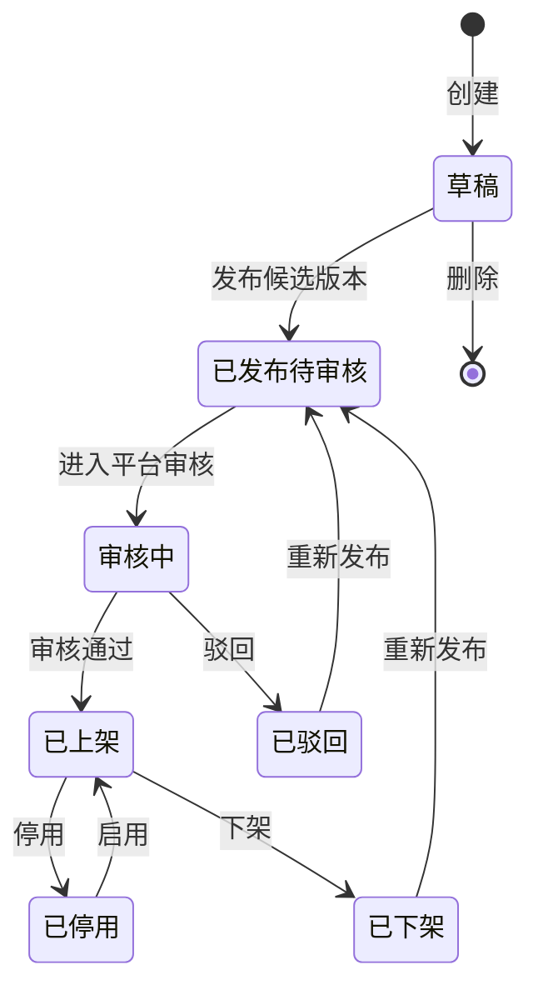
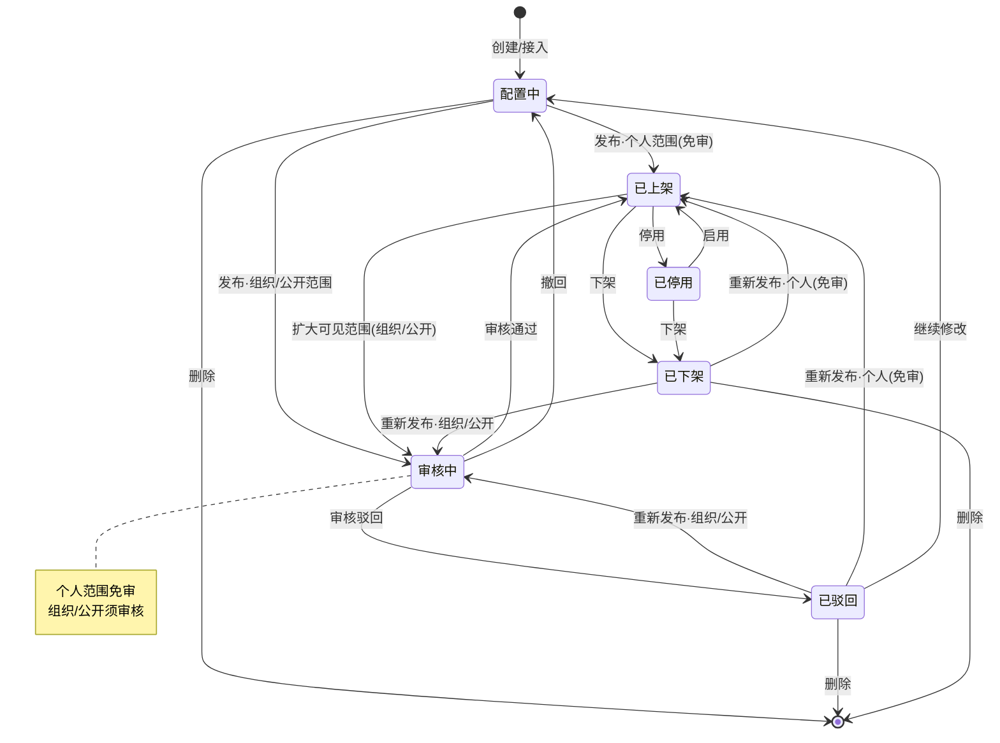
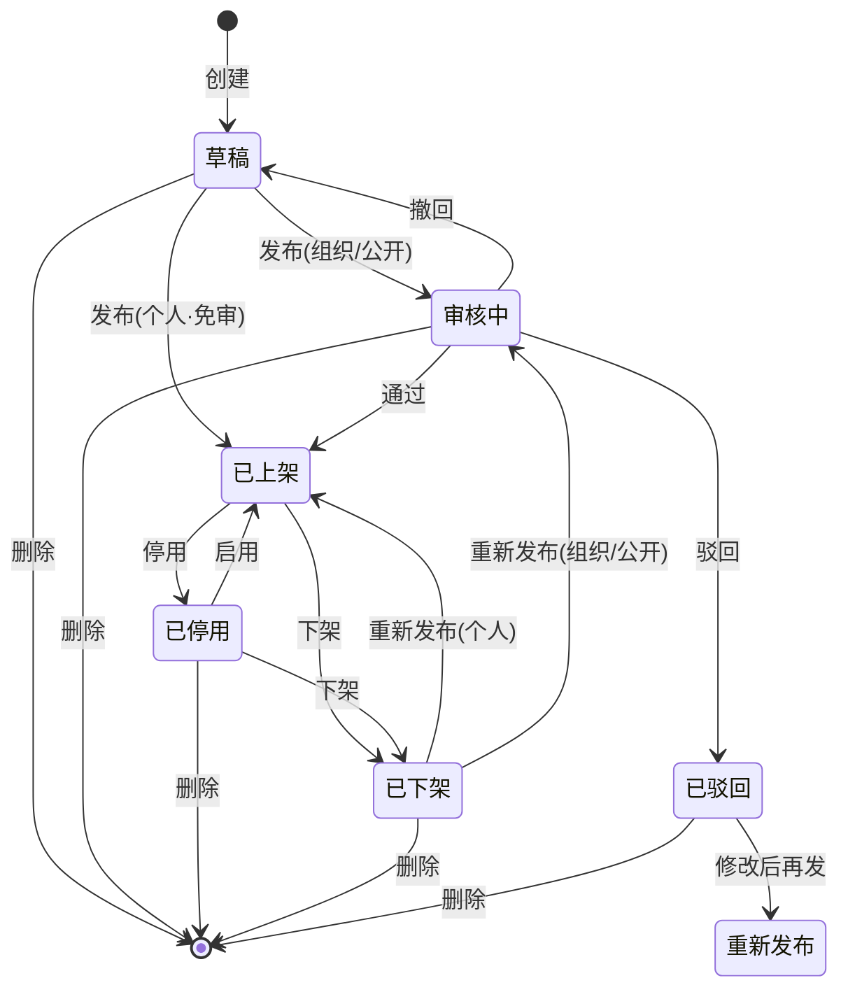
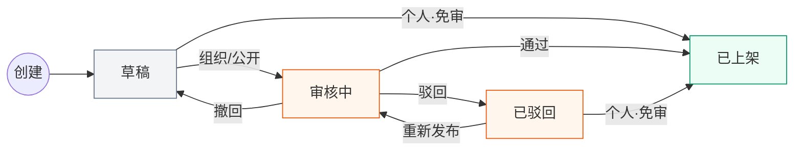
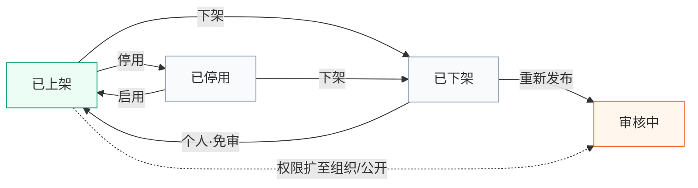

User: <user_query>
梳理一下现在智能体整个状态和功能的内容，
例如：状态为审核中的时候，功能是删除
已上架的话就是，下架、删除、权限
</user_query>

Assistant: Skills: global-session-core, requirement-clarifier（咨询类）

正在梳理智能体状态与对应功能，先从代码里查找状态定义和操作映射。

[REDACTED]

Assistant: [REDACTED]

Assistant: [REDACTED]

Assistant: [REDACTED]

Assistant: [REDACTED]

Assistant: [REDACTED]

Assistant: [REDACTED]

Assistant: [REDACTED]

Assistant: 这是基于当前原型代码梳理的**智能体状态 × 可用功能**对照。项目里有两套运营 UI，以 **v1.1 卡片版**（`prototype/智能体运营v1.1/`）为主，**v1.0 表格版**（`prototype/index.html` + `proto.js`）为旧版。

---

## 一、状态生命周期（v1.1 主模型）



| 状态 key | 展示名 | 用户端可见 | 说明 |
|---|---|---|---|
| `dev` | 草稿 | 否 | 刚创建，配置未完成 |
| `published_pending_review` | 已发布待审核（卡片上显示为「审核中」） | 否 | 已提交候选版本，等进审核队列 |
| `reviewing` | 审核中 | 否 | 在审核工作台处理中 |
| `listed` | 已上架 | 是 | 审核通过，对用户开放 |
| `disabled` | 已停用 | 否 | 临时停用，可启用恢复 |
| `offline` | 已下架 | 否 | 主动下架，可重新发布 |
| `rejected` | 已驳回 | 否 | 审核驳回（终态，需重新发布或重新注册） |

审核链路（ADR-011）：**发布候选版本 → 平台审核 → 已上架**，无「上级审批」「审核通过待上架」中间态。

---

## 二、v1.1 卡片列表 `⋯` 菜单（你举例的这套）

**交互约定**：点卡片 = 查看详情；审核操作只在**审核工作台**；`⋯` 菜单不含「查看 / 去审核 / 撤回」。

| 状态 | 卡片 `⋯` 菜单 | 备注 |
|---|---|---|
| **草稿** `dev` | 发布、删除、权限 | 内部智能体有权限；第三方无权限 |
| **已下架** `offline` | 发布、删除、权限 | 同草稿 |
| **已驳回** `rejected` | 发布、删除、权限 | 同草稿 |
| **已上架** `listed` | **下架、删除、权限** | 与你举例一致 |
| **已停用** `disabled` | 启用、下架、删除、权限 | v1.0 有「停用」，v1.1 卡片也有 |
| **审核中** `reviewing` / **已发布待审核** `published_pending_review` | **无 `⋯` 菜单** | 与你举例「审核中 → 删除」**不一致**；审核只在工作台 |

**权限规则**：
- 内部智能体（平台创建）：非审核态可配「权限」（个人 / 组织 / 公开）
- 第三方智能体：不显示「权限」

---

## 三、v1.1 详情页按钮（`agent-detail.html`）

| 状态 | 详情页主要操作 |
|---|---|
| 草稿 / 已驳回 / 已下架 | 前往开发配置、**发布候选版本**、权限（内部）、返回 |
| 已发布待审核 / 审核中 | 前往开发配置、**查看审核详情**、权限（内部）、返回 |
| 已上架 | 前往开发配置、权限、**打开用户对话页**、**下架**、返回 |

---

## 四、审核工作台（运营管理员）

| 入口 | 操作 |
|---|---|
| 审核工作台列表 | **去审核** → 进入审核详情 |
| 审核详情页 | **审核通过**（→ 直接 `listed` 已上架）、**驳回**（→ `rejected`） |

申请人侧：`08-audit-status.html` 可查看审核进度，不能在此做通过/驳回。

---

## 五、v1.0 表格列表（旧版 `proto.js`）

列表每行固定有「**查看**」，其余按状态：

| 状态 | 列表操作 |
|---|---|
| **已上架** `published` | 查看、**停用**、**下架** |
| **已停用** `disabled` | 查看、**启用** |
| **已下架** `offline` | 查看、**重新发布** |
| **审核中** `review` | 查看、**审核进度**（非删除） |
| **开发中 / 待审核** `dev` / `pending` | 查看、**发布** |
| **已驳回** `rejected` | 查看、**重新注册** |

v1.0 **没有**列表级的「删除」「权限」按钮；权限在详情页发布弹窗里配可见范围。

---

## 六、与你举例的对照

| 你的描述 | 当前 v1.1 实现 |
|---|---|
| 审核中 → 删除 | ❌ 审核中**无卡片菜单**，也没有删除入口 |
| 已上架 → 下架、删除、权限 | ✅ 完全一致 |

若产品目标是「审核中也能删除」，需要改 `cardMenuItems()`（`app.js` 约 522–541 行），并确认是否与 ADR-010「审核中卡片不显示菜单」冲突。

---

## 七、快速参考表（v1.1 推荐口径）

| 状态 | 卡片菜单 | 详情页 | 审核工作台 |
|---|---|---|---|
| 草稿 | 发布 / 删除 / 权限 | 发布候选版本 | — |
| 审核中 | — | 查看审核详情 | 通过 / 驳回 |
| 已上架 | 下架 / 删除 / 权限 | 下架 / 对话页 | — |
| 已停用 | 启用 / 下架 / 删除 / 权限 | — | — |
| 已下架 | 发布 / 删除 / 权限 | 发布候选版本 | — |
| 已驳回 | 发布 / 删除 / 权限 | 发布候选版本 | — |

需要的话，我可以按你期望的产品规则（比如审核中允许删除）出一版修改方案或直接改原型。

[REDACTED]

User: <user_query>
状态流大概是这样的状态，你把对应的功能卡片也梳理一下给我个表格，然后在v1.1的主页面把所有示例都做出来展示
说明
草稿
创建后尚未完成可发布配置，或审核驳回后等待修改
待发布
配置已保存，等待选择发布范围
审核中
已提交审核，等待直属上级、运营管理员等节点处理
已上架
已对目标范围用户可用
已停用
暂停用户访问，但保留配置与发布记录，可再次启用
已下架
已从用户可用入口移除，但历史记录保留
已驳回
是否作为终态保留待确认；若保留，需明确重新注册或重新提交规则
</user_query>

Assistant: Skills: ai-coding-ok, global-session-core, karpathy-guidelines

按你给出的状态流对齐 v1.1，并补全主页各状态示例卡片。先读当前 v1.1 实现与种子数据。

[REDACTED]

Assistant: [REDACTED]

Assistant: [REDACTED]

Assistant: 正在实现：对齐 7 态状态流、卡片菜单规则，并在 v1.1 主页展示全部状态示例。

[REDACTED]

Assistant: [REDACTED]

Assistant: [REDACTED]

Assistant: [REDACTED]

Assistant: [REDACTED]

Assistant: [REDACTED]

Assistant: [REDACTED]

Assistant: [REDACTED]

Assistant: [REDACTED]

Assistant: [REDACTED]

Assistant: 已按你给出的 7 态状态流对齐 v1.1，并在主页展示全部示例卡片。

---

## 状态 × 说明 × 卡片菜单

| 状态 | 说明 | 卡片 `⋯` 菜单 | 主页示例智能体 |
|---|---|---|---|
| **草稿** | 创建后尚未完成可发布配置，或驳回后等待修改 | 删除、权限（内部） | 日报生成器 |
| **待发布** | 配置已保存，等待选择发布范围 | 发布、删除、权限（内部） | 数据分析助手 |
| **审核中** | 已提交审核，等待直属上级、运营管理员等节点处理 | **删除**（无权限） | 采购申请助手 |
| **已上架** | 已对目标范围用户可用 | 下架、删除、权限（内部） | 客服助手、多系统集成助手 |
| **已停用** | 暂停访问，保留配置与发布记录，可再次启用 | 启用、删除、权限（内部） | 合同审查师 |
| **已下架** | 已从用户入口移除，历史记录保留 | 发布、删除、权限（内部） | 请假审批流程 |
| **已驳回** | **终态保留**：需重新提交审核（非直接上架） | 重新提交、删除、权限（内部） | 医疗分诊助手 |

**通用规则**
- 点卡片主体 → 查看详情
- 审核通过 / 驳回 → 仅在**审核工作台**
- 第三方智能体 → 菜单不含「权限」

**状态流转（主路径）**

```
草稿 → 待发布 → 审核中 → 已上架
                      ↘ 已驳回 → 重新提交 → 审核中
已上架 ⇄ 已停用
已上架 → 已下架 → 发布 → 审核中
```

---

## 已在 v1.1 主页实现的内容

1. **状态对照表**（筛选条上方）：7 态说明 + 卡片菜单一览  
2. **8 张示例卡片**：覆盖上述 7 态（已上架 2 张）  
3. **状态筛选**：草稿 / 待发布 / 审核中 / 已上架 / 已停用 / 已下架 / 已驳回  
4. **卡片菜单**按上表实现（审核中已开放「删除」）

打开 `prototype/智能体运营v1.1/index.html` 即可查看。若浏览器仍显示旧数据，清一下 `sessionStorage` 或硬刷新（存储 key 已升级为 `proto_ops_v11_agents_v2`）。

---

## 已驳回的处理口径（待你确认）

当前原型按**终态保留**实现：
- 卡片：**重新提交**（走发布弹窗 → 进入审核中）
- 详情：展示驳回原因 +「重新提交审核」
- **不提供**「重新注册新 ID」（与 v1.0 不同）

若你希望驳回后必须重新注册新智能体 ID，可以说一下，我再改一版。

---

**Completed** — 7 态定义、卡片菜单、主页对照表、全状态示例卡片  
**Verified** — `node prototype/scripts/v11-ops-check.js` → **V11 OPS CHECK PASSED**（含 7 态卡片与菜单断言）  
**Remaining Risks** — 草稿 → 待发布的自动流转仍依赖开发平台保存（原型未模拟）；已驳回是否必须新 ID 待产品确认

[REDACTED]

User: <user_query>
我只是让你在智能体卡片部分把所有情况都包含，我点击就能看到对应功能及状态，然后把表格给我，没让你坐在前端
</user_query>

Assistant: 明白：只需卡片区展示各状态示例，表格在回复里给你，不在页面上做对照表。正在移除前端对照表，保留卡片示例数据。

[REDACTED]

Assistant: [REDACTED]

Assistant: 抱歉，之前理解偏了——你要的是**卡片区能点到各状态示例**，表格在对话里给你，不是在前端做说明区。前端对照表已去掉；卡片种子数据仍保留，7 种状态在主页都能点到。

---

## 状态 × 说明 × 卡片功能

| 状态 | 说明 | 卡片左下角标签 | 卡片 `⋯` 菜单 | 点卡片进详情 |
|---|---|---|---|---|
| **草稿** | 创建后尚未完成可发布配置，或驳回后等待修改 | 草稿 | 删除、权限 | 前往开发配置、权限 |
| **待发布** | 配置已保存，等待选择发布范围 | 待发布 | 发布、删除、权限 | 选择范围并发布、权限 |
| **审核中** | 已提交审核，等待直属上级、运营管理员等节点处理 | 审核中 | 删除 | 查看审核详情 |
| **已上架** | 已对目标范围用户可用 | 已上架 | 下架、删除、权限 | 打开用户对话页、下架、权限 |
| **已停用** | 暂停用户访问，保留配置与发布记录，可再次启用 | 已停用 | 启用、删除、权限 | 启用、权限 |
| **已下架** | 已从用户可用入口移除，历史记录保留 | 已下架 | 发布、删除、权限 | 选择范围并发布、权限 |
| **已驳回** | 终态保留；需重新提交审核（待确认是否必须新 ID） | 已驳回 | 重新提交、删除、权限 | 重新提交审核、权限 |

**通用规则**
- 点卡片主体 = 查看详情
- 审核通过 / 驳回 = 仅在**审核工作台**（卡片菜单不含）
- 第三方智能体 = 菜单不含「权限」

---

## 主页卡片示例（`智能体运营v1.1/index.html`）

| 示例智能体 | 状态 | 怎么验 |
|---|---|---|
| 日报生成器 | 草稿 | 看标签 + 点 `⋯` |
| 数据分析助手 | 待发布 | 同上 |
| 采购申请助手 | 审核中 | 同上（仅删除） |
| 客服助手 / 多系统集成助手 | 已上架 | 同上 |
| 合同审查师 | 已停用 | 同上 |
| 请假审批流程 | 已下架 | 同上 |
| 医疗分诊助手 | 已驳回 | 同上 |

若看不到新状态，硬刷新或清 `sessionStorage`（key 为 `proto_ops_v11_agents_v2`）。

---

## 状态流转（参考）

```
草稿 → 待发布 → 审核中 → 已上架
                      ↘ 已驳回 → 重新提交 → 审核中
已上架 ⇄ 已停用
已上架 → 已下架 → 发布 → 审核中
```

**待你确认**：已驳回是「重新提交原记录」还是「必须重新注册新 ID」？确认后我可以只改卡片/菜单逻辑，不再加前端说明区。

[REDACTED]

User: <user_query>
这里的状态就很多很乱了，你自己基于实际情况梳理一下，草稿和待发布有什么区别，上架和发布的区别，以及功能，草稿为什么要有权限，这些东西你从产品的角度应该考虑清楚啊
</user_query>

Assistant: 从产品角度梳理前，先看当前原型里状态和操作是怎么定义的。

[REDACTED]

Assistant: 你说得对：当前原型把「状态」「动作」「权限」混在一起了，从产品上确实需要重新收拢。下面按**实际业务**梳理一版，不绑具体 UI 实现。

---

## 一、先分清三个概念

| 概念 | 是什么 | 用户感知 |
|---|---|---|
| **配置** | 在开发平台改提示词、工作流、Skills 等 | 「还在做」 |
| **发布**（动作） | 提交「这一版 + 可见范围」，进入治理流程 | 「我申请对外/open 给某范围」 |
| **上架**（状态） | 目标用户**已经能在用户端看到并使用** | 「已经能用了」 |

一句话：**发布是动作，上架是结果。**  
个人范围且免审时，点「发布」可以立刻变成「已上架」；部门/全公司范围则要经过「审核中 → 通过 → 已上架」。

---

## 二、草稿 vs 待发布 —— 要不要两个？

### 产品上的区别（如果保留两个）

| | **草稿** | **待发布** |
|---|---|---|
| 配置完成度 | 未完成，或刚创建 | 开发平台已标记「配置完成 / 可发布」 |
| 能否对用户可见 | 否 | 否 |
| 创建者下一步 | 去开发平台继续配 | 在运营侧选范围并点「发布」 |
| 谁推动状态变化 | 开发平台保存进度 | 开发平台回写「ready」或创建者点「完成配置」 |

### 我的建议：**默认合并成一个「配置中」**

在你们当前原型里，**没有**清晰的「开发平台配置完成」回写信号，「待发布」基本是人为多切一刀，和草稿对运营/用户**几乎一样**（都不能用）。

除非产品明确要：
- 开发平台有「提交发布申请」按钮，且与「保存草稿」分开；
- 运营列表要区分「还在改」和「改完了等发布」；

否则 **7 态可以收成 5～6 态**，去掉「待发布」，统一叫 **配置中（草稿）**。

---

## 三、上架 vs 发布 —— 别在界面上混用

| 用语 | 类型 | 含义 |
|---|---|---|
| 发布 | 按钮/动作 | 选版本 + 选可见范围 + 提交（可能进审核） |
| 已上架 | 状态标签 | 审核通过或免审后，用户端已开放 |
| 重新发布 | 动作 | 下架/驳回后，再提交一版（可能再审核） |
| 下架 | 动作 | 从用户入口撤下，**不等于删数据** |
| 启用 | 动作 | 从「已停用」恢复，**不必重新走发布** |

常见误区：卡片上写「发布」，状态却写「已上架」——用户会以为还没上架。  
规则：**状态只描述结果，按钮只描述动作。**

---

## 四、权限为什么不该出现在草稿卡片上？

这是当前原型里**不合理**的一点。

**可见范围（个人 / 部门 / 全公司）** 的含义是：**谁能在用户端使用这个智能体**。  
草稿阶段用户端根本看不到它，在卡片菜单里单独放「权限」没有业务意义，只会让人以为「草稿已经对外开放了」。

更合理的设计：

| 阶段 | 范围/权限怎么处理 |
|---|---|
| 配置中 | **不设**；最多在详情里只读展示「尚未发布」 |
| 点「发布」时 | 在**发布弹窗里必选**可见范围（核心入口） |
| 已上架后 | 卡片/详情可「调整可见范围」；**扩大范围**（如部门→全公司）应重新审核 |
| 已停用 / 已下架 | 范围配置**保留**，恢复或再发布时沿用或修改 |

所以：**草稿卡片菜单应该是「继续配置、删除」**，不应有「权限」。  
「权限」应出现在：**发布弹窗、已上架后的治理操作**。

（若将来有「协作者编辑权限」，那是开发平台的事，和「对谁可见可用」不是一回事。）

---

## 五、推荐的状态模型（收拢后）

### 主状态（5 个，够覆盖生命周期）

```
配置中 → [发布] → 审核中 → 已上架
              ↘ 已驳回 → 回配置中 / 再发布
已上架 ⇄ 已停用
已上架 → [下架] → 已下架 → [重新发布] → 审核中…
```

| 状态 | 含义 | 用户端 | 卡片 `⋯` 建议 |
|---|---|---|---|
| **配置中** | 未对外，配置未完成或驳回后修改中 | 不可见 | 继续配置（点卡片）、删除 |
| **审核中** | 已提交发布申请，等审批 | 不可见 | **撤回申请**（不是删除） |
| **已上架** | 对目标范围可用 | 可见可用 | 调整范围、停用、下架 |
| **已停用** | 临时暂停，版本和范围保留 | 不可见 | 启用、下架 |
| **已下架** | 主动撤出用户入口，记录保留 | 不可见 | 重新发布、删除 |
| **已驳回** | 审核未通过 | 不可见 | 继续修改、重新发布、删除 |

**可合并/弱化的：**
- **待发布** → 并入「配置中」，或用详情页小标签「可发布」表示，不单独占主状态
- **已停用 vs 已下架** → 若业务不需要「临时暂停」，可只保留「已下架」；若要保留，必须在文案里写清：停用=一键恢复，下架=需重新发布

---

## 六、动作 vs 状态对照（产品口径）

| 动作 | 触发条件 | 结果状态 |
|---|---|---|
| 保存配置 | 开发平台 | 仍为配置中 |
| 发布（个人/免审） | 配置完成 + 选范围 | 直接 **已上架** |
| 发布（部门/全公司） | 配置完成 + 选范围 | **审核中** |
| 审核通过 | 审核工作台 | **已上架** |
| 审核驳回 | 审核工作台 | **已驳回** |
| 撤回申请 | 审核中、创建者 | 回到 **配置中** |
| 停用 | 已上架 | **已停用** |
| 启用 | 已停用 | **已上架** |
| 下架 | 已上架 / 已停用 | **已下架** |
| 重新发布 | 已下架 / 已驳回 | **审核中**（或免审则直接上架） |
| 删除 | 配置中 / 已下架 / 已驳回，且从未上架或已下架 | 从列表移除 |

**已上架不建议主路径提供「删除」**——应先下架，避免误删线上对象。

---

## 七、和当前原型的差距（乱在哪）

| 问题 | 现状 | 产品上应怎样 |
|---|---|---|
| 草稿 vs 待发布 | 两个态，边界不清 | 合并，或等开发平台有「可发布」信号再拆 |
| 草稿有「权限」 | 卡片菜单里有 | 去掉；范围只在发布弹窗和已上架后 |
| 审核中有「删除」 | 菜单是删除 | 改为「撤回申请」 |
| 发布 / 上架混用 | 按钮、状态、文案交叉 | 按钮用动词，标签用结果态 |
| 7 个主状态 + 权限标签 | 筛选、标签、菜单都堆在一起 | 主状态 5～6 个；权限是**已上架后的属性**，不是独立生命周期 |

---

## 八、若只改一版卡片菜单（最小收敛）

| 状态 | 卡片 `⋯` |
|---|---|
| 配置中 | 删除 |
| 审核中 | 撤回 |
| 已上架 | 可见范围、停用、下架 |
| 已停用 | 启用、下架 |
| 已下架 | 重新发布、删除 |
| 已驳回 | 重新发布、删除 |

点卡片进详情：看摘要、去开发配置、发版记录；**审核只在审核工作台**。

---

**结论：**  
- **草稿 ≠ 待发布**：前者「还在配」，后者「配完等发布」——没有开发平台信号时，应合并。  
- **发布 ≠ 上架**：前者是申请动作，后者是用户能用的结果态。  
- **草稿不该有权限**：范围是发布时的决策，不是草稿上的菜单项。

你确认采用 **5 态收拢版** 后，我可以只改 v1.1 卡片种子数据和 `cardMenuItems`，不再加任何前端说明区。需要的话也可以一并定：**驳回后是「原 ID 重新发布」还是「必须新建智能体」**。

[REDACTED]

User: <user_query>
1、现在的话是以最大范围来去做的原型、然后状态和功能这部分你再思考一下给我个最终版
追求包含用户涉及智能体的全部流程和功能、但要追求简洁，然后再给一个meraid代码和图片
2、权限这部分，选择组织的话也是会走审核的，把现在项目的相关部分也进行修改
</user_query>

Assistant: Skills: ai-coding-ok, global-session-core, karpathy-guidelines

先梳理最终状态模型，并查找项目中「组织范围是否走审核」的相关逻辑。

[REDACTED]

Assistant: [REDACTED]

Assistant: [REDACTED]

Assistant: [REDACTED]

Assistant: [REDACTED]

Assistant: [REDACTED]

Assistant: [REDACTED]

Assistant: 正在实现最终 6 态模型，并修正「组织/公开须审核、个人免审」的逻辑。

[REDACTED]

Assistant: [REDACTED]

Assistant: [REDACTED]

Assistant: [REDACTED]

Assistant: [REDACTED]

Assistant: [REDACTED]

Assistant: [REDACTED]

Assistant: [REDACTED]

Assistant: ## 最终版：智能体状态与功能（简洁 · 全覆盖）

设计原则：**6 个状态 + 3 类动作 + 1 条审核规则**。  
「发布」是动作，「上架」是结果；「可见范围」只在发布时或已上架后调整，**配置中不设权限**。

---

### 1. 可见范围 × 审核规则（已改代码）

| 可见范围 | 用户端 | 是否审核 |
|---|---|---|
| **个人** | 仅创建者 | **免审**，发布后直接上架 |
| **组织**（部门/指定人） | 授权范围内 | **须审核** |
| **公开**（全公司） | 全员 | **须审核** |

已修改：`proto.js` `runAgentPublish`、`05-agent-detail.html` 发布弹窗、v1.1 发布/可见范围弹窗、第三方接入文案、`org-access-picker` 说明。

---

### 2. 状态定义（6 态）

| 状态 | 含义 | 用户端 |
|---|---|---|
| **配置中** | 未对外；在开发平台编辑或驳回后修改 | 不可见 |
| **审核中** | 已提交发布/范围变更，等审核 | 不可见 |
| **已上架** | 对目标范围可用 | 可见可用 |
| **已停用** | 临时暂停，版本与范围保留 | 不可见 |
| **已下架** | 从用户入口撤出，记录保留 | 不可见 |
| **已驳回** | 审核未通过，需修改后再发布 | 不可见 |

已去掉「待发布」独立态——与「配置中」边界不清，合并进 **配置中**；「可发布」在详情页用「发布」按钮表达即可。

---

### 3. 卡片 `⋯` 菜单（v1.1 已实现）

| 状态 | 卡片菜单 | 点卡片进详情 |
|---|---|---|
| 配置中 | 删除 | 开发配置、**发布** |
| 审核中 | **撤回** | 审核详情、撤回 |
| 已上架 | 可见范围、停用、下架 | 对话页、停用、下架、可见范围 |
| 已停用 | 启用、下架 | 启用、下架 |
| 已下架 | 重新发布、删除 | 重新发布 |
| 已驳回 | 重新发布、删除 | 重新发布 |

第三方智能体：已上架菜单**无**「可见范围」。

---

### 4. 动作清单（覆盖全流程）

| 动作 | 谁操作 | 入口 | 结果 |
|---|---|---|---|
| 创建 | 创建者 | 新建/第三方接入 | → 配置中 |
| 开发配置 | 创建者 | 开发平台 | 仍配置中 |
| **发布** | 创建者 | 详情/重新发布 | 个人→已上架；组织/公开→审核中 |
| 撤回 | 创建者 | 审核中卡片/详情 | → 配置中 |
| 审核通过/驳回 | 运营 | 审核工作台 | → 已上架 / 已驳回 |
| 调整可见范围 | 创建者 | 已上架菜单 | 个人→立即；组织/公开→审核中 |
| 停用 / 启用 | 运营/创建者 | 已上架/已停用 | ⇄ 已停用 |
| 下架 | 运营/创建者 | 已上架/已停用 | → 已下架 |
| 删除 | 创建者 | 配置中/已下架/已驳回 | 从列表移除 |

---

### 5. 主页示例卡片（点开即可验）

| 智能体 | 状态 |
|---|---|
| 日报生成器、数据分析助手 | 配置中 |
| 采购申请助手 | 审核中 |
| 客服助手、多系统集成助手 | 已上架 |
| 合同审查师 | 已停用 |
| 请假审批流程 | 已下架 |
| 医疗分诊助手 | 已驳回 |

路径：`prototype/智能体运营v1.1/index.html`（需硬刷新；存储 key 为 `proto_ops_v11_agents_v3`）

---

### 6. Mermaid 状态图



把上面代码粘贴到 [mermaid.live](https://mermaid.live) 即可导出 PNG/SVG。当前环境未能自动生成图片文件，你用该链接一键导出即可。

---

**Completed** — 6 态终版口径、组织范围走审核、v1.1 卡片菜单与发布流  
**Verified** — `v11-ops-check` PASS；`verify-all` PASS  
**Remaining Risks** — v1.0 列表页（`index.html` + `proto.js`）卡片菜单仍是旧词表；若需完全统一可再收一轮

[REDACTED]

User: <user_query>
1、照下面情况改，前端、流程图和项目内容
状态
说明
功能卡片
草稿
未对外，配置未完成或驳回后修改中
删除
审核中
已提交发布申请，等审批
撤回、删除
已上架
已对目标范围用户可用
停用、下架、权限
已停用
暂停用户访问，版本和范围保留，可再次启用
启用、下架、删除
已下架
已从用户可用入口移除，但历史记录保留
重新发布、删除
已驳回
审核未通过，需修改后再发布或删除
重新发布、删除
</user_query>

Assistant: 按你给的表格统一状态名与卡片菜单，并同步更新 v1.1 前端、流程与项目逻辑。

[REDACTED]

Assistant: [REDACTED]

Assistant: [REDACTED]

Assistant: [REDACTED]

Assistant: [REDACTED]

Assistant: [REDACTED]

Assistant: [REDACTED]

Assistant: 已按你的表格改完，摘要如下。

## 状态 × 功能卡片（终版）

| 状态 | 说明 | 功能卡片 |
|---|---|---|
| **草稿** | 未对外，配置未完成或驳回后修改中 | 删除 |
| **审核中** | 已提交发布申请，等审批 | 撤回、删除 |
| **已上架** | 已对目标范围用户可用 | 停用、下架、权限 |
| **已停用** | 暂停用户访问，版本和范围保留，可再次启用 | 启用、下架、删除 |
| **已下架** | 已从用户可用入口移除，但历史记录保留 | 重新发布、删除 |
| **已驳回** | 审核未通过，需修改后再发布或删除 | 重新发布、删除 |

第三方智能体「已上架」仍不含「权限」（沿用 ADR）。

---

## 已改内容

| 区域 | 变更 |
|---|---|
| **v1.1 卡片菜单** | `app.js` → `cardMenuItems` 与上表一致 |
| **状态文案** | 「配置中」→ **草稿**（筛选、标签、详情流程） |
| **详情页** | 对齐撤回/删除/权限等操作 |
| **v1.0 标签** | `proto.js` `statusLabel` 开发中→草稿 |
| **流程图文档** | [`docs/architecture/agent-lifecycle-states.md`](docs/architecture/agent-lifecycle-states.md) |
| **AGENTS.md** | Ops v1.1 卡片菜单契约更新 |

打开 `prototype/智能体运营v1.1/index.html` 可逐态点 `⋯` 验证；若数据旧，硬刷新（storage key：`proto_ops_v11_agents_v4`）。

---

## Mermaid 流程图

完整版在 [`docs/architecture/agent-lifecycle-states.md`](docs/architecture/agent-lifecycle-states.md)，核心如下：



---

**Verified** — `v11-ops-check` PASS；`verify-all` PASS

[REDACTED]

User: <user_query>
能把这个流程的图的线清一清嘛，处理一下，太乱了
</user_query>

Assistant: 整理流程图，减少交叉连线，让主路径更清晰。

[REDACTED]

Assistant: 拆成「发布链路」和「运行治理」两张图，删除类操作改用文字说明，避免所有线汇到一个节点。

[REDACTED]

Assistant: 删除图仍偏乱，改为文字说明，只保留两张主流程图。

[REDACTED]

Assistant: 已整理：原来一张 `stateDiagram` 里 20+ 条边互相交叉，现拆成 **两张横向主流程图**，删除单独用文字说明。

文档已更新：[`docs/architecture/agent-lifecycle-states.md`](docs/architecture/agent-lifecycle-states.md)

---

### ① 发布链路（创建 → 审核 → 上架）



---

### ② 运行治理（上架后）



---

**删除**不再画进图里（避免五路汇到一个点）：草稿 / 审核中 / 已停用 / 已下架 / 已驳回 → 卡片「删除」。

在 [mermaid.live](https://mermaid.live) 粘贴任一张即可导出 PNG。若还想把「已驳回 → 草稿（改配置）」补成虚线，可以说一声我再加一条不交叉的注释线。

[REDACTED]

User: <user_query>
能把这个流程的图的线清一清嘛，处理一下，太乱了，汇总成一张图，但是要尽量清晰
</user_query>

Assistant: [REDACTED]

Assistant: 重绘流程图：主路径用实线，免审捷径用虚线，并合并「删除」说明以减少交叉线。

[REDACTED]

Assistant: 已把 [`docs/architecture/agent-lifecycle-states.md`](docs/architecture/agent-lifecycle-states.md) 里的流程图整理成**一张**更清晰的图，主要改动：

1. **改用 `flowchart TB`**，自上而下：创建 → 草稿 → 审核 → 上架 → 停用/下架，层次更清楚  
2. **6 个状态各只出现一次**，卡片功能写在节点里，不再单独堆线  
3. **删除不画 5 条汇聚线**，改在图上方用文字说明（减少交叉）  
4. **个人免审**用**虚线**（草稿/已驳回/已下架 → 已上架），和须审核的**实线**分开  
5. **颜色分组**：草稿灰、审核黄、上架绿、停用/下架浅灰  

在 Cursor 里打开该 md 预览即可看渲染效果；也可把 mermaid 块复制到 [mermaid.live](https://mermaid.live) 导出 PNG。

若还想再简一点，可以把「已驳回 → 修改后 → 草稿」也收成虚线或注释，你说一声我改一版。

[REDACTED]
