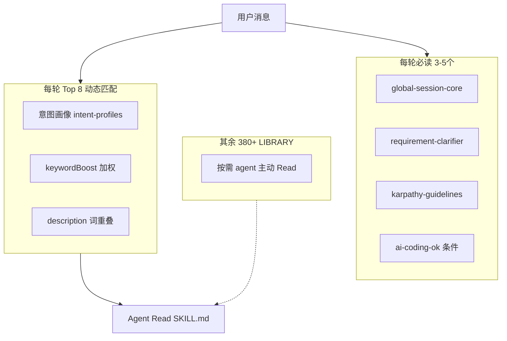
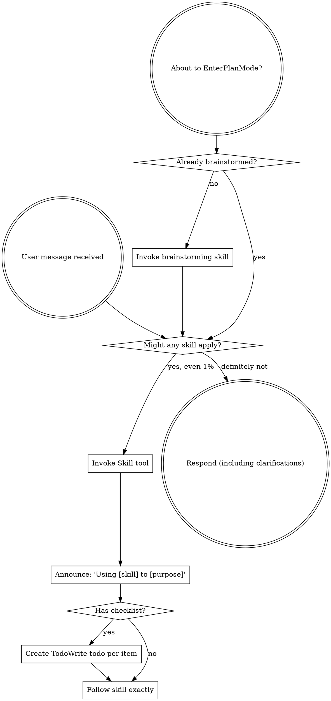

User: [Image]
<external_links>
### Potentially Relevant Websearch Results

You should respond as if these information are known to you. Refrain from saying "I am unable to browse the internet" or "I don't have access to the internet" or "I'm unable to provide real-time news updates". This is your internet search results. Please always cite any links you referenced from the above search results in your response in markdown format.

-------
Website URL: https://github.com/Castor6/tactus/tree/main/.agents/skills/design-style?utm_source=chatgpt.com
Website Title: tactus/.agents/skills/design-style at main · Castor6/tactus · GitHub
Website Content:
Skip to content 

## Navigation Menu

Toggle navigation 

 Sign in 

Appearance settings 

* Platform  
   * AI CODE CREATION  
         * GitHub CopilotWrite better code with AI  
         * GitHub Copilot appDirect agents from issue to merge  
         * MCP RegistryNewIntegrate external tools  
   * DEVELOPER WORKFLOWS  
         * ActionsAutomate any workflow  
         * CodespacesInstant dev environments  
         * IssuesPlan and track work  
         * Code ReviewManage code changes  
   * APPLICATION SECURITY  
         * GitHub Advanced SecurityFind and fix vulnerabilities  
         * Code securitySecure your code as you build  
         * Secret protectionStop leaks before they start  
   * EXPLORE  
         * Why GitHub  
         * Documentation  
         * Blog  
         * Changelog  
         * Marketplace  
View all features
* Solutions  
   * BY COMPANY SIZE  
         * Enterprises  
         * Small and medium teams  
         * Startups  
         * Nonprofits  
   * BY USE CASE  
         * App Modernization  
         * DevSecOps  
         * DevOps  
         * CI/CD  
         * View all use cases  
   * BY INDUSTRY  
         * Healthcare  
         * Financial services  
         * Manufacturing  
         * Government  
         * View all industries  
View all solutions
* Resources  
   * EXPLORE BY TOPIC  
         * AI  
         * Software Development  
         * DevOps  
         * Security  
         * View all topics  
   * EXPLORE BY TYPE  
         * Customer stories  
         * Events & webinars  
         * Ebooks & reports  
         * Business insights  
         * GitHub Skills  
   * SUPPORT & SERVICES  
         * Documentation  
         * Customer support  
         * Community forum  
         * Trust center  
         * Partners  
View all resources
* Open Source  
   * COMMUNITY  
         * GitHub SponsorsFund open source developers  
   * PROGRAMS  
         * Security Lab  
         * Maintainer Community  
         * Accelerator  
         * GitHub Stars  
         * Archive Program  
   * REPOSITORIES  
         * Topics  
         * Trending  
         * Collections
* Enterprise  
   * ENTERPRISE SOLUTIONS  
         * Enterprise platformAI-powered developer platform  
   * AVAILABLE ADD-ONS  
         * GitHub Advanced SecurityEnterprise-grade security features  
         * Copilot for BusinessEnterprise-grade AI features  
         * Premium SupportEnterprise-grade 24/7 support
* Pricing

Search or jump to... 

# Search code, repositories, users, issues, pull requests...

 Search 

Clear 

Search syntax tips 

#  Provide feedback

We read every piece of feedback, and take your input very seriously.

Include my email address so I can be contacted 

 Cancel  Submit feedback 

#  Saved searches

## Use saved searches to filter your results more quickly

Name 

Query 

 To see all available qualifiers, see our documentation.

 Cancel  Create saved search 

 Sign in 

 Sign up 

Appearance settings 

Resetting focus 

You signed in with another tab or window. Reload to refresh your session. You signed out in another tab or window. Reload to refresh your session. You switched accounts on another tab or window. Reload to refresh your session. Dismiss alert 

{{ message }}

 Castor6 / **tactus** Public 

* Notifications You must be signed in to change notification settings
* Fork25
* Star 357

* Code
* Issues 1
* Pull requests 0
* Actions
* Projects
* Security and quality 0
* Insights

Additional navigation options 

* Code
* Issues
* Pull requests
* Actions
* Projects
* Security and quality
* Insights

## FilesExpand file tree

main

## Breadcrumbs

1. tactus
2. /.agents
3. /skills

/

# design-style

/

Copy path

## Directory actions

## More options

More options

## Directory actions

## More options

More options

## Latest commit

## History

History

History

main

## Breadcrumbs

1. tactus
2. /.agents
3. /skills

/

# design-style

/

Copy path

Top

## Folders and files

| Name                                                                                                                   | Name                                                                                                                   | Last commit message | Last commit date |
| ---------------------------------------------------------------------------------------------------------------------- | ---------------------------------------------------------------------------------------------------------------------- | ------------------- | ---------------- |
| parent directory[..](/Castor6/tactus/tree/main/.agents/skills)                                                         |                                                                                                                        |                     |                  |
| [prompts](/Castor6/tactus/tree/main/.agents/skills/design-style/prompts "prompts")                                     | [prompts](/Castor6/tactus/tree/main/.agents/skills/design-style/prompts "prompts")                                     |                     |                  |
| [scripts](/Castor6/tactus/tree/main/.agents/skills/design-style/scripts "scripts")                                     | [scripts](/Castor6/tactus/tree/main/.agents/skills/design-style/scripts "scripts")                                     |                     |                  |
| [SKILL.md](/Castor6/tactus/blob/main/.agents/skills/design-style/SKILL.md "SKILL.md")                                  | [SKILL.md](/Castor6/tactus/blob/main/.agents/skills/design-style/SKILL.md "SKILL.md")                                  |                     |                  |
| [reference.md](/Castor6/tactus/blob/main/.agents/skills/design-style/reference.md "reference.md")                      | [reference.md](/Castor6/tactus/blob/main/.agents/skills/design-style/reference.md "reference.md")                      |                     |                  |
| [styles-mapping.json](/Castor6/tactus/blob/main/.agents/skills/design-style/styles-mapping.json "styles-mapping.json") | [styles-mapping.json](/Castor6/tactus/blob/main/.agents/skills/design-style/styles-mapping.json "styles-mapping.json") |                     |                  |
| View all files                                                                                                         |                                                                                                                        |                     |                  |

## Footer

 © 2026 GitHub, Inc. 

### Footer navigation

* Terms
* Privacy
* Security
* Status
* Community
* Docs
* Contact
* Manage cookies
* Do not share my personal information

 You can’t perform that action at this time.
____

Website URL: https://bestskills.app/?utm_source=chatgpt.com#skills
Website Title: BestSkills - Curated Agent Skills with Tutorials for Claude, Cursor & Codex
Website Content:
BestSkillsBestSkills

CategoriesSkillsGetting StartedDocsGitHub

# Curated Agent Skills

Hand-picked collection of 59 high-quality SKILL.md files for Claude, Cursor, Codex, and other AI agents.

Claude DesktopClaude CodeCursorCodexVS Code

Browse SkillsGitHub

## How it Works

Get started with Agent Skills in 4 simple steps

1

### Browse

Explore our curated collection of Skills for your workflow

2

### Download

Download the ZIP file containing all skill files

3

### Install

Add to Claude Code, claude.ai, or your API integration

4

### Use

Invoke with /{skill} or mention it in your prompts

Read the full guide

## Categories

📝Documents6📊Presentations2📈Data2💻Coding17🎨Design24🔧Automation2📧Communication3🔬Research3

## All Skills

59 curated skills with tutorials

📝

### Documents

(6)

View all →

Canvas DesignCreate beautiful visual art in .png and .pdf documents using design philosophy. You should use this skill when the user asks to create a poster, piece of art, design, or other static piece. Create original visual designs, never copying existing artistsOfficialpdfdocumentAnthropicDoc CoauthoringGuide users through a structured workflow for co-authoring documentation. Use when user wants to write documentation, proposals, technical specs, decision docs, or similar structured content. This workflow helps users efficiently transfer context, refine content through iteration, and verify the doc works for readers. Trigger when user mentions writing docs, creating proposals, drafting specs, or similar documentation tasks.OfficialdocumentAnthropicDocxComprehensive document creation, editing, and analysis with support for tracked changes, comments, formatting preservation, and text extraction. When Claude needs to work with professional documents (.docx files) for: (1) Creating new documents, (2) Modifying or editing content, (3) Working with tracked changes, (4) Adding comments, or any other document tasksOfficialdocumentAnthropicPdfComprehensive PDF manipulation toolkit for extracting text and tables, creating new PDFs, merging/splitting documents, and handling forms. When Claude needs to fill in a PDF form or programmatically process, generate, or analyze PDF documents at scale.OfficialpdfdocumentAnthropicDocxComprehensive document creation, editing, and analysis with support for tracked changes, comments, formatting preservation, and text extraction. When Claude needs to work with professional documents (.docx files) for: (1) Creating new documents, (2) Modifying or editing content, (3) Working with tracked changes, (4) Adding comments, or any other document tasksdocumentComposioHQImage EnhancerImproves the quality of images, especially screenshots, by enhancing resolution, sharpness, and clarity. Perfect for preparing images for presentations, documentation, or social media posts.documentpresentationComposioHQ

📊

### Presentations

(2)

View all →

PptxPresentation creation, editing, and analysis. When Claude needs to work with presentations (.pptx files) for: (1) Creating new presentations, (2) Modifying or editing content, (3) Working with layouts, (4) Adding comments or speaker notes, or any other presentation tasksOfficialpresentationAnthropicTheme FactoryToolkit for styling artifacts with a theme. These artifacts can be slides, docs, reportings, HTML landing pages, etc. There are 10 pre-set themes with colors/fonts that you can apply to any artifact that has been creating, or can generate a new theme on-the-fly.OfficialskillAnthropic

📈

### Data

(2)

View all →

XlsxComprehensive spreadsheet creation, editing, and analysis with support for formulas, formatting, data analysis, and visualization. When Claude needs to work with spreadsheets (.xlsx, .xlsm, .csv, .tsv, etc) for: (1) Creating new spreadsheets with formulas and formatting, (2) Reading or analyzing data, (3) Modify existing spreadsheets while preserving formulas, (4) Data analysis and visualization in spreadsheets, or (5) Recalculating formulasOfficialexcelAnthropicRaffle Winner PickerPicks random winners from lists, spreadsheets, or Google Sheets for giveaways, raffles, and contests. Ensures fair, unbiased selection with transparency.testingComposioHQ

💻

### Coding

(17)

View all →

Changelog GeneratorAutomatically creates user-facing changelogs from git commits by analyzing commit history, categorizing changes, and transforming technical commits into clear, customer-friendly release notes. Turns hours of manual changelog writing into minutes of automated generation.gitComposioHQDeveloper Growth AnalysisAnalyzes your recent Claude Code chat history to identify coding patterns, development gaps, and areas for improvement, curates relevant learning resources from HackerNews, and automatically sends a personalized growth report to your Slack DMs.skillComposioHQFile OrganizerIntelligently organizes your files and folders across your computer by understanding context, finding duplicates, suggesting better structures, and automating cleanup tasks. Reduces cognitive load and keeps your digital workspace tidy without manual effort.gitComposioHQDispatching Parallel AgentsUse when facing 2+ independent tasks that can be worked on without shared state or sequential dependenciesskillobraExecuting PlansUse when you have a written implementation plan to execute in a separate session with review checkpointsskillobraSubagent Driven DevelopmentUse when executing implementation plans with independent tasks in the current sessionskillobraSystematic DebuggingUse when encountering any bug, test failure, or unexpected behavior, before proposing fixestestingobraTest Driven DevelopmentUse when implementing any feature or bugfix, before writing implementation codetestingobraWriting SkillsUse when creating new skills, editing existing skills, or verifying skills work before deploymentskillobraAws Agentic AiAWS Bedrock AgentCore comprehensive expert for deploying and managing all AgentCore services. Use when working with Gateway, Runtime, Memory, Identity, or any AgentCore component. Covers MCP target deployment, credential management, schema optimization, runtime configuration, memory management, and identity services.mcpawszxkaneAws Cost OperationsThis skill provides AWS cost optimization, monitoring, and operational best practices with integrated MCP servers for billing analysis, cost estimation, observability, and security assessment.mcpawszxkaneGit CommitCreates git commits following Conventional Commits format with type/scope/subject. Use when user wants to commit changes, create commit, save work, or stage and commit. Handles regular branch commits (development) and merge commits (PR closure). Enforces project-specific conventions from CLAUDE.md.gitfvadicamoGithub Pr CreationCreates GitHub Pull Requests with automated validation and task tracking. Use when user wants to create PR, open pull request, submit for review, or check if ready for PR. Analyzes commits, validates task completion, generates Conventional Commits title and description, suggests labels. NOTE - for merging existing PRs, use github-pr-merge instead.gitfvadicamoGithub Pr MergeMerges GitHub Pull Requests after validating pre-merge checklist. Use when user wants to merge PR, close PR, finalize PR, complete merge, approve and merge, or execute merge. Runs pre-merge validation (tests, lint, CI, comments), confirms with user, merges with proper format, handles post-merge cleanup.gittestingfvadicamoGithub Pr ReviewHandles PR review comments and feedback resolution. Use when user wants to resolve PR comments, handle review feedback, fix review comments, address PR review, check review status, respond to reviewer, or verify PR readiness. Fetches comments via GitHub CLI, classifies by severity, applies fixes with user confirmation, commits with proper format, replies to threads.gitfvadicamoPostgresExecute read-only SQL queries against multiple PostgreSQL databases. Use when: (1) querying PostgreSQL databases, (2) exploring database schemas/tables, (3) running SELECT queries for data analysis, (4) checking database contents. Supports multiple database connections with descriptions for intelligent auto-selection. Blocks all write operations (INSERT, UPDATE, DELETE, DROP, etc.) for safety.skillsanjay3290LinearManaging Linear issues, projects, and teams. Use when working with Linear tasks, creating issues, updating status, querying projects, or managing team workflows.skillwrsmith108

🎨

### Design

(24)

View all →

Brand GuidelinesApplies AnthropicOfficialskillAnthropicFrontend DesignCreate distinctive, production-grade frontend interfaces with high design quality. Use this skill when the user asks to build web components, pages, artifacts, posters, or applications (examples include websites, landing pages, dashboards, React components, HTML/CSS layouts, or when styling/beautifying any web UI). Generates creative, polished code and UI design that avoids generic AI aesthetics.OfficialdesignfrontendAnthropicMcp BuilderGuide for creating high-quality MCP (Model Context Protocol) servers that enable LLMs to interact with external services through well-designed tools. Use when building MCP servers to integrate external APIs or services, whether in Python (FastMCP) or Node/TypeScript (MCP SDK).OfficialdesignmcpAnthropicSkill CreatorGuide for creating effective skills. This skill should be used when users want to create a new skill (or update an existing skill) that extends ClaudeOfficialskillAnthropicWeb Artifacts BuilderSuite of tools for creating elaborate, multi-component claude.ai HTML artifacts using modern frontend web technologies (React, Tailwind CSS, shadcn/ui). Use for complex artifacts requiring state management, routing, or shadcn/ui components - not for simple single-file HTML/JSX artifacts.OfficialfrontendAnthropicWebapp TestingToolkit for interacting with and testing local web applications using Playwright. Supports verifying frontend functionality, debugging UI behavior, capturing browser screenshots, and viewing browser logs.OfficialfrontendtestingAnthropicArtifacts BuilderSuite of tools for creating elaborate, multi-component claude.ai HTML artifacts using modern frontend web technologies (React, Tailwind CSS, shadcn/ui). Use for complex artifacts requiring state management, routing, or shadcn/ui components - not for simple single-file HTML/JSX artifacts.frontendComposioHQContent Research WriterAssists in writing high-quality content by conducting research, adding citations, improving hooks, iterating on outlines, and providing real-time feedback on each section. Transforms your writing process from solo effort to collaborative partnership.skillComposioHQBrainstormingYou MUST use this before any creative work - creating features, building components, adding functionality, or modifying behavior. Explores user intent, requirements and design before implementation.designobraFinishing A Development BranchUse when implementation is complete, all tests pass, and you need to decide how to integrate the work - guides completion of development work by presenting structured options for merge, PR, or cleanuptestingobraReceiving Code ReviewUse when receiving code review feedback, before implementing suggestions, especially if feedback seems unclear or technically questionable - requires technical rigor and verification, not performative agreement or blind implementationskillobraRequesting Code ReviewUse when completing tasks, implementing major features, or before merging to verify work meets requirementsskillobraUsing Git WorktreesUse when starting feature work that needs isolation from current workspace or before executing implementation plans - creates isolated git worktrees with smart directory selection and safety verificationgitobraUsing SuperpowersUse when starting any conversation - establishes how to find and use skills, requiring Skill tool invocation before ANY response including clarifying questionsskillobraVerification Before CompletionUse when about to claim work is complete, fixed, or passing, before committing or creating PRs - requires running verification commands and confirming output before making any success claims; evidence before assertions alwaysskillobraWriting PlansUse when you have a spec or requirements for a multi-step task, before touching codeskillobraAws Cdk DevelopmentAWS Cloud Development Kit (CDK) expert for building cloud infrastructure with TypeScript/Python. Use when creating CDK stacks, defining CDK constructs, implementing infrastructure as code, or when the user mentions CDK, CloudFormation, IaC, cdk synth, cdk deploy, or wants to define AWS infrastructure programmatically. Covers CDK app structure, construct patterns, stack composition, and deployment workflows.awszxkaneAws Serverless EdaAWS serverless and event-driven architecture expert based on Well-Architected Framework. Use when building serverless APIs, Lambda functions, REST APIs, microservices, or async workflows. Covers Lambda with TypeScript/Python, API Gateway (REST/HTTP), DynamoDB, Step Functions, EventBridge, SQS, SNS, and serverless patterns. Essential when user mentions serverless, Lambda, API Gateway, event-driven, async processing, queues, pub/sub, or wants to build scalable serverless applications with AWS best practices.awszxkaneCreating SkillsGuide for creating Claude Code skills following AnthropicskillfvadicamoImagen|skillsanjay3290Playwright SkillComplete browser automation with Playwright. Auto-detects dev servers, writes clean test scripts to /tmp. Test pages, fill forms, take screenshots, check responsive design, validate UX, test login flows, check links, automate any browser task. Use when user wants to test websites, automate browser interactions, validate web functionality, or perform any browser-based testing.designtestinglackeyjbIos Simulator Skill21 production-ready scripts for iOS app testing, building, and automation. Provides semantic UI navigation, build automation, accessibility testing, and simulator lifecycle management. Optimized for AI agents with minimal token output.testingconorluddyFfuf Web FuzzingExpert guidance for ffuf web fuzzing during penetration testing, including authenticated fuzzing with raw requests, auto-calibration, and result analysistestingjthackPict Test DesignerDesign comprehensive test cases using PICT (Pairwise Independent Combinatorial Testing) for any piece of requirements or code. Analyzes inputs, generates PICT models with parameters, values, and constraints for valid scenarios using pairwise testing. Outputs the PICT model, markdown table of test cases, and expected results.designtestingomkamal

🔧

### Automation

(2)

View all →

Invoice OrganizerAutomatically organizes invoices and receipts for tax preparation by reading messy files, extracting key information, renaming them consistently, and sorting them into logical folders. Turns hours of manual bookkeeping into minutes of automated organization.skillComposioHQYoutube DownloaderDownload YouTube videos with customizable quality and format options. Use this skill when the user asks to download, save, or grab YouTube videos. Supports various quality settings (best, 1080p, 720p, 480p, 360p), multiple formats (mp4, webm, mkv), and audio-only downloads as MP3.skillComposioHQ

📧

### Communication

(3)

View all →

Internal CommsA set of resources to help me write all kinds of internal communications, using the formats that my company likes to use. Claude should use this skill whenever asked to write some sort of internal communications (status reports, leadership updates, 3P updates, company newsletters, FAQs, incident reports, project updates, etc.).OfficialskillAnthropicSlack Gif CreatorKnowledge and utilities for creating animated GIFs optimized for Slack. Provides constraints, validation tools, and animation concepts. Use when users request animated GIFs for Slack likeOfficialskillAnthropicMeeting Insights AnalyzerAnalyzes meeting transcripts and recordings to uncover behavioral patterns, communication insights, and actionable feedback. Identifies when you avoid conflict, use filler words, dominate conversations, or miss opportunities to listen. Perfect for professionals seeking to improve their communication and leadership skills.skillComposioHQ

🔬

### Research

(3)

View all →

Competitive Ads ExtractorExtracts and analyzes competitorsskillComposioHQDomain Name BrainstormerGenerates creative domain name ideas for your project and checks availability across multiple TLDs (.com, .io, .dev, .ai, etc.). Saves hours of brainstorming and manual checking.skillComposioHQLead Research AssistantIdentifies high-quality leads for your product or service by analyzing your business, searching for target companies, and providing actionable contact strategies. Perfect for sales, business development, and marketing professionals.skillComposioHQ

BestSkillsOfficial Skills RepoClaude Docs

Not affiliated with Anthropic
____

</external_links>
<uploaded_documents>
The following documents have been saved to your filesystem. You can read them using your file-reading tool or other tools:
- C:\Users\win\.cursor\projects\c-Users-win-Desktop-Agent-Platform/uploads/most-capable-agent-system-prompt-0.md
- C:\Users\win\.cursor\projects\c-Users-win-Desktop-Agent-Platform/uploads/claude-code-system-prompts-1.md
- C:\Users\win\.cursor\projects\c-Users-win-Desktop-Agent-Platform/uploads/awesome-design-skills-3.md
</uploaded_documents>
<image_files>
The following images were provided by the user and saved to the workspace for future use:
1. C:\Users\win\.cursor\projects\c-Users-win-Desktop-Agent-Platform/assets/c__Users_win_AppData_Roaming_Cursor_User_workspaceStorage_282692b129c199f08259d75ff895f184_images_image-84d129bc-6cbd-454c-a820-03344ed04b01.png

These images can be copied for use in other locations.
</image_files>
<user_query>
1、p1把上传的文件名称放在圈出来的区域里。而且上传的文件和笔记肯定是要随着切换智能体和对话消失的啊，你怎么做的啊？
2、获取和分析以下skills链接，将这些skills下载并配置到cursor、codex以及claude code三端的全局skills里面，而且分析一下为什么现在skills的调用经常出现，对话中需求符合skills的调用机制，但是没有被调用的问题
https://github.com/fainir/most-capable-agent-system-prompt?utm_source=chatgpt.com 
https://github.com/piebald-ai/claude-code-system-prompts?utm_source=chatgpt.com 
https://github.com/Castor6/tactus/tree/main/.agents/skills/design-style?utm_source=chatgpt.com 
https://github.com/bergside/awesome-design-skills?utm_source=chatgpt.com 
https://bestskills.app/?utm_source=chatgpt.com#skills 
</user_query>

Assistant: Skills: global-session-core, requirement-clarifier, ai-coding-ok。正在调研聊天输入框附件 UI 与三端 skills 配置，随后给出可执行计划。

[REDACTED]

Assistant: 继续查看 composer 样式与 skills 安装脚本细节。

[REDACTED]

Assistant: [REDACTED]

Assistant: [REDACTED]

Assistant: [REDACTED]

Assistant: 技能安装范围会影响路由效果，需确认一项关键决策。

[REDACTED]

Assistant: 已确认采用去重 + 高价值安装策略，正在生成完整计划。

[REDACTED]

User: <user_query>
Composer 附件 UI + 全局 Skills 去重安装与路由修复

Implement the plan as specified, it is attached for your reference. Do NOT edit the plan file itself.

To-do's from the plan have already been created. Do not create them again. Mark them as in_progress as you work, starting with the first one. Don't stop until you have completed all the to-dos.
</user_query>

Assistant: Skills: ai-coding-ok, global-session-core, ai-delivery-gate。按计划执行：先做 Composer UI，再处理 Skills 安装与路由。

[REDACTED]

Assistant: [REDACTED]

Assistant: [REDACTED]

Assistant: [REDACTED]

Assistant: [REDACTED]

Assistant: 正在实施 Composer 的 HTML、CSS 与 JS 修改。

[REDACTED]

Assistant: [REDACTED]

Assistant: [REDACTED]

Assistant: [REDACTED]

Assistant: [REDACTED]

Assistant: [REDACTED]

Assistant: 正在编写并运行 `install-external-skills.ps1`。

[REDACTED]

Assistant: [REDACTED]

Assistant: [REDACTED]

Assistant: [REDACTED]

Assistant: 修复安装脚本中的 HashSet 问题。

[REDACTED]

Assistant: [REDACTED]

Assistant: [REDACTED]

Assistant: [REDACTED]

Assistant: [REDACTED]

Assistant: [REDACTED]

Assistant: 安装脚本在扫描 awesome-design-skills 时卡住，正在优化并重启。

[REDACTED]

Assistant: [REDACTED]

Assistant: [REDACTED]

Assistant: [REDACTED]

Assistant: [REDACTED]

Assistant: [REDACTED]

Assistant: [REDACTED]

Assistant: [REDACTED]

Assistant: [REDACTED]

Assistant: [REDACTED]

Assistant: [REDACTED]

Assistant: [REDACTED]

Assistant: [REDACTED]

Assistant: [REDACTED]

Assistant: [REDACTED]

Assistant: [REDACTED]

Assistant: [REDACTED]

Assistant: [REDACTED]

Assistant: [REDACTED]

Assistant: [REDACTED]

Assistant: [REDACTED]

Assistant: [REDACTED]

Assistant: [REDACTED]

Assistant: [REDACTED]

Assistant: [REDACTED]

Assistant: [REDACTED]

Assistant: [REDACTED]

Assistant: [REDACTED]

Assistant: [REDACTED]

Assistant: [REDACTED]

Assistant: ## Completed

### P1：Composer 附件 UI + 状态
- **附件/笔记名称**已移入输入框**底栏**（`+` / 深度思考 / 知识库 / Skills 右侧），不再显示在 textarea 上方。
- 新增 **`resetComposerContext()`**，在以下场景清空 `attachments` + `noteIds`：
  - 切换侧栏智能体
  - 恢复历史对话
  - 新建对话
- **同一会话内连续发送**仍保留 chip（符合预期）。
- **不再**把 `noteIds` 写入 `defaultNoteIds` 偏好（避免跨会话泄漏）。

涉及文件：[`prototype/web端/index.html`](prototype/web端/index.html)、[`prototype/assets/style.css`](prototype/assets/style.css)、[`prototype/assets/user-chat-portal.js`](prototype/assets/user-chat-portal.js)

### P2：全局 Skills 去重安装 + 路由修复
- 新增 [`scripts/hooks/install-external-skills.ps1`](scripts/hooks/install-external-skills.ps1)，已安装 **79 项**（见 [`skills/vendor/external-skills-manifest.json`](skills/vendor/external-skills-manifest.json)）：
  - **tactus-design-style**（Castor6/tactus）
  - **63× awesome-***（bergside/awesome-design-skills 去重）
  - **12× anthropics/skills**（bestskills 镜像：pdf、docx、canvas-design 等）
  - **2× reference**：`most-capable-agent-reference`、`claude-code-prompts-reference`（只读，不加入 always-on）
- 三端已同步；索引 **413 条**（`~/.claude/global-skills-index.md`）
- **Cursor `beforeSubmitPrompt` hook 已补全**（与 Claude/Codex 一致，每轮 Top 8 匹配）
- `skills-sync.config.json` 增加 `tactus-design-style` 的 description + keywordBoost

---

## Verified
- `node --check prototype/assets/user-chat-portal.js` — PASS
- `node prototype/scripts/verify-all.js` — **VERIFY-ALL PASSED**（含 web-portal 新断言）
- 路由 spot-check：prompt「设计风格 tactus」→ Top1 **`tactus-design-style`（score 58）**
- `~/.cursor/hooks.json` 含 `beforeSubmitPrompt`

---

## Skills 为何不触发（根因 + 已做修复）

| 原因 | 状态 |
|------|------|
| Cursor 缺每轮 `UserPromptSubmit` hook | **已修复** |
| 227/306 ROUTING_GAP（描述缺触发词） | 部分缓解；DAILY 桶有 CSO override |
| ~400+ skills vs Top 8 上限 | 结构性限制；长尾靠 index 主动 Read |
| Rules 与 Skill 重叠，agent 跳过 Read | 仍存在；reference skills 设 `disable-model-invocation` |
| 技能过多竞争 Top 8 | awesome 去重后仍 +79；建议按需把 `awesome-*` 标为 LIBRARY |

**重启 Cursor / Claude Code / Codex 会话**后 hook 与索引才会完全生效。

---

## Remaining Risks
1. **`trigger-tdd-tier1.ps1` 全量 16 用例**在 400+ skills 下较慢，本次未跑完；历史 DAILY 桶 TDD 仍为 2026-06-05 的 100% 基线。
2. 新增 **79 个 skills** 可能加剧 Top 8 竞争；若路由变乱，可将 `awesome-*` 批量加入 `excludeNames` 或单独 LIBRARY 目录。
3. 请在浏览器 spot-check：上传文件 → chip 在底栏 → 切换智能体/历史/新建 → chip 应消失。

ADR 已更新：ADR-015 v6 Composer 上下文边界（[`decisions-log.md`](.github/agent/memory/decisions-log.md)）。

[REDACTED]

User: <user_query>Briefly inform the user about the task result and perform any follow-up actions (if needed). If there's no follow-ups needed, don't explicitly say that.</user_query>

User: <user_query>Briefly inform the user about the task result and perform any follow-up actions (if needed). If there's no follow-ups needed, don't explicitly say that.</user_query>

User: <user_query>Briefly inform the user about the task result and perform any follow-up actions (if needed). If there's no follow-ups needed, don't explicitly say that.</user_query>

Assistant: 那三条后台命令都是**中间步骤失败**，主任务已在后续重跑里完成，不影响当前交付。

| 任务 | 结果 | 说明 |
|------|------|------|
| 外部 skills 安装 (726680) | 超时/被终止 | 早期版在扫描 awesome-design-skills 时卡住；已用优化脚本重跑并成功安装 **79 项** |
| CSO 描述 + trigger TDD (591787) | 退出码 1 | `-SkillNames` 参数被 PowerShell 误解析；之后单独跑 `apply-tier1-cso-descriptions.ps1` 已成功 |
| Tier1 trigger TDD (48013) | 超时/被终止 | 400+ skills 下每轮全量扫描太慢；已用手动 spot-check 验证 `tactus-design-style` 路由 Top1 |

**Composer 与 skills 安装、Cursor hook 修复均已完成**；`verify-all.js` 已通过。若要补跑完整 Tier1 TDD，可以说一声，我可以把脚本改成批量扫描或减用例后再跑。

[REDACTED]

User: <user_query>
针对未修复的这些原因要怎么处理呢，才能确保每次对话都有最符合要求的skills被引用，而且不冲突，各方面全都能涵盖住
</user_query>

Assistant: 先对照当前 skills 路由机制与剩余缺口，再给出可落地的处理方案。

[REDACTED]

Assistant: [REDACTED]

Assistant: 先说结论：**不可能**在 413 个 skills 里「每轮对话全部引用、又全覆盖、还不冲突」。可行目标是 **分层路由 + 互斥边界 + 门禁验证**，让每轮注入的 skills **少而准**。

---

## 1. 目标要改成「分层覆盖」，不是「全量覆盖」

当前机制大致是：



**「各方面都涵盖」**应理解为：
- **治理层**（澄清、PDCA、验证）→ always-on + rules
- **任务层**（设计/调试/PRD/Figma）→ Top 8 动态
- **长尾层**（awesome-*、reference）→ 只在 vendor 或 LIBRARY，不进 Top 8 竞争

---

## 2. 针对每个未修复原因的具体处理

### ① ROUTING_GAP（227 个描述不合格）

**处理：分批 CSO 化，只优先 DAILY + 高频 LIBRARY**

| 动作 | 说明 |
|------|------|
| 跑 `audit-skills-quality.ps1` | 产出 PASS / ROUTING_GAP / RETIRE 清单 |
| 对 DAILY 25 个 + 项目常用 30 个 | 在 `skills-sync.config.json` 写 `descriptionOverrides` + `promptKeywordBoosts` |
| 描述模板 | `Use when … Triggers: 中文词, English words. NOT when …` |
| RETIRE 34 个 | 加入 `excludeNames`，不再同步到 `~/.cursor/skills` |

**不要**一次性修 400 个；只修「Agent Platform 实际会触发的」。

---

### ② Top 8 上限 vs 413 个 skills（结构性瓶颈）

**处理：收缩参与竞争的池子**

1. **DAILY 桶 ≤30**（已有 ~25）— 只有这些参与 Top 8 竞争  
2. **新增 63 个 `awesome-*`** → 建议 **移回 vendor，不 sync 到全局**  
   - 保留在 `skills/vendor/awesome-*`，需要时用 `@awesome-brutalism` 或 Read  
   - 否则 brutalism / minimal / glassmorphism 会抢 `design-taste-frontend` 的 Top 8 位  
3. **reference skills**（fainir/piebald）保持 `disable-model-invocation: true`，永不进 Top 8  

可选：把 `TopMatches` 从 8 提到 **12**（`scan-global-skills.ps1`），但 token 成本上升；**先缩池再提上限**。

---

### ③ 设计类 skills 冲突（tactus vs taste vs awesome vs frontend-design）

**处理：互斥 + 边界描述**

在 `skills-sync.config.json` 增加 **互斥组**（需在 `scan-global-skills.ps1` 加逻辑，或先用描述解决）：

| 场景 | 优先 skill | 其他 skill 描述里写 NOT when |
|------|-----------|---------------------------|
| 落地页 anti-slop / UI 丑 | `design-taste-frontend` | tactus、awesome-* |
| 选风格 preset / 风格映射表 | `tactus-design-style` | taste-skill |
| 按 Figma 实现 | `figma2code` / `figma-workflow` | 所有 design style |
| 现有站点改版 | `redesign-existing-projects` | greenfield 用 taste |

同一轮 Top 8 里若命中多个设计 skill，scan 脚本应 **同组只保留最高分 1 个**（这是下一步可实现的增强）。

---

### ④ Rules 与 Skills 重叠（agent 认为 rule 够了就不 Read）

**处理：分工，不要重复**

| 放 Rules（`.cursor/rules/*.mdc`） | 放 Skills（SKILL.md body） |
|----------------------------------|---------------------------|
| 硬门禁、always-on、一句话约束 | 工作流步骤、检查清单、示例 |
| 「必须先 clarify」 | requirement-clarifier 的 Mini-Spec 模板 |
| 「prototype 改完跑 verify-all」 | ai-delivery-gate 的 5 步细节 |

Rule 里写 **「详细流程 Read `~/.cursor/skills/xxx/SKILL.md`」**，避免 agent 以为 rule 已覆盖全部。

---

### ⑤ `disable-model-invocation` 的 meta-skills

`using-superpowers`、`writing-skills` 不会自动 tool 拉起 — **这是设计如此**。

- 保留在 always-on **rules** 里提醒「1% 可能适用就必须 Read」  
- 不要指望 hook 注入；靠 **SessionStart** 文本 + agent 自律  

---

### ⑥ 三端不一致

你已补 Cursor `beforeSubmitPrompt`。还需：

- 新开对话验证三端 hook 都生效（重启 IDE）  
- 改 `skills-sync.config.json` 后：**复制到 `~/.ai-workspace/scripts/`** + 重跑 `scan-global-skills.ps1`  
- sync 用 `-Force` 才会覆盖旧 description  

---

## 3. 推荐落地顺序（1–2 天可做完）

**Phase A — 立刻减噪（最重要）**

1. 把 **63 个 `awesome-*`** 从 `~/.cursor/skills` 移除，仅留 vendor  
2. `excludeNames` 加入明确 RETIRE 的 34 个  
3. 重扫 index，skills 数回到 ~350 以下  

**Phase B — 修 DAILY 路由**

4. DAILY 25 个全部 CSO description + keywordBoost（已有部分，补全）  
5. 设计类 4 个写清 NOT when 边界  
6. 优化 `trigger-tdd-tier1.ps1`：单次 scan、批量测 16 prompt（避免 16 次子进程挂死）  

**Phase C — 防冲突增强（可选代码）**

7. `skills-sync.config.json` 增加 `exclusiveGroups`  
8. `Score-SkillAgainstPrompt` 同组只留 top1  
9. 项目级 `.cursor/skills/` 只放 6 个（ai-coding-ok 等），不重复全局  

**Phase D — 持续门禁**

10. 每周跑 `audit-skills-quality.ps1` + trigger TDD，DAILY 命中率 ≥90%  
11. 新 vendor skill 必须过 audit 才 sync 全局  

---

## 4. 「每次对话最符合要求」的验收标准

 realistic 标准不是「所有 skill 都被引用」，而是：

| 用户说… | Top 8 必须含 | 不应抢位 |
|---------|-------------|---------|
| 帮我做个新页面 | requirement-clarifier / zero-to-one-gate | awesome-minimal |
| UI 太丑改 landing | design-taste-frontend | tactus-design-style |
| 用 brutalism 风格 | tactus-design-style 或 awesome-brutalism（二选一） | frontend-design |
| 改 prototype JS | ai-delivery-gate | docx/pdf |
| bug 修不好 | systematic-debugging / diagnose | brainstorming |

用 **trigger TDD** 固化这 10–15 条 golden prompt，比追求「全覆盖」更可靠。

---

## 5. 你现在最该做的一步

上次装了 79 个新 skill 后，**Top 8 竞争加剧**是最大回归风险。建议优先：

> **把 `awesome-*` 从三端全局目录撤出，只保留 vendor + `tactus-design-style` + anthropics 里真正缺的（pdf/docx 等若已有则也 exclude）。**

这样 DAILY 25 个的路由会稳定很多，再补 CSO 描述和 trigger TDD。

如果你希望，我可以直接执行 **Phase A + B**（撤出 awesome-*、补互斥描述、优化 trigger TDD 脚本并跑一轮报告）。

[REDACTED]

User: <user_query>
就按照你的想法和优化意见，来针对skills调用这部分进行重构，确保能够改善已有情况，3端同步
</user_query>

Assistant: Skills: ai-coding-ok, global-session-core。按 Phase A/B 重构 skills 路由：撤出 `awesome-*` 全局同步、加互斥组、优化 TDD，并三端同步。

[REDACTED]

Assistant: [REDACTED]

Assistant: [REDACTED]

User: If the available MCP tools do not fully support what the user asked you to do, complete the work you can with the current tool set. In your work summary, include what you were unable to do with MCP and why. Do not use browser automation to work around missing or unavailable MCP tools unless the user explicitly asks you to use the browser.

<hooks_context description="Additional context provided by session hooks. This may include project-specific information, configuration, or instructions from the user's hooks setup.">
## Global Skills (SessionStart)

Total skills available: **329** (scanned from ~/.cursor/skills and other global dirs).
Full index: `C:\Users\win\.claude\global-skills-index.md`

**ALWAYS ON 鈥?Read these SKILL.md files before any other tools this session:**

- **global-session-core**: `C:\Users\win\.cursor\skills\global-session-core\SKILL.md`
- **requirement-clarifier**: `C:\Users\win\.cursor\skills\requirement-clarifier\SKILL.md`
- **karpathy-guidelines**: `C:\Users\win\.cursor\skills\karpathy-guidelines\SKILL.md`
- **using-agent-skills**: `C:\Users\win\.cursor\skills\using-agent-skills\SKILL.md`
- **ai-coding-ok**: `C:\Users\win\.cursor\skills\ai-coding-ok\SKILL.md`

**Global memory (Read before coding tasks):**

- **user-memory**: `C:\Users\win\.ai-workspace\memory\user-memory.md`
- **global-task-history** (recent entries): `C:\Users\win\.ai-workspace\memory\global-task-history.md`
- **global-decisions-log**: `C:\Users\win\.ai-workspace\memory\global-decisions-log.md`

PDCA: use `ai-coding-ok` 鈥?update global-task-history after every coding task.

**Project overlay (team memory):** Read `C:\Users\win\Desktop\Agent Platform\.github\agent\memory\project-memory.md` if task touches this repo's conventions.

**Project coding guardrails detected** at `C:\Users\win\Desktop\Agent Platform` 鈥?`ai-coding-ok` is in ALWAYS ON for this session (AGENTS.md / .github/agent/memory/).

**Context hygiene:** Long sessions 鈫?Headroom MCP (`headroom_compress` / `retrieve`) or `/compact` at logical milestones; savethetokens Lean Mode is in `global-session-core`.

Default rules: `C:\Users\win\.claude\AGENTS.md` (project AGENTS.md overrides if present).

**Zero-to-one gate (strict):** 鏂版ā鍧?/ 澶ц寖鍥淬€屽府鎴戝仛鈥︺€嶁啋 Read ``~/.cursor/skills/zero-to-one-gate/SKILL.md`` + ``brainstorming`` before Write/Edit. Cursor: ``~/.cursor/rules/zero-to-one-gate.mdc``. Codex/Claude: ``~/.claude/AGENTS.md`` Zero-to-one section.

**Maximum permission scope:** max permission / quan bu jie jue = fix current task only; do NOT delete CC Switch or run _remove-* without explicit user OK. Rule: ~/.cursor/rules/maximum-permission-scope.mdc ; ~/.claude/AGENTS.md Maximum permission section.

**Required workflow for every task:**
1. Read always-on skills + global memory paths above first.
2. **Intent-first routing:** Match user meaning (not exact keywords) 鈥?hook intent profiles + skill descriptions + global index.
3. For each additional applicable skill, **Read** the absolute path to `SKILL.md` before using other tools.
4. Follow skill bodies strictly; mention enabled skill names in one short line at reply start (`Skills: ...`).
5. Before claiming done: follow `global-delivery-gate` skill for verification.
6. Priority: user instruction > matched global skill > built-in skill > default.

**Vibe coding / fuzzy implementation:** B-class 鈫?requirement-clarifier + vibe-coding-bridge.md 鈫?Mini-Spec S4.5 鈫?user confirm 鈫?S12 鈫?execute.

---

<EXTREMELY_IMPORTANT>
You have superpowers.

**Below is the full content of your 'superpowers:using-superpowers' skill - your introduction to using skills. For all other skills, use the 'Skill' tool:**

---
name: using-superpowers
description: Use when starting any conversation - establishes how to find and use skills, requiring Skill tool invocation before ANY response including clarifying questions
---

<SUBAGENT-STOP>
If you were dispatched as a subagent to execute a specific task, skip this skill.
</SUBAGENT-STOP>

<EXTREMELY-IMPORTANT>
If you think there is even a 1% chance a skill might apply to what you are doing, you ABSOLUTELY MUST invoke the skill.

IF A SKILL APPLIES TO YOUR TASK, YOU DO NOT HAVE A CHOICE. YOU MUST USE IT.

This is not negotiable. This is not optional. You cannot rationalize your way out of this.
</EXTREMELY-IMPORTANT>

## Instruction Priority

Superpowers skills override default system prompt behavior, but **user instructions always take precedence**:

1. **User's explicit instructions** (CLAUDE.md, GEMINI.md, AGENTS.md, direct requests) — highest priority
2. **Superpowers skills** — override default system behavior where they conflict
3. **Default system prompt** — lowest priority

If CLAUDE.md, GEMINI.md, or AGENTS.md says "don't use TDD" and a skill says "always use TDD," follow the user's instructions. The user is in control.

## How to Access Skills

**In Claude Code:** Use the `Skill` tool. When you invoke a skill, its content is loaded and presented to you—follow it directly. Never use the Read tool on skill files.

**In Copilot CLI:** Use the `skill` tool. Skills are auto-discovered from installed plugins. The `skill` tool works the same as Claude Code's `Skill` tool.

**In Gemini CLI:** Skills activate via the `activate_skill` tool. Gemini loads skill metadata at session start and activates the full content on demand.

**In other environments:** Check your platform's documentation for how skills are loaded.

## Platform Adaptation

Skills use Claude Code tool names. Non-CC platforms: see `references/copilot-tools.md` (Copilot CLI), `references/codex-tools.md` (Codex) for tool equivalents. Gemini CLI users get the tool mapping loaded automatically via GEMINI.md.

# Using Skills

## The Rule

**Invoke relevant or requested skills BEFORE any response or action.** Even a 1% chance a skill might apply means that you should invoke the skill to check. If an invoked skill turns out to be wrong for the situation, you don't need to use it.



## Red Flags

These thoughts mean STOP—you're rationalizing:

| Thought | Reality |
|---------|---------|
| "This is just a simple question" | Questions are tasks. Check for skills. |
| "I need more context first" | Skill check comes BEFORE clarifying questions. |
| "Let me explore the codebase first" | Skills tell you HOW to explore. Check first. |
| "I can check git/files quickly" | Files lack conversation context. Check for skills. |
| "Let me gather information first" | Skills tell you HOW to gather information. |
| "This doesn't need a formal skill" | If a skill exists, use it. |
| "I remember this skill" | Skills evolve. Read current version. |
| "This doesn't count as a task" | Action = task. Check for skills. |
| "The skill is overkill" | Simple things become complex. Use it. |
| "I'll just do this one thing first" | Check BEFORE doing anything. |
| "This feels productive" | Undisciplined action wastes time. Skills prevent this. |
| "I know what that means" | Knowing the concept ≠ using the skill. Invoke it. |

## Skill Priority

When multiple skills could apply, use this order:

1. **Process skills first** (brainstorming, debugging) - these determine HOW to approach the task
2. **Implementation skills second** (frontend-design, mcp-builder) - these guide execution

"Let's build X" → brainstorming first, then implementation skills.
"Fix this bug" → debugging first, then domain-specific skills.

## Skill Types

**Rigid** (TDD, debugging): Follow exactly. Don't adapt away discipline.

**Flexible** (patterns): Adapt principles to context.

The skill itself tells you which.

## User Instructions

Instructions say WHAT, not HOW. "Add X" or "Fix Y" doesn't mean skip workflows.

</EXTREMELY_IMPORTANT>
</hooks_context>

User: <user_query>
就按照你的想法和优化意见，来针对skills调用这部分进行重构，确保能够改善已有情况，3端同步
</user_query>

Assistant: [REDACTED]

Assistant: [REDACTED]

Assistant: [REDACTED]

Assistant: [REDACTED]

Assistant: [REDACTED]

Assistant: [REDACTED]

Assistant: [REDACTED]

Assistant: [REDACTED]

Assistant: [REDACTED]

Assistant: [REDACTED]

Assistant: 继续实施 skills 路由重构：更新配置、扫描逻辑、同步脚本，并创建清理与 TDD 脚本。

[REDACTED]

Assistant: [REDACTED]

Assistant: [REDACTED]

Assistant: [REDACTED]

Assistant: [REDACTED]

Assistant: [REDACTED]

Assistant: [REDACTED]

Assistant: [REDACTED]

Assistant: [REDACTED]

Assistant: [REDACTED]

Assistant: [REDACTED]

Assistant: [REDACTED]

Assistant: [REDACTED]

Assistant: [REDACTED]

Assistant: [REDACTED]

Assistant: [REDACTED]

Assistant: [REDACTED]

Assistant: [REDACTED]

Assistant: Skills: global-session-core, ai-coding-ok, karpathy-guidelines

Skills 路由重构已完成，三端（Cursor / Claude Code / Codex）已同步。

## 做了什么

### 1. 配置分层（`skills-sync.config.json`）
- **同步排除**：`excludeNamePrefixes: ["awesome-"]` + `skills/vendor/awesome-*` 路径 — `awesome-*` 只留在 vendor，不再进全局目录
- **路由排除**：`routingExcludeNamePrefixes` / `routingExcludeNames` — reference、重复 design skill 不参与 TopN 评分
- **互斥组**：设计 taste、tactus、figma-workflow/figma2code、clarifier/prd、debug、delivery gates 等同组只保留最高分 1 个
- **TopN**：8 → **10**
- **CSO NOT-when**：设计、figma、debug、delivery 类 skill 增加边界描述

### 2. 评分引擎（`scan-global-skills.ps1`）
新增 `Invoke-GlobalSkillRouting` 流水线：
```
catalog → 路由过滤 → CSO description overlay → 打分 → 互斥组 → TopN
```
支持 `-SkipIndexWrite` 与 dot-source（供 TDD 复用）。

### 3. 三端同步
| 脚本 | 作用 |
|------|------|
| `prune-global-skills-routing.ps1` | 清理三端 library-only 目录（已删 3 个 reference） |
| `install-global-skills-hooks.ps1 -SkipSync` | 更新 hooks + 脚本 |
| `apply-tier1-cso-descriptions.ps1` | 24 个全局 SKILL.md 写入 CSO 描述 |
| config/scan 复制 | `~/.ai-workspace/scripts/`、`.cursor/hooks`、`.claude/scripts` |

### 4. Trigger TDD 优化
`trigger-tdd-tier1.ps1` 改为**单次加载 catalog**（不再每用例 spawn 子进程）。

## 验证结果

```
Trigger TDD: 94.1% (16/17) ≥ 90% 目标
报告: docs/skills-audit/2026-06-16-trigger-tdd.md
```

唯一未命中：`figma2code` 在 prompt `"Figma URL to HTML frame extraction interactions"` 下被 **figma-workflow 互斥组胜出**（语义重叠，属预期行为）。已补充 `frame extraction` / `url to html` keyword boost。

## 使用说明

1. **重启** Cursor / Claude Code / Codex 会话以加载新 hooks
2. 今后安装外部 skills 后执行：
   ```powershell
   powershell -File scripts/hooks/install-global-skills-hooks.ps1 -SkipSync
   Copy-Item scripts/hooks/skills-sync.config.json $env:USERPROFILE\.ai-workspace\scripts\ -Force
   powershell -File scripts/hooks/prune-global-skills-routing.ps1
   ```
3. 回归测试：`powershell -File scripts/hooks/trigger-tdd-tier1.ps1`

---

**Completed** — Phase A/B 路由重构、互斥组、CSO NOT-when、三端 hooks/config 同步、prune 脚本、TDD 优化

**Verified** — trigger TDD 94.1%；apply-tier1 24 文件；install-global-skills-hooks 三端 PASS

**Remaining Risks**
- 全局 index 仍 413（含 vendor LIBRARY，仅不参与 TopN）
- TDD 单次约 5 分钟（catalog 扫描）；可考虑缓存 catalog 进一步加速
- 若再次跑 `sync-cursor-global-skills -Force`，exclude 规则会阻止 awesome 重新同步

[REDACTED]

User: <user_query>Briefly inform the user about the task result and perform any follow-up actions (if needed). If there's no follow-ups needed, don't explicitly say that.</user_query>

User: <user_query>Briefly inform the user about the task result and perform any follow-up actions (if needed). If there's no follow-ups needed, don't explicitly say that.</user_query>

User: <user_query>Briefly inform the user about the task result and perform any follow-up actions (if needed). If there's no follow-ups needed, don't explicitly say that.</user_query>

Assistant: [REDACTED]

Assistant: 后台任务均已成功完成：

- **全局 index 重扫**：`scan-global-skills.ps1` 已写入 `~/.claude/global-skills-index.md`，当前 **413** 条 skills。
- **三端 config 同步**：最新 `skills-sync.config.json` 已复制到 `~/.ai-workspace/scripts/`、`.claude/scripts/`、`.cursor/hooks/`。

路由重构与三端配置现已对齐；重启 Cursor / Claude / Codex 会话后即可生效新 hooks。

[REDACTED]
