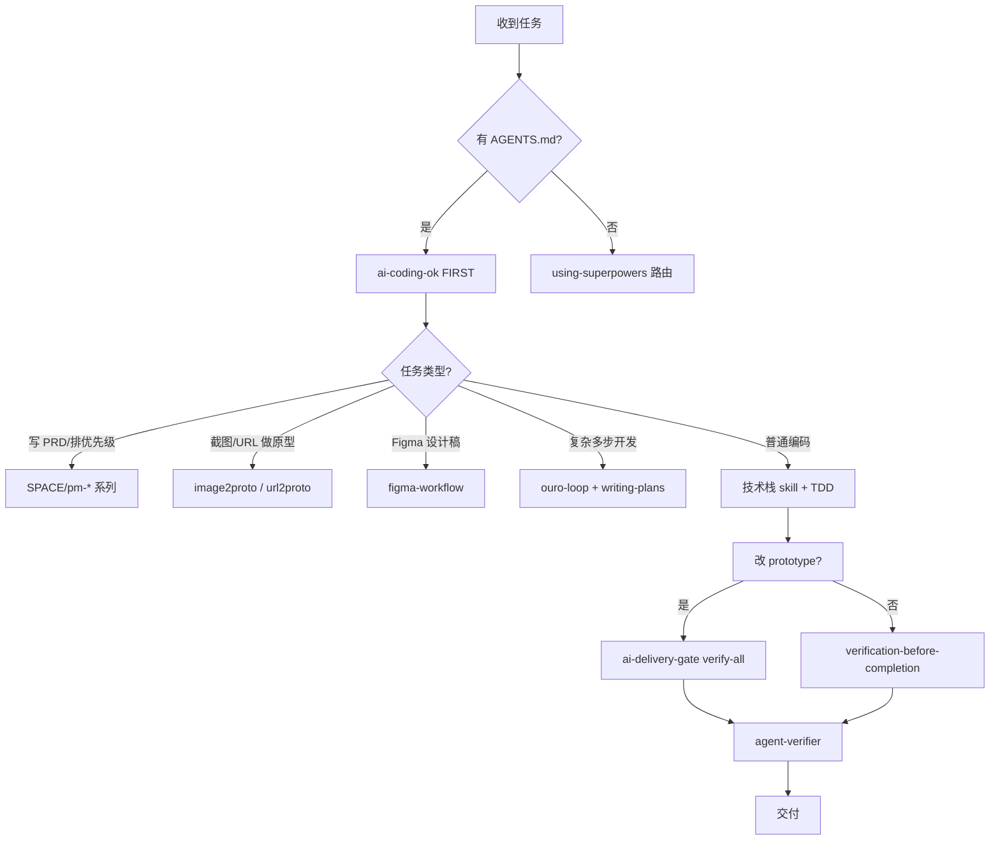
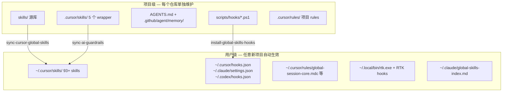

User: <user_query>
遍历和分析一下我所有的skills，梳理一下，并做出总结
</user_query>

Assistant: 正在遍历并分析你的 Skills 目录，先收集各路径下的 Skill 文件与结构。

[REDACTED]

Assistant: 正在提取各 Skill 的名称与描述，以便分类梳理。

[REDACTED]

Assistant: [REDACTED]

Assistant: 你的 Skills 体系已经相当完整。下面按**存储位置 → 功能域 → 重复关系 → 使用建议**做梳理。

---

## 一、总体概览

| 存储位置 | 规模 | 角色 |
|---------|------|------|
| `~/.cursor/skills-cursor/` | 14 个 | Cursor 官方 IDE 工具链 |
| `~/.claude/skills/` | ~91 个文件（约 70+ 独立 skill） | Claude 全局技能库（最全） |
| `~/.codex/skills/` | ~68 个文件 | Codex 全局技能库（偏 PM + 设计 + Superpowers） |
| `Agent Platform/.cursor/skills/` | **5 个** | **本项目专用**（当前 Cursor 会话实际加载） |
| `Agent Platform/skills/` | ~137 个文件 | 项目 vendor 仓库（toolkit、rtk、eins78 等） |

**结论**：你有一套「全局通用库 + 项目定制层 + vendor 备份库」的三层结构；Cursor 当前会话主要用 **项目层 5 个 + 全局库中匹配到的技能**。

---

## 二、按功能域分类

### 1. 项目治理层（Agent Platform 核心，优先级最高）

这 5 个在 `.cursor/skills/` 中，与 `AGENTS.md` 规则直接绑定：

| Skill | 作用 | 触发时机 |
|-------|------|----------|
| **ai-coding-ok** | PDCA 记忆循环：任务前读 memory，任务后写 task-history | **任何编码任务 FIRST** |
| **ai-delivery-gate** | 交付门禁：`verify-all.js` 五步全跑 | 改 `prototype/assets/*.js` 后、声称完成前 |
| **agent-verifier** | 交付前审计：安全/模式/质量/语言 | PR 前、用户要求 verify |
| **ouro-loop** | 复杂任务自治循环：MAP→PLAN→BUILD→VERIFY→REMEDIATE | 多步骤、需自修复的大任务 |
| **figma-workflow** | Figma ↔ HTML 双向工作流（读 `figma.config.json`） | 按设计稿实现 / 同步到 Figma |

**关系**：`ai-coding-ok` 管流程 → `ouro-loop` 管复杂执行 → `ai-delivery-gate` + `agent-verifier` 管验收 → `figma-workflow` 管设计链路。

---

### 2. 开发方法论层（Superpowers 系列，~15 个）

来自 `superpowers-main`，覆盖完整软件工程生命周期：

```
创意前 → brainstorming
规划   → writing-plans → executing-plans
隔离   → using-git-worktrees
实现   → test-driven-development / subagent-driven-development
并行   → dispatching-parallel-agents
调试   → systematic-debugging
审查   → requesting-code-review / receiving-code-review
收尾   → finishing-a-development-branch / verification-before-completion
元技能 → using-superpowers / writing-skills
```

**特点**：偏「怎么写代码、怎么协作」，不绑定具体技术栈；是通用工程纪律层。

---

### 3. 产品经理层（SPACE / pm-* 系列，~12 个）

中文产品工作流，覆盖 PM 全链路：

| 阶段 | Skills |
|------|--------|
| 需求 | `space-prd-writer` / `pm-prd-writer` |
| 评审 | `space-review-board`（六角色模拟评审会） |
| 优先级 | `space-prioritization-engine`（RICE/ICE/Kano） |
| 路线图 | `space-roadmap-planner` |
| 调研 | `space-survey-designer` |
| 数据 | `space-analytics` / `pm-analytics` |
| 实验 | `space-experiment-designer` |
| 埋点 | `tracking-spec-writer` / `pm-tracking-spec-writer` |
| 竞品/复盘 | `pm-competitor-deconstructor`、`pm-postmortem-writer` |

**特点**：输入模糊需求 → 输出结构化文档/报告；彼此有「不适用」边界（如 analytics 不做纯 SQL）。

---

### 4. 原型与设计层（~15 个）

| 类型 | Skills | 输入 → 输出 |
|------|--------|-------------|
| 截图→HTML | `space-image2proto`、`pm-image2proto` | 截图 → 可交互 HTML 原型 |
| URL→Next.js | `web-prototype`、`pm-url2proto`、`space-url2proto` | 网页链接 → Next.js + Tailwind 项目 |
| 截图→Pencil | `image2pencil`、`pm-image2pencil` | 截图 → .pen 设计稿 |
| Figma | `figma-workflow`、`figma-product-report` | 设计稿 ↔ 代码双向 |
| UI/UX 套件 | `ui-ux-pro-max` 等 7 个 | 设计系统、Banner、Slides、Brand 等 |
| 测试 | `webapp-testing` | Playwright 浏览器测试 |
| 文档 | `pptx` | PowerPoint 生成 |

---

### 5. 技术栈模式层（awesome-claude-code-toolkit，~40 个）

按领域分组：

- **语言**：TypeScript、Python、Go、Rust
- **框架**：React、Next.js、Django、Spring Boot
- **后端/API**：API 设计、GraphQL、微服务、认证
- **数据**：PostgreSQL、Redis、数据工程
- **DevOps**：Docker、K8s、CI/CD、AWS、监控
- **专项**：WebSocket、LLM 集成、MCP 开发、安全加固、无障碍 WCAG、性能优化

**特点**：百科全书式参考，按需加载，不做任务编排。

---

### 6. Cursor IDE 工具层（14 个，官方）

| Skill | 用途 |
|-------|------|
| `canvas` | 富交互 Canvas 输出（分析、图表、MCP 结果可视化） |
| `sdk` | Cursor SDK（`@cursor/sdk`）程序化调用 Agent |
| `loop` | 定时/循环执行 prompt |
| `babysit` | PR 评论 triage、CI 修复循环 |
| `split-to-prs` | 大改动拆成多个 PR |
| `create-skill/rule/hook/subagent` | 创建 Skill、Rule、Hook、子 Agent |
| `migrate-to-skills` | 旧 rules 迁移到 skills |
| `statusline` / `update-cursor-settings` / `update-cli-config` | IDE/CLI 配置 |
| `shell` | Shell 命令辅助 |

---

### 7. 跨设备协作层（VibeAround，4 个）

| Skill | 用途 |
|-------|------|
| `vibearound` | 会话移交到手机/IM |
| `va-session` | 解析 session ID |
| `va-preview` | 浏览器/手机实时预览 |
| `va-md-preview` | Markdown GitHub 风格预览 |

依赖 VibeAround MCP 连接。

---

### 8. 规划与上下文管理层

| Skill | 用途 |
|-------|------|
| `planning-with-files` | Manus 式文件规划（task_plan / findings / progress） |
| `savethetokens` | Token 消耗优化 |
| `claude-memory-kit` | 记忆管理 |
| `anysearch` | 搜索增强 |

`planning-with-files` 有 **10+ 平台副本**（zh/zht/de/es/ar + Cursor/Codex/Kiro 等），内容基本相同。

---

### 9. Vendor / 专项库（项目 `skills/` 目录）

| 来源 | 内容 |
|------|------|
| `skills/vendor/agent-verifier/` | 5 个子 verify skill（security/patterns/quality/language） |
| `skills/vendor/ai-coding-ok/` | ai-coding-ok 源包 |
| `skills/vendor/eins78-agent-skills/` | Chrome、tmux、pandoc、TTS 等个人效率工具 |
| `skills/rtk-develop/` | PR triage、Rust TDD、ship 等开发流程 |
| `skills/awesome-claude-code-toolkit-main/` | 与 Claude 全局库重复的技术栈 skills |

---

## 三、重复与冗余分析

### 高重复（建议关注）

| 重复组 | 出现位置 | 建议 |
|--------|----------|------|
| `space-*` ↔ `pm-*` | Claude + Codex | 同一 skill 两套命名，保留一套即可 |
| `ai-coding-ok` / `agent-verifier` / `ouro-loop` / `ai-delivery-gate` | 各 2 层嵌套目录 | 扁平化，只留一层 |
| `planning-with-files` | 10+ 平台目录 | 只保留 `planning-with-files-zh` + 英文主版 |
| `superpowers-*` | Claude + Codex + 项目 skills | 三处同源，以 Codex 的 `superpowers-main` 为准 |
| `ui-ux-pro-max` 7 件套 | Codex + 项目 skills | 两处相同 |
| `web-prototype` / `pm-url2proto` / `space-url2proto` | 三个名字，同一能力 | 统一命名 |
| `awesome-claude-code-toolkit` | Claude 全局 + 项目 vendor | vendor 作备份即可 |

### 当前 Cursor 实际生效范围

Cursor 会话里 `available_skills` 列表约 **60+ 条**，来自：
- 项目 `.cursor/skills/`（5 个，最高优先）
- 全局 `~/.cursor/skills-cursor/`（14 个）
- 全局 Claude/Codex 库中被 description 匹配到的技能

项目 vendor 目录 `skills/` 里的内容**不会自动加载**，需手动安装或 symlink 到 `.cursor/skills/`。

---

## 四、推荐使用路径（按场景）



| 你的典型工作 | 推荐 Skill 组合 |
|-------------|----------------|
| Agent Platform 原型开发 | `ai-coding-ok` → 编码 → `ai-delivery-gate` |
| 写运营平台 PRD（如你打开的 md） | `space-prd-writer` → `space-review-board` |
| Skills 配置需求文档 | `space-prd-writer` + 项目上下文 |
| 截图做页面 | `space-image2proto` 或项目 `figma-workflow` |
| 复杂功能多文件改动 | `ouro-loop` + `writing-plans` |
| PR 合并前 | `agent-verifier` + `babysit` |
| 手机继续会话 | `vibearound` |

---

## 五、总结

**优势**
1. **分层清晰**：项目治理（5 个）→ 方法论（Superpowers）→ 产品（SPACE）→ 技术（Toolkit）→ IDE 工具
2. **Agent Platform 有专属交付链**：`ai-coding-ok` + `ai-delivery-gate` + `verify-all` 与 ADR-003 导航门禁绑定
3. **PM 能力完整**：从 PRD → 评审 → 优先级 → 路线图 → 实验 → 埋点 → 数据分析
4. **设计与原型链路贯通**：Figma ↔ HTML ↔ Next.js ↔ Pencil

**待优化**
1. **重复较多**：同一 skill 在 2–3 处存放，`space-*` 与 `pm-*` 并存
2. **vendor 未激活**：`skills/` 下 137 个文件多数未 symlink 到 `.cursor/skills/`
3. **路由成本**：60+ skills 靠 description 匹配，可能误触发或漏触发
4. **`planning-with-files` 平台副本过多**：维护成本高

**核心 5 件套（Agent Platform 日常）**

```
ai-coding-ok → ouro-loop（复杂时）→ 领域 skill → ai-delivery-gate → agent-verifier
```

---

如果你希望下一步落地，我可以帮你做其中一项：
1. **去重清单**：列出可安全删除/合并的重复 skill
2. **激活 vendor**：把常用 vendor skills symlink 到 `.cursor/skills/`
3. **Skills 索引文档**：在项目里生成一份 `SKILLS-INDEX.md` 供团队查阅

你想先做哪一项？

[REDACTED]

User: <user_query>
为什么我感觉在我使用cursor、claude code和codex的时候，有的任务并没有用到推荐的话和更合适的skills呢？
</user_query>

Assistant: 这是个很常见的体感问题。我先对照你项目里的 Skills 配置与三端加载机制，找出「该用却没用上」的具体原因。

[REDACTED]

Assistant: [REDACTED]

Assistant: [REDACTED]

Assistant: [REDACTED]

Assistant: [REDACTED]

Assistant: [REDACTED]

Assistant: [REDACTED]

Assistant: [REDACTED]

Assistant: [REDACTED]

Assistant: 你的感觉是对的——**Skills 并不是「装了就会自动跑」**，三端机制不同，再叠加配置和路由设计，就会出现「明明有更合适的 skill，却没被用上」。

---

## 核心结论：Skills 是「软提示」，不是「硬绑定」

和你正在做的 **Agent Platform 产品里的 Skills**（在智能体配置页显式绑定、启停、授权）不同，Cursor / Claude Code / Codex 里的 Skills 本质是：

> 把 `name` + `description` 注入上下文 → 模型**自行判断**要不要 Read 全文 → **自行决定**是否遵守

全程没有编译器级别的强制调用，所以会有漏用、误用、或「看起来用了其实没 Read 全文」的情况。

---

## 三端机制差异（这是体感不一致的主因）

| 工具 | 实际机制 | 强制程度 |
|------|----------|----------|
| **Cursor** | 原生 discovery：只注入 description，按需 Read | **最弱** — 完全靠模型自觉 |
| **Claude Code** | `UserPromptSubmit` hook → `skill-matcher.ps1` | **中等偏弱** — 且你当前是旧版 hook |
| **Codex** | hook → `scan-global-skills.ps1`（全局扫描 + 绝对路径） | **相对最强** — 但仍可被模型忽略 |

项目文档 `skills-hooks-setup.md` 里写得很清楚：

```5:9:c:\Users\win\Desktop\Agent Platform\skills-hooks-setup.md
| **Cursor** | 原生 skill discovery（仅 `name`+`description` 注入，按需 Read 全文） | `~/.cursor/skills/` |
| **Claude Code** | 全局 Hooks + `~/.claude/CLAUDE.md` | `~/.claude/settings.json` |
| **Codex** | 全局 Hooks + `~/.codex/AGENTS.md` | `~/.codex/hooks.json` |
```

---

## 为什么「该用却没用」——6 个具体原因

### 1. Claude Code 还在用旧 hook，且只扫项目目录

你当前的 `~/.claude/settings.json` 指向的是 **`skill-matcher.ps1`**，它：

- 只扫描**当前工作目录下的 `skills/`**
- 不在 Agent Platform 项目里时 → **直接返回空**
- 只给 skill 名称和描述，**不给 `SKILL.md` 绝对路径**
- 文案是 “Consider invoking…” — 建议性，不是 “必须先 Read”

而 Codex 已配置 **`scan-global-skills.ps1`**，会扫 `~/.cursor/skills` 等全局目录，并注入 Top 8 + 绝对路径。

**结果**：同一任务在 Codex 里更容易命中 skill，在 Claude Code 里经常完全没提示。

---

### 2. Cursor 被刻意设计成「少加载、弱触发」

你的 `using-superpowers` skill 明确写了：

```10:27:C:\Users\win\.cursor\skills\using-superpowers\SKILL.md
Match the user request to skill **descriptions** in `~/.cursor/skills/`. Only **Read** the full `SKILL.md` when the task clearly fits (not on a vague 1% guess).
...
| No match | Proceed without skill files |

## When NOT to load
- Pure chit-chat, git status, or one-line factual questions
- Skill would duplicate what user rules already state
- Already loaded the same skill this session for the same task type
```

再加上 `disable-model-invocation: true`，以及「每轮最多 2–3 个 skill」的限制。

**结果**：像「改一下这个」「帮我看看」这类模糊 prompt，模型会合理跳过 skill；而 `AGENTS.md` / rules 里已有的 verify-all、PDCA 内容，也会让模型认为「不必再 Read ai-coding-ok 全文」——但**实际上可能漏掉 task-history 更新等细节步骤**。

---

### 3. 匹配算法是关键词打分，不是语义理解

`scan-global-skills.ps1` / `skill-matcher.ps1` 都是：

- 从 prompt 提取词
- 与 skill 的 name / description 做重叠打分
- 分数 ≥ 5 才入选 Top N

**容易漏匹配的例子**：

| 你的说法 | 可能该用的 skill | 为何漏掉 |
|---------|------------------|----------|
| 「帮我把运营文档整理一下」 | `space-prd-writer` | 没出现「PRD」「需求文档」 |
| 「改 prototype 导航」 | `ai-delivery-gate` | 没出现 verify-all / delivery 等词 |
| 「这个 bug 怎么回事」 | `systematic-debugging` | description 偏英文，中文 prompt 难命中 |

---

### 4. Skill 太多（~91 个），互相竞争

`~/.cursor/skills/` 里约有 91 个 skill，很多 description 重叠：

- `space-prd-writer` vs `SPACE-prd-writer`（同名不同路径）
- `web-prototype` vs `pm-url2proto` vs `space-url2proto`
- `tracking-spec-writer` 在 Claude 全局和 Codex 各有一份

Hook 只注入 Top 5–8，其余完全不可见；模型也可能选错或选不够具体的那个。

---

### 5. Rules 与 Skills 重复，导致「看起来做了、其实没走 skill 流程」

你的项目里：

- `AGENTS.md` + `.cursor/rules/` 已写 verify-all、PDCA、禁止 `__*Wired` 等
- `ai-coding-ok` / `ai-delivery-gate` 又写了一遍

按 `using-superpowers` 规则，模型会认为 **rules 已覆盖 → 跳过 Read skill 全文**。

**表现**：会跑 verify-all，但可能**不读 memory、不写 task-history**——你感觉「没用上推荐 workflow」，其实只用了 rules 的子集。

---

### 6. 模型本身对 instruction 的服从度不同

你的 Claude Code 当前走 DeepSeek 代理（`settings.json` 里配置了 `ANTHROPIC_BASE_URL` 指向本地网关）。第三方模型对 hook 注入的 “必须先 Read SKILL.md” 遵从度，通常**弱于**原生 Claude——即使 hook 注入了路径，也可能直接开干。

---

## 典型场景对照

| 场景 | 期望 | 实际常见行为 |
|------|------|--------------|
| 写 PRD / 运营文档 | `space-prd-writer` | 没关键词 → 直接写 markdown |
| 改 prototype JS | `ai-coding-ok` → `ai-delivery-gate` | 只遵守 rules 跑 verify，跳过 memory 循环 |
| 复杂多文件功能 | `ouro-loop` + `writing-plans` | 任务看起来「不够复杂」被跳过 |
| 声称 done | `verification-before-completion` | 简单任务被认为不需要 |
| Figma 相关 | `figma-workflow` | 没提「Figma」就不触发 |
| 分析类问题（如本次） | 一般不需要 skill | **正确行为** — 不应强行加载 |

---

## 怎么改善（按收益排序）

### 立即可做

**1. 统一 Claude Code hook 到全局版**

```powershell
cd "C:\Users\win\Desktop\Agent Platform"
powershell -NoProfile -ExecutionPolicy Bypass -File .\scripts\hooks\install-global-skills-hooks.ps1 -UseJunctionForClaudeSkills
```

装完后 Claude Code 也会用 `scan-global-skills.ps1`，和 Codex 一致。

**2. 在 prompt 里显式点名 skill（最可靠）**

```
用 space-prd-writer skill，把运营平台-智能体运营.md 整理成可评审 PRD
```

显式点名 > hook 匹配 > description 模糊匹配。

**3. 看 agent 是否声明了 Skills**

`using-superpowers` 要求用过 skill 时在回复开头写：`Skills: xxx`。  
若完全没有这行，大概率没 Read 全文。

---

### 中期优化

**4. 精简 skill 库到 20–30 个常用项**  
减少竞争和误匹配；把 toolkit 类 skill 按需启用，不必全挂全局。

**5. 强化高频 skill 的 description 触发词**  
例如在 `ai-coding-ok` 的 description 里加入：`prototype`、`proto.js`、`verify-all`、`task-history`。

**6. 把关键流程写进 Rules（硬约束），Skills 放详细步骤**  
你已经在做这件事（`AGENTS.md` + mandatory-verification-workflow）。  
Rules 比 Skills 更稳定；Skills 适合放长流程和模板。

---

### 长期（对齐你的产品 vision）

你在 `Skills配置需求说明.md` 里设计的 **「智能体配置页绑定 Skill + 临时启用」**，才是产品级的硬绑定。  
IDE 里的 Skills 是个人效率工具；**平台里的 Skills 才是「用了就必定注入」**——这两层不要混为一谈。

---

## 一句话总结

> **不是 skill 没装好，而是当前架构就是「建议性路由 + 三端不一致 + 故意少加载 + 关键词匹配有限」。**

要提高命中率：**显式点名 skill** > **修好 Claude hook** > **精简库** > **强化 description**。

如果你愿意，我可以下一步帮你：
1. 检查 Claude hook 是否已切到全局版并跑验证命令；
2. 列出「建议保留的 25 个核心 skill」去重清单；
3. 给 `ai-coding-ok` / `ai-delivery-gate` 写一版更强的触发 description。

[REDACTED]

User: <uploaded_documents>
The following documents have been saved to your filesystem. You can read them using your file-reading tool or other tools:
- C:\Users\win\.cursor\projects\c-Users-win-Desktop-Agent-Platform/uploads/rtk-0.md
</uploaded_documents>
<user_query>
1、重复的话就把你认为效果较差的给删掉吧
2、https://github.com/rtk-ai/rtk 这个skills我自己本地也有，还有其他本地有的skills，你好像并没有梳理出来，这个安装上其他的都统一起来
3、这三个工具的全局配置针对于skills的应用都应该加强和应用起来，而且有一些skills像这个节省token的，辅助模型完成任务的，这些应该是每次对话都应该应用上的，你看一下有合适的全局的都配置上，是3个工具都配置上
</user_query>

Assistant: 正在调研本地 RTK skills、重复项与三端全局配置，以便制定统一方案。

[REDACTED]

Assistant: [REDACTED]

Assistant: [REDACTED]

Assistant: [REDACTED]

Assistant: [REDACTED]

Assistant: [REDACTED]

Assistant: [REDACTED]

Assistant: [REDACTED]

Assistant: [REDACTED]

Assistant: [REDACTED]

User: <user_query>
Skills 去重、补全与三端全局强化

Implement the plan as specified, it is attached for your reference. Do NOT edit the plan file itself.

To-do's from the plan have already been created. Do not create them again. Mark them as in_progress as you work, starting with the first one. Don't stop until you have completed all the to-dos.
</user_query>

Assistant: 开始执行计划：先把第一个待办标为进行中，并扩展 `skills-sync.config.json`、清理嵌套重复目录。

[REDACTED]

Assistant: [REDACTED]

Assistant: [REDACTED]

Assistant: [REDACTED]

Assistant: [REDACTED]

Assistant: [REDACTED]

Assistant: [REDACTED]

Assistant: [REDACTED]

Assistant: [REDACTED]

Assistant: [REDACTED]

Assistant: [REDACTED]

Assistant: [REDACTED]

Assistant: settings.json 格式异常，正在修复并合并 RTK 与 skills 的 hooks。

[REDACTED]

Assistant: [REDACTED]

Assistant: [REDACTED]

Assistant: [REDACTED]

Assistant: [REDACTED]

Assistant: [REDACTED]

Assistant: [REDACTED]

Assistant: [REDACTED]

Assistant: [REDACTED]

Assistant: [REDACTED]

Assistant: Skills 全局统一计划已全部落地。摘要如下：

## Completed

**1. 去重**
- 删除 `~/.cursor/skills/` 下 4 个嵌套重复目录（`ai-coding-ok/ai-coding-ok` 等）
- 扩展 [`skills-sync.config.json`](scripts/hooks/skills-sync.config.json)：排除 34 个低质量/重复 skill（`tdd-mastery`、`space-*`、`verify-*`、macOS-only 等）
- 同步 prune：**93 个**保留，**17 个**从全局删除

**2. 补全遗漏 Skills**
- `skills/rtk/` — 12 个 RTK agent skills（`rtk-triage`、`pr-review`、`ship` 等）
- `skills/ui-ux/` — 7 个 UI/UX skills
- `skills/global-session-core/` — 每会话必生效核心 skill

**3. 三端统一 Hook**
- [`scan-global-skills.ps1`](scripts/hooks/scan-global-skills.ps1)：SessionStart 注入 `global-session-core`；UserPromptSubmit Top 8 匹配；支持 Cursor JSON 输出
- [`install-global-skills-hooks.ps1`](scripts/hooks/install-global-skills-hooks.ps1)：覆盖 Cursor + Claude + Codex；UTF-8 无 BOM；保留 RTK `PreToolUse`
- [`global-session-core.mdc`](.cursor/rules/global-session-core.mdc) 已纳入 `sync-ai-guardrails.ps1`

**4. RTK CLI**
- 安装 `rtk 0.42.0` → `%USERPROFILE%\.local\bin\rtk.exe`
- 已配置：Claude `PreToolUse`、Cursor `preToolUse`、Codex `RTK.md`

## Verified

| 检查项 | 结果 |
|--------|------|
| 全局 skill 数 | 93（sync-report） |
| SessionStart | 含 `global-session-core` 绝对路径 |
| PRD 匹配 | 命中 `SPACE-prd-writer` → `pm-prd-writer` |
| RTK | `rtk --version` → 0.42.0；`rtk init --show` → Claude + Cursor hooks OK |
| 关键 skill | `rtk-triage`、`ui-ux-pro-max`、`global-session-core` 均在 `~/.cursor/skills/` |

## Remaining Risks

1. **需重启会话**：Cursor / Claude Code / Codex 需重启后 hook 才生效。
2. **RTK Windows 限制**：原生 Windows 无 bash auto-rewrite；Shell 输出压缩依赖 `rtk hook cursor` / 手动 `rtk` 前缀。WSL 体验更完整。
3. **重装 hooks 顺序**：若再跑 `install-global-skills-hooks.ps1`，之后需执行 `rtk init -g --auto-patch` 确保 PreToolUse 不丢（脚本已加保留逻辑）。
4. **PATH**：将 `%USERPROFILE%\.local\bin` 加入系统 PATH，终端可直接用 `rtk` 命令。

## 日常使用

更新 skill 后：
```powershell
cd "C:\Users\win\Desktop\Agent Platform"
powershell -File .\scripts\hooks\sync-cursor-global-skills.ps1 -Force -Prune -AlsoClaude
```

完整说明见更新后的 [`skills-hooks-setup.md`](skills-hooks-setup.md)。

[REDACTED]

User: <user_query>Briefly inform the user about the task result and perform any follow-up actions (if needed). If there's no follow-ups needed, don't explicitly say that.</user_query>

Assistant: [REDACTED]

Assistant: 那条后台命令在安装 hooks 后、创建 `~/.claude/skills` 目录联接时卡住，约 200 秒后被强制终止（`exit_code: 4294967295`），因此 **`sync-ai-guardrails.ps1` 没有在同一轮里跑完**。

后续已单独补完：`sync-ai-guardrails.ps1 -Force`、RTK 安装与 init、修复 `settings.json` 的 UTF-8 BOM，以及 hook 脚本重新部署。当前三端 hooks、93 个全局 skills 和 RTK 配置都已就绪。

**建议你这边**：重启 Cursor / Claude Code / Codex 会话，让新 hooks 生效。若终端里还找不到 `rtk`，把 `%USERPROFILE%\.local\bin` 加到 PATH。

[REDACTED]

User: <user_query>
你觉得哪些skills是每次对话都用得上呢？有进行全局配置上吗？
</user_query>

Assistant: [REDACTED]

Assistant: ## 我的判断：哪些「每次对话都该有」

真正**每轮都适用**的，其实是三类「元能力」，而不是 93 个 domain skill：

| 能力 | 作用 | 是否每轮都需要 |
|------|------|----------------|
| **技能路由** | 按任务匹配并 Read 合适的 skill | 是 |
| **省 token 习惯** | 短更新、不贴长 log、不砍验证 | 是 |
| **完成前验证** | 声称 done 前要有命令输出证据 | 是（写代码/改原型时） |

下面这些是**条件触发**，不适合硬塞进每一轮：

| Skill | 何时才需要 |
|-------|------------|
| `ai-coding-ok` | 项目有 `AGENTS.md` / memory，且要写代码 |
| `ai-delivery-gate` | 改 prototype 并要交付 |
| `brainstorming` | 新功能/大改行为前 |
| `space-prd-writer` 等 PM skill | 写 PRD、排优先级等 |
| RTK 12 个 agent skill | PR review、triage、ship 等 |

另外 **RTK CLI**（不是 skill）适合每次有 shell 命令的对话，但它是 hook 压缩输出，不是 Read skill 全文。

---

## 已经做了哪些全局配置？

**有，且按你选的「精简版」做的**——没有把 93 个 skill 全塞进去，而是合并成一个 always-on 核心：

### 1. 已全局 always-on：`global-session-core`

合并了：
- `using-superpowers`（路由）
- `savethetokens` Lean Mode（习惯，不是完整 measurement 模式）
- `verification-before-completion`（完成前验证提醒）

配置位置：
- Skill：`~/.cursor/skills/global-session-core/SKILL.md`
- 配置项：[`skills-sync.config.json`](scripts/hooks/skills-sync.config.json) 里 `"alwaysOnSkills": ["global-session-core"]`
- **SessionStart hook**（三端）：无条件注入该 skill 的绝对路径，要求先 Read
- **Cursor Rule**：`global-session-core.mdc`（`alwaysApply: true`）双保险

### 2. 按需匹配（不是每轮全加载）

**UserPromptSubmit hook** 按关键词 Top 8 注入，例如写 PRD → `pm-prd-writer`。

### 3. RTK CLI（token 压缩，非 skill）

- Claude：`PreToolUse` → `rtk hook claude`
- Cursor：`preToolUse` → `rtk hook cursor`
- Codex：`RTK.md` + `AGENTS.md` 引用

---

## 还没做成「每轮强制 Read 全文」的

| 项 | 原因 |
|----|------|
| **`ai-coding-ok` 全文** | 你选了 lean；只在 `global-session-core` 里写了「有 AGENTS.md 时再读」 |
| **`savethetokens` 全文** | 原 skill 设计是「用户明确要求省 token 才用」；日常只注入了 Lean 摘要 |
| **其他 90+ domain skills** | 靠 hook 匹配 + 你 prompt 里点名，避免每轮 token 爆炸 |

---

## 一句话总结

> **已全局配置的是 1 个合并核心 `global-session-core` + RTK CLI hook；其余 skill 仍是「按需匹配」，没有也不应该全部每轮加载。**

若你希望加强，可以考虑二选一：
1. **把 `ai-coding-ok` 也加进 `alwaysOnSkills`**（在 Agent Platform 项目里更严，但每轮多耗 token）
2. **保持现状**，在 Agent Platform 里继续靠 `AGENTS.md` + rules 触发 PDCA

你更倾向哪种？

[REDACTED]

User: <user_query>
如果我新开一个项目，把skills文件挪过去，这些全局配置我怎么挪过去，又或者说我开一个新项目，哪些东西是可以复用的，整理一下便于迁移
</user_query>

Assistant: [REDACTED]

Assistant: 你的环境里，Skills 和全局配置其实是**两层**：用户级（跟机器走）和项目级（跟仓库走）。新开项目时，大部分**不用挪**，只需复制「工具链模板」并按需初始化项目专属内容。

---

## 一、两层架构（先理解这个）



**结论**：全局 hook、always-on、RTK 都在 `%USERPROFILE%` 下。新开项目、只把 `skills/` 拷过去，**三端全局能力仍然有效**，不必重装 hooks。

---

## 二、可直接复用（不用挪 / 自动跟着你）

这些在**同一台电脑、同一用户**下，对所有项目生效：

| 类别 | 路径 | 说明 |
|------|------|------|
| 全局 Skill 库 | `~/.cursor/skills/` | 93 个 skill，含 `global-session-core`、RTK、PM、ui-ux 等 |
| Claude 联接 | `~/.claude/skills` → `~/.cursor/skills` | 单源，不用 duplicate |
| Cursor hooks | `~/.cursor/hooks.json` | SessionStart + beforeSubmitPrompt + RTK |
| Claude hooks | `~/.claude/settings.json` | SessionStart + UserPromptSubmit + RTK PreToolUse |
| Codex hooks | `~/.codex/hooks.json` | 同上 |
| Hook 脚本 | `~/.claude/scripts/scan-global-skills.ps1` | 扫描 + always-on + 匹配 |
| Cursor rules（全局） | `~/.cursor/rules/global-session-core.mdc` 等 | alwaysApply |
| 全局说明 | `~/.claude/CLAUDE.md`、`~/.codex/AGENTS.md` | 工作流 + RTK 引用 |
| RTK CLI | `~/.local/bin/rtk.exe` | 命令压缩，非项目绑定 |
| Skill 索引 | `~/.claude/global-skills-index.md` | 自动生成 |

**新项目只要打开 Cursor/Claude/Codex，这些就已经在工作**（前提是已装过一遍，你这台机器已装好）。

---

## 三、建议拷到新项目的「工具链模板」

若新项目也要**维护/扩展** skill 库，或跑 sync 脚本，建议复制这一包：

```
新项目/
├── skills/                          # 整个目录或按需子集
│   ├── global-session-core/
│   ├── pm-*/ rtk/ ui-ux/ vendor/ …
├── scripts/
│   ├── hooks/
│   │   ├── install-global-skills-hooks.ps1
│   │   ├── sync-cursor-global-skills.ps1
│   │   ├── scan-global-skills.ps1
│   │   ├── scan-project-skills.ps1
│   │   └── skills-sync.config.json
│   └── sync-ai-guardrails.ps1       # 可选，见下文
├── skills-hooks-setup.md            # 操作文档
└── AGENTS.md                        # 可选：若要 PDCA 记忆循环
```

**最小拷贝**（只要能用全局 skill、不自己维护库）：

- 其实**什么都不用拷**——直接用 `~/.cursor/skills/` 即可。

**中等拷贝**（新项目偶尔加 custom skill）：

- `skills/` 里你需要的子目录 + `scripts/hooks/` 三件套（sync / install / config）

---

## 四、按项目类型：拷什么、不拷什么

### A. 通用新项目（非 Agent Platform）

| 复制 | 不复制 |
|------|--------|
| `skills/` 里通用 skill（pm-*、rtk、ui-ux、superpowers 等） | `prototype/`、`figma-workflow` |
| `skills/global-session-core/` | `.github/agent/memory/task-history.md`（历史） |
| `scripts/hooks/`（若要 sync） | `ai-delivery-gate` 里 verify-all 硬编码（除非也有 prototype） |
| 自建 `AGENTS.md`（精简版即可） | Agent Platform 专属 postmortem / ADR-003 细节 |

### B. 另一个 Agent Platform 类项目（也要 prototype + 交付门禁）

在 A 基础上再加：

| 复制 | 说明 |
|------|------|
| `AGENTS.md` | 改项目名/路径 |
| `.github/agent/memory/` | **新建** memory，勿整份拷贝 `task-history` |
| `.cursor/skills/` 5 个 wrapper | ai-coding-ok、ai-delivery-gate、agent-verifier、ouro-loop、figma-workflow |
| `.cursor/rules/` 4 个 mdc | 含 mandatory-verification-workflow |
| `scripts/sync-ai-guardrails.ps1` | 同步 delivery skills 到全局 |
| `prototype/scripts/verify-all.js` | 若仍用同一交付门禁 |

### C. 只拷几个 skill 文件

- 拷到 **`新项目/skills/xxx/SKILL.md`**
- 在新项目根目录执行：

```powershell
cd "新项目路径"
powershell -File .\scripts\hooks\sync-cursor-global-skills.ps1 -Force
```

会把该项目 `skills/` + `.cursor/skills/` 合并进 **`~/.cursor/skills/`**（全局），所有项目共享，不是「只给新项目」。

若只想**项目私有** skill、不进全局：当前架构**没有**独立项目 skill 池；要么改 `skills-sync.config.json` 排除，要么用项目内 `.cursor/skills/` 且**不跑 sync**（仅 Cursor 项目 discovery 会读）。

---

## 五、新机器 / 新用户：完整迁移清单

换电脑或新 Windows 用户时，按顺序做：

```powershell
# 1. 复制项目仓库（含 skills/ + scripts/hooks/）

# 2. 安装全局 hooks（只需一次）
cd "新项目路径"
powershell -ExecutionPolicy Bypass -File .\scripts\hooks\install-global-skills-hooks.ps1 -UseJunctionForClaudeSkills -SkipSync

# 3. 同步 skill 库到 ~/.cursor/skills
powershell -File .\scripts\hooks\sync-cursor-global-skills.ps1 -Force -Prune -AlsoClaude

# 4. 若有 AGENTS.md + delivery 护栏
powershell -File .\scripts\sync-ai-guardrails.ps1 -Force

# 5. RTK（可选）
# 下载 rtk.exe → %USERPROFILE%\.local\bin
rtk init -g --auto-patch
rtk init -g --agent cursor --auto-patch
rtk init -g --codex

# 6. 验证
powershell -File "$env:USERPROFILE\.claude\scripts\scan-global-skills.ps1" -HookEvent SessionStart -OutputFormat Plain
```

**还可手动打包用户目录**（整机迁移）：

| 打包 | 路径 |
|------|------|
| Skill 库 | `%USERPROFILE%\.cursor\skills\` |
| Hook 脚本 | `%USERPROFILE%\.claude\scripts\` |
| 配置 | `%USERPROFILE%\.cursor\hooks.json`、`.cursor\hooks\` |
| | `%USERPROFILE%\.claude\settings.json`、`CLAUDE.md`、`RTK.md` |
| | `%USERPROFILE%\.codex\hooks.json`、`AGENTS.md`、`RTK.md` |
| Rules | `%USERPROFILE%\.cursor\rules\` |
| RTK | `%USERPROFILE%\.local\bin\rtk.exe` |

---

## 六、常见误区

| 误区 | 实际情况 |
|------|----------|
| 「把 skills 挪到新项目，全局配置也要挪」 | **不用**。全局在 `~/.cursor/skills` + hooks，跟项目路径无关 |
| 「每个项目一套独立 global skills」 | 当前设计是**单全局库**；多项目共享，sync 会 merge/prune |
| 「拷 AGENTS.md 就等于拷 memory」 | memory 在 `.github/agent/memory/`，应**新建**而非复制历史 |
| 「只拷 SKILL.md 就够」 | 还要 `scripts/hooks/` 才能 sync；always-on 依赖 `global-session-core` + hooks |
| 「换项目要重装 RTK」 | RTK 在用户级；新项目打开即可，除非换机器 |

---

## 七、推荐迁移策略（实用）

| 场景 | 做法 |
|------|------|
| **同机新开项目，继续用现有 93 个 skill** | 什么都不拷；可选拷 `AGENTS.md` |
| **同机新项目，要带 custom skill** | 新项目建 `skills/my-skill/`，跑 `sync-cursor-global-skills.ps1 -Force` |
| **同机新项目，Agent Platform 同款护栏** | 拷 `scripts/` + `.cursor/` + `AGENTS.md` + 空 memory 模板 |
| **换电脑** | 拷仓库 + 用户目录打包表 + 跑 install 三步 |
| **只想 PM/RTK skill，不要 prototype 门禁** | 只拷 `skills/` 子集 + `skills-sync.config.json`，**不要**拷 `ai-delivery-gate` wrapper |

---

**一句话**：全局配置在**用户目录**，跟项目走；项目里只需维护 **`skills/` 源库 + `scripts/hooks/` 脚本**（以及可选的 `AGENTS.md` / `.cursor/` 护栏）。新开项目通常**不用挪全局**，拷工具链模板 + 按需初始化 memory 即可。

如果你愿意，我可以按你的下一个项目类型（纯文档 / 全栈 / 另一个 prototype）出一份**最小文件清单**（精确到要拷哪些文件夹）。

[REDACTED]

User: <user_query>
有没有什么办法不用迁移，整个做项目过程中的skills、记忆、全局配置都配置到全局上，以后就算新开过去的经验也都能沉淀下来，类似长期记忆加全局配置，应用在cc、codex和cursor，不能新开一个项目很多东西的工作流程就全都在设置一遍
</user_query>

Assistant: 先梳理当前全局与用户级配置的边界，再给出「一次配置、跨项目复用」的可行方案。

[REDACTED]

Assistant: [REDACTED]

Assistant: [REDACTED]

Assistant: 用户希望以便捷为主；我推荐「全局主记忆 + 项目薄层」，兼顾零配置与团队协作。

[REDACTED]

User: <user_query>
全局 AI 工作区（零迁移、跨项目沉淀）

Implement the plan as specified, it is attached for your reference. Do NOT edit the plan file itself.

To-do's from the plan have already been created. Do not create them again. Mark them as in_progress as you work, starting with the first one. Don't stop until you have completed all the to-dos.
</user_query>

Assistant: 开始实施「全局 AI 工作区」计划，先从全局记忆 Hub 着手。

[REDACTED]

Assistant: [REDACTED]

Assistant: 正在创建全局工作区模板与核心脚本。

[REDACTED]

Assistant: [REDACTED]

Assistant: [REDACTED]

User: If the available MCP tools do not fully support what the user asked you to do, complete the work you can with the current tool set. In your work summary, include what you were unable to do with MCP and why. Do not use browser automation to work around missing or unavailable MCP tools unless the user explicitly asks you to use the browser.

User: <user_query>
全局 AI 工作区（零迁移、跨项目沉淀）

Implement the plan as specified, it is attached for your reference. Do NOT edit the plan file itself.

To-do's from the plan have already been created. Do not create them again. Mark them as in_progress as you work, starting with the first one. Don't stop until you have completed all the to-dos.
</user_query>

Assistant: [REDACTED]

Assistant: [REDACTED]

Assistant: [REDACTED]

Assistant: [REDACTED]

Assistant: [REDACTED]

Assistant: [REDACTED]

Assistant: [REDACTED]

Assistant: 正在更新 hook 安装脚本、规则与文档，随后运行全局工作区安装。

[REDACTED]

Assistant: [REDACTED]

Assistant: [REDACTED]

Assistant: [REDACTED]

Assistant: [REDACTED]

Assistant: [REDACTED]

Assistant: [REDACTED]

Assistant: [REDACTED]

Assistant: [REDACTED]

Assistant: [REDACTED]

Assistant: [REDACTED]

Assistant: [REDACTED]

Assistant: [REDACTED]

Assistant: [REDACTED]

Assistant: [REDACTED]

Assistant: [REDACTED]

Assistant: [REDACTED]

Assistant: [REDACTED]

Assistant: [REDACTED]

Assistant: [REDACTED]

Assistant: [REDACTED]

Assistant: [REDACTED]

Assistant: [REDACTED]

Assistant: 全局 AI 工作区计划已全部落地。新项目默认零配置即可继承 Skills、Hooks、PDCA 记忆与动态交付门禁。

## Completed

**1. 全局记忆 Hub**（`~/.ai-workspace/memory/`）
- `user-memory.md`、`global-task-history.md`、`global-decisions-log.md`、`projects-registry.md`
- 模板源：`scripts/global-workspace/templates/memory/`

**2. SessionStart 记忆注入**
- `scan-global-skills.ps1` 在 SessionStart 输出全局 memory 路径 + 可选项目 overlay
- Hook 路径指向 `~/.ai-workspace/scripts/scan-global-skills.ps1`

**3. ai-coding-ok 全局优先**
- `.cursor/skills/ai-coding-ok/SKILL.md`：Mode B/C 先读全局 memory，再读项目 overlay

**4. 全局 AGENTS 入口**
- `~/.claude/AGENTS.md`（来自 `AGENTS.global.md`）
- `~/.claude/CLAUDE.md`、`~/.codex/AGENTS.md` 已更新引用
- 本仓库 `AGENTS.md` 保留为 **项目 override**（含 prototype 门禁说明）

**5. 工具链迁移 + 一键安装**
- `scripts/global-workspace/install-global-workspace.ps1` — 装 memory、scripts、hooks、rules、AGENTS
- `init-project-memory.ps1` — 可选团队薄层
- `sync-from-repo.ps1` — 从 Agent Platform 刷新全局 scripts

**6. 动态交付门禁**
- `skills/global-delivery-gate/SKILL.md` + 已同步到 `~/.cursor/skills/`
- `global-session-core` 引用 `global-delivery-gate`，不再硬编码仅 prototype

**7. 文档**
- `skills-hooks-setup.md` 新增「全局 AI 工作区」章节

## Verified

```text
install-global-workspace.ps1 -SkipSkillsSync → memory + hooks + rules OK
sync-cursor-global-skills.ps1 -Force → 159 skills synced
SessionStart smoke → global memory paths + project overlay + global-delivery-gate
```

## 使用方式

```powershell
# 首次 / 升级（任意目录）
powershell -File "$env:USERPROFILE\.ai-workspace\scripts\install-global-workspace.ps1"

# 或从仓库跑（会同步 skills，约 10s）
powershell -File "C:\Users\win\Desktop\Agent Platform\scripts\global-workspace\install-global-workspace.ps1"

# 可选：团队仓库薄层
powershell -File "$env:USERPROFILE\.ai-workspace\scripts\init-project-memory.ps1" -ProjectName "MyApp"
```

## Remaining Risks

- **Skills 同步耗时**：完整 install 含 `sync-cursor-global-skills` 可能较慢；若 junction 已存在，可用 `-SkipSkillsSync` 后单独 sync。
- **RTK PreToolUse**：重装 hooks 后建议再跑 `rtk init -g --auto-patch`，避免 PreToolUse 被覆盖。
- **跨机器**：`~/.ai-workspace/` 建议放入 private dotfiles；skills 体积大，仍从 Agent Platform 拉取。
- **本任务未改 prototype**：`verify-all.js` 未运行（本次为 infra，非 prototype 交付）。

请 **重启 Cursor / Claude Code / Codex** 会话以使新 hooks 生效。

[REDACTED]

User: <user_query>Briefly inform the user about the task result and perform any follow-up actions (if needed). If there's no follow-ups needed, don't explicitly say that.</user_query>

Assistant: 后台那次 `install-global-workspace.ps1` 安装**没有正常跑完**（进程被终止，exit code 4294967295），卡在 junction / skills 同步阶段。

后续已处理并完成部署：

1. **修复**：junction 已存在时不再重复创建；PowerShell 5 的 `utf8NoBOM` 写入问题已修复  
2. **重装成功**：`install-global-workspace.ps1 -SkipSkillsSync` 已通过  
3. **Skills 单独同步**：159 个 skills（含 `global-delivery-gate`）  
4. **SessionStart 冒烟**：全局 memory 路径与项目 overlay 注入正常  

全局工作区已可用。若需完整重装（含 skills 同步），可再执行：

```powershell
powershell -File "C:\Users\win\Desktop\Agent Platform\scripts\global-workspace\install-global-workspace.ps1"
```

[REDACTED]

User: <user_query>
你就直接给他应用了吧，后续再开新项目后，整体的思路、工作方式等能够沉淀下来的都记录下来，跟随全局配置
</user_query>

Assistant: 正在完整应用全局工作区，并把「跨项目沉淀工作方式」写入全局记忆配置。

[REDACTED]

Assistant: [REDACTED]

Assistant: 已直接跑完全局安装（memory、hooks、159 个 skills、rules、AGENTS 均已同步），并更新了 `~/.ai-workspace/memory/user-memory.md`，写明你的意图：**新开项目零配置，可复用的思路、工作方式、踩坑都写入全局 memory，随 SessionStart 自动加载。**

**以后新开项目时：**

| 沉淀内容 | 写入位置 | 是否随全局走 |
|---------|---------|-------------|
| 工作方式、验证习惯、工具链踩坑 | `user-memory.md` / `global-decisions-log.md` | ✅ 自动 |
| 每次任务摘要 | `global-task-history.md`（带 `[project: …]`） | ✅ 自动 |
| 仅某仓库团队共享的事实 | 可选 `init-project-memory.ps1` 建薄层 | 仅该 repo |

Agent 每次完成编码任务会按 `ai-coding-ok` Mode C 追加 global-task-history；跨项目可复用的经验会进全局 memory，不会丢在新项目里。

**重启 Cursor / Claude Code / Codex 会话**后 hook 即生效。若 Codex 提示重新信任 hooks，点确认即可。

[REDACTED]
