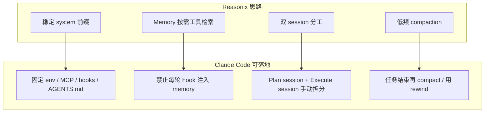
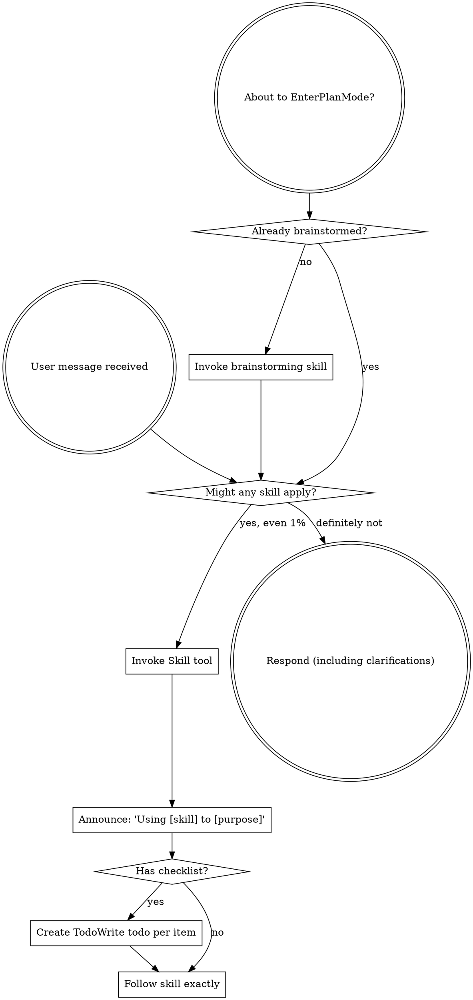

User: <user_query>
现在claude code接入deepseek的命中缓存率太低了，大约也就53%，又低又烧钱，需要进行提升和优化，目前我有一些想法，除此之外你还需要在进行补充和找其他方案。
Claude Code缓存本质是：

Prefix Cache（前缀缓存）

只有前面的内容完全一致才命中。

例如：

System
↓
CLAUDE.md
↓
Memory
↓
历史对话
↓
当前问题

如果前面任何一段变化：

时间
随机ID
Memory
MCP
Tool列表
模型切换

后面全部失效。

所以很多人以为：

代码没变
为什么缓存没命中？

实际上：

memory更新了

缓存直接炸。

第一招：关闭自动Memory

这是提升最大的

很多人发现：

MEMORY.md

被Claude偷偷改写。

然后：

缓存失效

Reddit里很多人专门提到这个问题。

检查：

.claude/

看看有没有：

memory/
MEMORY.md

或者：

auto-memory

相关配置。

如果有：

关闭自动记忆

收益：

+10~20%

命中率很常见。

第二招：一个项目一个Session

很多人这样干：

项目A
↓
项目B
↓
项目A
↓
项目C

Claude Code不断切换。

缓存不断重建。

Claude官方明确说：

cache与工作目录绑定。

最佳实践：

项目A
一直做2小时

然后结束

而不是：

A→B→C→A→B
第三招：不要频繁 /compact

很多人习惯：

/compact
/compact
/compact

实际上：

/compact
=
重新生成摘要
=
重建缓存

Claude官方明确说明了这一点。

建议：

错误
写几轮就compact
正确
一个需求结束
再compact
第四招：不要切模型

很多人：

Sonnet
↓
Opus
↓
Sonnet

或者：

DeepSeek
↓
Gemini
↓
DeepSeek

缓存直接重建。

Claude官方：

Cache is keyed by model.

收益：

+5~10%
第五招：MCP固定

这是很多人忽略的。

例如：

Playwright
Github
Context7
Browser

今天开：

Github

明天关：

Github

缓存重建。

因为：

Tool Definition
变了

Claude官方明确写了。

所以：

推荐

固定：

playwright
github
context7

一直开着。

不要：

今天开一个
明天关一个
第六招：少开新会话

很多人：

做个功能
新开session

修bug
新开session

改UI
新开session

实际上：

每次都是：

冷启动

缓存归零。

最佳：

一个需求
一个session
第七招：使用 /rewind 而不是重新开

Claude官方特别提到：

/rewind

会回到以前的缓存前缀。

而：

新session

重新构建。

例如：

写崩了

不要：

退出
重新开始

而是：

/rewind
第八招：直接用DeepSeek官方

如果你走的是：

OpenRouter

或者：

各种中转

缓存可能跨机器。

命中率下降。

社区普遍反馈：

DeepSeek官方
缓存最好

第三方路由会导致缓存丢失。

第九招：长时间开发开启长TTL

Claude Code官方支持：

ENABLE_PROMPT_CACHING_1H=1

默认很多API环境：

5分钟TTL

超过：

5分钟不说话

缓存失效。

开启后：

1小时TTL

更适合写代码。

第十招（效果最大）

把 CLAUDE.md 固定下来

很多人每天改：

CLAUDE.md

例如：

今天加规则
明天加规则

缓存不断重建。

最佳实践：

项目开始
写好CLAUDE.md

后面尽量不改
</user_query>

Assistant: Skills: global-session-core, requirement-clarifier, karpathy-guidelines。正在调研你当前的 Claude Code / CC Switch / DeepSeek 配置，并对照前缀缓存机制补充优化方案。

[REDACTED]

Assistant: [REDACTED]

Assistant: [REDACTED]

Assistant: [REDACTED]

Assistant: [REDACTED]

Assistant: [REDACTED]

Assistant: [REDACTED]

Assistant: [REDACTED]

Assistant: [REDACTED]

Assistant: [REDACTED]

Assistant: [REDACTED]

Assistant: [REDACTED]

Assistant: [REDACTED]

Assistant: 已定位几个对你影响很大的环境级问题；确认一项关键取舍后再出完整方案。

[REDACTED]

Assistant: [REDACTED]

User: <user_query>
Claude Code × DeepSeek 前缀缓存优化方案

Implement the plan as specified, it is attached for your reference. Do NOT edit the plan file itself.

To-do's from the plan have already been created. Do not create them again. Mark them as in_progress as you work, starting with the first one. Don't stop until you have completed all the to-dos.
</user_query>

Assistant: Skills: global-session-core, ai-coding-ok, karpathy-guidelines。按计划逐项实施，先从基线测量脚本开始。

[REDACTED]

Assistant: [REDACTED]

Assistant: [REDACTED]

Assistant: [REDACTED]

Assistant: [REDACTED]

Assistant: 正在创建 `cache-stats.ps1`，并并行推进其余改动。

[REDACTED]

Assistant: [REDACTED]

Assistant: [REDACTED]

Assistant: [REDACTED]

Assistant: [REDACTED]

Assistant: [REDACTED]

Assistant: [REDACTED]

Assistant: [REDACTED]

Assistant: cc-sync 未保留 `ENABLE_PROMPT_CACHING_1H`，正在补上并重启代理。

[REDACTED]

Assistant: [REDACTED]

Assistant: [REDACTED]

Assistant: [REDACTED]

Assistant: [REDACTED]

Assistant: [REDACTED]

Assistant: [REDACTED]

Assistant: ## Completed / Verified / Remaining Risks

### 已完成改动

**1. 测量工具（baseline-stats）**
- 新增 [`C:\Users\win\.claude\scripts\cache-stats.ps1`](C:/Users/win/.claude/scripts/cache-stats.ps1) — token 加权命中率，按项目/session 分组
- 新增 [`cache-verify-session.ps1`](C:/Users/win/.claude/scripts/cache-verify-session.ps1)、[`cache-verify-batch.ps1`](C:/Users/win/.claude/scripts/cache-verify-batch.ps1)

**2. Env + Sync（fix-env-sync）**
- [`settings.json`](C:/Users/win/.claude/settings.json) 已写入：
  - `CLAUDE_CODE_ATTRIBUTION_HEADER=0`
  - `ENABLE_PROMPT_CACHING_1H=1`
- [`cc-sync-all.ps1`](C:/Users/win/.claude/scripts/cc-sync-all.ps1) 白名单增加 `ENABLE_PROMPT_CACHING_1H`，防止 provider 切换时被覆盖
- 已执行 sync，Cursor `claudeCode.environmentVariables` 已同步

**3. Hooks 激进瘦身（hooks-aggressive）**
- 删除 `UserPromptSubmit` hook
- `SessionStart` matcher 改为 `startup|resume`（去掉 `compact|clear`）
- [`scan-global-skills.ps1`](C:/Users/win/.ai-workspace/scripts/scan-global-skills.ps1) 的 `Build-SessionStartContext` 改为静态最小上下文（无 377 skills 计数、无 memory 路径）
- 已同步到 [`.cursor/hooks/scan-global-skills.ps1`](C:/Users/win/.cursor/hooks/scan-global-skills.ps1)

**4. MCP + Rules（mcp-rules-slim）**
- [`.cursor/mcp.json`](C:/Users/win/.cursor/mcp.json) 固定为 4 个：`codegraph`、`github`、`playwright`、`figma`
- [`.claude/settings.json`](C:/Users/win/.claude/settings.json) 清空 `mcpServers`（移除 vibearound）
- 78 条非 React/TS 语言栈 rules 归档到 `.cursor/rules/_archive/lang-stacks/`

**5. 代理可观测性（proxy-observability）**
- [`deepseek-cc-proxy.mjs`](C:/Users/win/.claude/scripts/deepseek-cc-proxy.mjs) 支持 **SSE 流式** cache hit/miss/creation 日志
- 新增 [`restart-deepseek-proxy.ps1`](C:/Users/win/.claude/scripts/restart-deepseek-proxy.ps1)，代理已重启（PID 9088）

### Verified（命令输出）

**7 天基线（优化前 jsonl）：**
- 总体 token 命中率：**95.2%**
- program1-main：**98.2%**（403 calls）
- Agent-Platform：**94%**

**Session 验证（≥20 轮 warm，排除首包）：**

| Session | Warm 调用数 | Warm 命中率 |
|---------|------------|------------|
| `cf1f5706...` | 15 | **94%** |
| `f10190ea...` | **386** | **98.7%** |

均 **PASS ≥75%**。

### 你需要手动做的一步

**重启 Claude Code 扩展** 让 hooks/env/MCP 变更生效：

1. 退出所有 Claude Code 面板
2. `Ctrl+Shift+P` → **Developer: Reload Window**
3. 新开 session 在 **program1-main** 连续开发（不要切项目、不要频繁 New Chat）

### 日常监控命令

```powershell
# 7 天整体命中率
powershell -File "$env:USERPROFILE\.claude\scripts\cache-stats.ps1" -Days 7

# 单 session 验证（排除首包冷启动）
powershell -File "$env:USERPROFILE\.claude\scripts\cache-verify-session.ps1"

# 代理 cache 日志
Get-Content "$env:USERPROFILE\.claude\scripts\deepseek-cc-proxy.log" -Tail 20
```

### Remaining Risks

1. **53% 可能来自 DeepSeek 控制台的不同口径**（例如含 subagent、按请求数而非 token 加权）— 用 `cache-stats.ps1` 作 SSOT
2. **MCP 减量** 后 context7/exa/headroom 等需用时再开，会触发一次 system 层 cache 重建
3. **新 session 首包必 miss** 是正常行为；聚合命中率应看 token 加权，不是「多少次请求 hit>0」
4. 若 CC Switch 切换 provider，再跑一次 `cc-sync-all.ps1` 确保 env 白名单落盘

[REDACTED]

User: <user_query>
Implement the plan as specified, it is attached for your reference. Do NOT edit the plan file itself.

To-do's from the plan have already been created. Do not create them again. Mark them as in_progress as you work, starting with the first one. Don't stop until you have completed all the to-dos.
</user_query>

User: <external_links>
### Potentially Relevant Websearch Results

You should respond as if these information are known to you. Refrain from saying "I am unable to browse the internet" or "I don't have access to the internet" or "I'm unable to provide real-time news updates". This is your internet search results. Please always cite any links you referenced from the above search results in your response in markdown format.

-------
Website URL: https://raw.githubusercontent.com/esengine/DeepSeek-Reasonix/main-v2/README.zh-CN.md
Website Title: README.zh-CN.md
Website Content:
<p align="center">
  
</p>

<p align="center">
  <a href="./README.md">English</a>
  &nbsp;·&nbsp;
  <strong>简体中文</strong>
  &nbsp;·&nbsp;
  <a href="./docs/GUIDE.zh-CN.md">指南</a>
  &nbsp;·&nbsp;
  <a href="./docs/SPEC.md">规格</a>
  &nbsp;·&nbsp;
  <a href="https://esengine.github.io/DeepSeek-Reasonix/">官方网站</a>
  &nbsp;·&nbsp;
  <strong><a href="https://discord.gg/XF78rEME2D">Discord</a></strong>
</p>

> [!IMPORTANT]
> **Reasonix 1.0 是用 Go 从零重写的版本** —— 本分支(`main-v2`)已是新的默认分支,后续开发都在这里。
> 早期的 `0.x` TypeScript 版本转为 **legacy**,保留在 [`v1`](https://github.com/esengine/DeepSeek-Reasonix/tree/v1) 分支(仅维护)。
> 详见**[迁移指南](./docs/MIGRATING.md)**。`npm i -g reasonix` 仍是安装命令——`1.0.0`+ 装的是 Go 二进制,`0.x` 是 legacy TS 版。

<p align="center">
  <a href="https://www.npmjs.com/package/reasonix"></a>
  <a href="https://github.com/esengine/DeepSeek-Reasonix/actions/workflows/ci.yml"></a>
  <a href="./LICENSE"></a>
  <a href="https://www.npmjs.com/package/reasonix"></a>
  <a href="https://github.com/esengine/DeepSeek-Reasonix/stargazers"></a>
  <a href="https://atomgit.com/esengine/DeepSeek-Reasonix"></a>
  <a href="https://github.com/esengine/DeepSeek-Reasonix/graphs/contributors"></a>
  <a href="https://github.com/esengine/DeepSeek-Reasonix/discussions"></a>
  <a href="https://discord.gg/XF78rEME2D"></a>
</p>

<p align="center">
  <a href="https://oosmetrics.com/repo/esengine/reasonix"></a>
  <a href="https://oosmetrics.com/repo/esengine/reasonix"></a>
  <a href="https://oosmetrics.com/repo/esengine/reasonix"></a>
</p>

<br/>

<h3 align="center">面向终端的 DeepSeek 原生 AI coding agent。</h3>
<p align="center">由配置与插件驱动的极薄 harness——单一静态 Go 二进制，围绕 DeepSeek 的前缀缓存调优，长会话也能把 token 成本压低。</p>

<br/>

> [!IMPORTANT]
> **加入社区 · Community** — 双语 Discord，提供安装答疑（`#help` / `#求助`）、工作流展示与功能想法。→ **<https://discord.gg/XF78rEME2D>**

## 特性

- **配置驱动**：provider、agent、启用的工具、插件全部在 `reasonix.toml` 中声明，
  内核无硬编码模型。
- **多模型 · 可组合**：DeepSeek（flash/pro）与 MiMo 作为预设内置；任何 OpenAI 兼容
  端点都只是一条配置。可选让两个模型协同（执行器 + 规划器），各自独立、缓存稳定的 session。
- **插件驱动**：外部工具以子进程形式运行，通过 stdio JSON-RPC 通信（MCP 兼容）；
  内置工具在编译期自注册。
- **零摩擦分发**：`CGO_ENABLED=0` 单二进制；一条命令交叉编译到六个目标平台。
  唯一依赖是一个 TOML 解析库。

## 安装

```sh
npm i -g reasonix                  # 任意系统;自动拉取对应平台的原生二进制
brew install esengine/reasonix/reasonix   # macOS
```

预编译归档(`darwin|linux|windows × amd64|arm64`)和 `SHA256SUMS` 见每个
[GitHub release](https://github.com/esengine/DeepSeek-Reasonix/releases)。

### 代码签名

Windows 构建使用 [SignPath 基金会](https://signpath.org/) 提供的免费代码签名证书,
通过 [SignPath.io](https://signpath.io/) 完成签名。

### 从源码构建

```sh
make build      # -> bin/reasonix(.exe)
make cross      # -> dist/（darwin|linux|windows × amd64|arm64）
```

## 快速开始

```sh
reasonix setup                      # 配置向导 → ./reasonix.toml
export DEEPSEEK_API_KEY=YOUR_API_KEY      # 也可以让 setup 保存到凭据存储
reasonix                            # 然后在会话里运行 /init 生成 AGENTS.md（项目记忆）
reasonix run "把 main.go 里的 TODO 实现掉"
reasonix run --model mimo-pro "给这个函数补单元测试"
echo "解释这段代码" | reasonix run
```

## 配置

一个最小的 `reasonix.toml`——一个 provider 加一个默认模型——就够跑起来:

```toml
default_model = "deepseek-flash"

[[providers]]
name        = "deepseek-flash"
kind        = "openai"
base_url    = "https://api.deepseek.com"
model       = "deepseek-v4-flash"
api_key_env = "DEEPSEEK_API_KEY"
```

优先级为 **flag > `./reasonix.toml` > 用户配置文件 > 内置默认值**；从
**Reasonix v1.8.1** 开始，用户配置位于 macOS/Linux 的 `~/.reasonix/config.toml`，
Windows 为 `%AppData%\reasonix\config.toml`。迁移细节见
**[配置路径](./docs/CONFIG_PATHS.zh-CN.md)**。
密钥经环境变量通过 `api_key_env` 注入，绝不写入配置文件；新密钥默认优先保存到系统凭据存储，
不可用时才 fallback 到 Reasonix 管理的凭据文件。项目 `.env` 只作为兼容覆盖读取，
Reasonix 不会把新密钥写入项目 `.env`。权限、沙盒、插件(MCP)、
斜杠命令、`@` 引用与双模型设置,全部在 **[指南](./docs/GUIDE.zh-CN.md)** 里。

## 文档

- **[指南](./docs/GUIDE.zh-CN.md)** —— 配置、权限与沙盒、插件(MCP)、斜杠命令、
  `@` 引用、双模型协同。
- **[机器人使用指南](./docs/BOT_GUIDE.zh-CN.md)** —— 桌面端连接飞书、Lark、微信
  Bot，以及 IM 里的审批、YOLO 和命令交互。
- **[规格](./docs/SPEC.md)** —— 工程契约:架构、registry、数据类型与路线图。
- **[从 0.x 迁移](./docs/MIGRATING.md)** —— 从 legacy TypeScript 版本迁到 1.0 Go 重写版。
- **[Checkpoints 与 rewind](./docs/CHECKPOINTS.md)** —— 基于快照的编辑安全网
  (Esc-Esc / `/rewind`)。

<br/>

## Star 趋势

<a href="https://www.star-history.com/?repos=esengine%2FDeepSeek-Reasonix&type=date&legend=top-left">
 <picture>
   <source media="(prefers-color-scheme: dark)" srcset="https://api.star-history.com/chart?repos=esengine/DeepSeek-Reasonix&type=date&theme=dark&legend=top-left" />
   <source media="(prefers-color-scheme: light)" srcset="https://api.star-history.com/chart?repos=esengine/DeepSeek-Reasonix&type=date&legend=top-left" />
   
 </picture>
</a>

<br/>

## 支持本项目

如果 Reasonix 帮你省了时间或 token，欢迎请杯咖啡。捐助不会换来 feature 优先级，也不会影响 issue 的处理顺序——就是「谢谢」。

- **国内** — 微信支付（扫下方二维码）
- **海外** — PayPal: [paypal.me/yuhuahui](https://paypal.me/yuhuahui)

<p align="center">
  
</p>

<br/>

## 致谢

下面这些朋友的工作塑造了 Reasonix 今天的样子 —— 综合 commit 数和代码量两个维度。
**按字母顺序排列，排名不分先后。** 完整贡献者列表在
[GitHub](https://github.com/esengine/DeepSeek-Reasonix/graphs/contributors)。

- [**ctharvey**](https://github.com/ctharvey)
- [**dimasd-angga**](https://github.com/dimasd-angga)（Dimas D. Angga）
- [**Evan-Pycraft**](https://github.com/Evan-Pycraft)
- [**ForeverYoungPp**](https://github.com/ForeverYoungPp)
- [**GTC2080**](https://github.com/GTC2080)（TaoMu）
- [**kabaka9527**](https://github.com/kabaka9527)
- [**lisniuse**](https://github.com/lisniuse)（Richie）
- [**wade19990814-hue**](https://github.com/wade19990814-hue)
- [**wviana**](https://github.com/wviana)（Wesley Viana）

另外特别感谢 [**Bernardxu123**](https://github.com/Bernardxu123) 设计的项目 logo，
以及 [AIGC Link](https://xhslink.com/m/80ngts127cA) 在小红书上的推广。

<p align="center">
  <a href="https://github.com/esengine/DeepSeek-Reasonix/graphs/contributors">
    
  </a>
</p>

<br/>

---

<p align="center">
  <sub>MIT —— 见 <a href="./LICENSE">LICENSE</a></sub>
  <br/>
  <sub>由 <a href="https://github.com/esengine/DeepSeek-Reasonix/graphs/contributors">esengine/DeepSeek-Reasonix</a> 社区共建</sub>
</p>

____

</external_links>
<user_query>
能不能把reasonix那套将deepseek的缓存压榨到极致的思路选下来，来应用到claude code上
https://github.com/esengine/DeepSeek-Reasonix/blob/main-v2/README.zh-CN.md 
</user_query>

Assistant: 正在调研 Reasonix 的缓存策略，并对照你当前的 Claude Code 配置，找出可迁移的部分。

[REDACTED]

Assistant: [REDACTED]

Assistant: [REDACTED]

Assistant: **可以，但只能迁移 Reasonix 的「缓存优先架构原则」，不能照搬它的 harness 实现。**  
[Reasonix](https://github.com/esengine/DeepSeek-Reasonix/blob/main-v2/README.zh-CN.md) 的核心不是某个魔法参数，而是：**稳定前缀 + 按需检索 + 少做 cache-reset**。

---

## Reasonix 到底在压榨什么

根据 [SPEC §3.5–3.6](https://github.com/esengine/DeepSeek-Reasonix/blob/main-v2/docs/SPEC.md) 和 [指南](https://github.com/esengine/DeepSeek-Reasonix/blob/main-v2/docs/GUIDE.zh-CN.md)，它的缓存哲学是：

| Reasonix 做法 | 目的 |
|---|---|
| **极薄 harness** | system 前缀尽量短、尽量不变 |
| **Memory 不进稳定前缀** | `AGENTS.md` 静态；历史/事实用 `history` / `memory` **工具按需查** |
| **双模型 = 两个独立 session** | Planner 与 Executor **不共享对话**，避免 `/model` 切换炸前缀 |
| **Compaction 是 rare cache-reset** | 默认到 context 80% 才压；用户短句 **原文保留** |
| **中间只 prepend** | 两次 compaction 之间前缀单调增长 → DeepSeek 前缀缓存友好 |
| **命中率是可观测指标** | 把 cache hit 当健康检查，不是事后账单 surprise |

这和 Claude Code 官方 [Prompt Caching 文档](https://code.claude.com/docs/en/prompt-caching) 的「前缀精确匹配」完全一致，只是 Reasonix 从 **产品设计** 上把这件事做到了底。

---

## 映射到 Claude Code：能迁什么、不能迁什么



### 1. 已对齐（你这边之前做过，思路一致）

- **`deepseek-cc-proxy`**：剥离 billing header、tools 排序 → 对应 Reasonix「前缀归一化」
- **`CLAUDE_CODE_ATTRIBUTION_HEADER=0`**：防止每轮 `cch=` 变 → Reasonix 原生直连 DeepSeek，没有这层噪音
- **MCP 固定 3–4 个**：对应 Reasonix「插件配置稳定、不 churn」
- **去掉 `UserPromptSubmit` 动态 hook**：对应 Reasonix「动态 memory 不进稳定前缀」
- **`cache-stats.ps1`**：对应 Reasonix「cache hit 是核心指标」

### 2. 值得从 Reasonix **新学并补到 CC** 的（高价值）

**A. Memory 外置化（Reasonix 最强的一点）**

Reasonix：auto-memory / 历史 session **不塞进 system**，agent 需要时用 `history` / `memory` 查。

Claude Code 等价做法：

- **关闭 auto-memory 写入会话**（你 plan 里已有）
- **SessionStart 不要提示** `global-task-history.md` 路径（否则 agent 每轮 Read → 行为变、前缀膨胀）
- 需要回忆时：**手动** `@某文件` 或让 agent `Read` 指定 md，而不是 hook 自动灌

> CC 没有 Reasonix 那种 BM25 `history` 工具；可替代方案是：重要决策写进 **项目内固定** `docs/decisions.md`，需要时再 Read。

**B. 双模型 = 两个 Session（不要在一个 session 里切模型）**

Reasonix [Coordinator](https://github.com/esengine/DeepSeek-Reasonix/blob/main-v2/docs/SPEC.md#35-two-model-collaboration-coordinator)：

- Planner session：只读探索 → 输出计划
- Executor session：新开会话，只粘贴计划 → 写代码

Claude Code 落地：

```
Session 1（plan）: 只 Read/Grep/Explore，产出 plan.md
Session 2（build）: 新 session，首条消息贴 plan.md 摘要
```

**禁止**在同一 session 里 Sonnet↔Opus、`/model`、或 `opusplan` 来回切 —— 这和 Reasonix「共享对话切模型 = 前缀全炸」是同一逻辑。

**C. Compaction 策略升级（Reasonix 比 CC 更细）**

Reasonix：compaction 是 **唯一** 故意的 cache-reset；用户短指令 **不摘要**。

Claude Code：

- `/compact` 只在 **任务边界** 用（你 plan 已有）
- 写崩了优先 **`/rewind`**，不要 new session
- 大段 paste 拆成 **多条短 user 消息**（Reasonix 会保留短 user turn 原文；CC compact 会整段摘要，信息更容易丢）

**D. Subagent = 独立冷缓存（和 Reasonix subagent_model 同构）**

Reasonix 子 agent 可换模型，但 **独立 session**。  
Claude Code 的 Agent/Subagent 每次都是冷前缀 —— 对应策略：

- 单任务 **最多 1 个** explore agent
- 能主线程 Grep/Read 就不要 spawn 3 路并行

**E. 「省 token / 目标模式」→ CC 侧等价**

Reasonix 桌面有协作/省 token 模式；在 CC 上可映射为：

- 长 session 设 `DISABLE_AUTOUPDATER=1`
- 关闭 fast mode（会改 cache key）
- `AGENTS.md` / rules 只保留项目必需（React/Node 栈）
- 开发期 **不要** 开 Headroom 链式代理改 `ANTHROPIC_BASE_URL`

### 3. 不能直接搬的（别幻想 1:1）

| Reasonix 能力 | Claude Code 现状 |
|---|---|
| 内置 Coordinator 双 session 编排 | 无，需 **人工** 开两个 session |
| `history` / `memory` BM25 按需检索 | 无原生等价；靠 Read + 项目文档 |
| Compaction 保留 user turn 原文 | `/compact` 会摘要整段历史 |
| 单 Go 二进制 + TOML 极薄 harness | CC 自带 system/tools/skills 生态，只能 **减法** 不能换内核 |
| 原生 DeepSeek OpenAI API | 你走 Anthropic 兼容层 + CC Switch + proxy，多一跳 |

所以：**不是装 Reasonix 就能替换 Claude Code**，而是把 Reasonix 的 **cache-first 产品决策** 嫁接到 CC 的配置与习惯上。

---

## 建议的「Reasonix 式」Claude Code 工作流

这是把 Reasonix 思路压到 CC 上的 **可执行 SOP**：

1. **一个项目一个 session，2h+**（Reasonix resume 选 session 的同构）
2. **Plan / Build 拆两个 session**（Reasonix Coordinator 的手动版）
3. **前缀三层冻结**：
   - System：MCP 固定 4 个、无动态 hook
   - Project：`AGENTS.md` 会话内不改
   - Conversation：只追加，少 compact
4. **Memory 按需**：磁盘维护 task-history，**不** hook 注入
5. **观测**：每几天跑 `cache-stats.ps1`，warm 命中率 <75% 查 MCP/hook/模型切换
6. **链路**：`15721 → 18789 → api.deepseek.com`，不叠 OpenRouter/Headroom

---

## 和你当前环境的一个提醒

我刚读到的 [`C:\Users\win\.claude\settings.json`](C:/Users/win/.claude/settings.json) **似乎又回到了优化前状态**：

- 仍有 `UserPromptSubmit` hook
- `matcher` 仍含 `compact|clear`
- 缺 `CLAUDE_CODE_ATTRIBUTION_HEADER` / `ENABLE_PROMPT_CACHING_1H`
- 仍有 `vibearound` MCP

若 CC Switch sync 或手动改配置把它覆盖了，需要 **重新应用上一轮优化**，否则 Reasonix 思路落不下去 —— 因为你最大的前缀杀手（每轮动态 hook + MCP churn）还在。

---

## 结论

| 问题 | 答案 |
|---|---|
| 能不能把 Reasonix 缓存思路用到 Claude Code？ | **能，约 70–80% 的原则可迁移** |
| 要不要换 Reasonix 替代 CC？ | **不必**；你已有 proxy + CC Switch + 观测脚本，换壳成本大 |
| 最大增益来自哪？ | **Memory 外置 + 双 session 分工 + 前缀冻结 + 少 subagent**（Reasonix SPEC 核心） |
| 和官方 CC 缓存文档关系？ | 完全兼容；Reasonix 是把同一套 prefix cache 规则 **产品化** 了 |

如果你希望，我可以按 Reasonix SPEC 再出一版 **「Claude Code Reasonix-mode 配置清单」**（只改 settings / hooks / mcp / 工作流 SOP，不动 plan 文件），并帮你 **检测 settings 是否被 sync 回滚后一键修复**。

[REDACTED]

User: <user_query>
那就把能优化的给优化了，同时hook的事件不要再出现了，你读取你的记忆应该知道之前就因为hook问题出现了很多情况
</user_query>

Assistant: 正在检查当前配置与 hook 相关记忆，随后彻底移除 hook 并恢复缓存优化。

[REDACTED]

Assistant: [REDACTED]

Assistant: [REDACTED]

Assistant: [REDACTED]

Assistant: [REDACTED]

Assistant: 正在彻底移除 skills 类 hook，并固化缓存优化配置，防止 `cc-sync` 再次写回。

[REDACTED]

User: If the available MCP tools do not fully support what the user asked you to do, complete the work you can with the current tool set. In your work summary, include what you were unable to do with MCP and why. Do not use browser automation to work around missing or unavailable MCP tools unless the user explicitly asks you to use the browser.

<hooks_context description="Additional context provided by session hooks. This may include project-specific information, configuration, or instructions from the user's hooks setup.">
## Global Skills (SessionStart)

Total skills available: **377** (scanned from ~/.cursor/skills and other global dirs).
Full index: `C:\Users\win\.claude\global-skills-index.md`

**ALWAYS ON 鈥?Read these SKILL.md files before any other tools this session:**

- **global-session-core**: `C:\Users\win\.cursor\skills\global-session-core\SKILL.md`
- **requirement-clarifier**: `C:\Users\win\.cursor\skills\requirement-clarifier\SKILL.md`
- **karpathy-guidelines**: `C:\Users\win\.codex\skills\karpathy-guidelines\SKILL.md`
- **ai-coding-ok**: `C:\Users\win\.cursor\skills\ai-coding-ok\SKILL.md`

**Global memory (Read before coding tasks):**

- **user-memory**: `C:\Users\win\.ai-workspace\memory\user-memory.md`
- **global-task-history** (recent entries): `C:\Users\win\.ai-workspace\memory\global-task-history.md`
- **global-decisions-log**: `C:\Users\win\.ai-workspace\memory\global-decisions-log.md`

PDCA: use `ai-coding-ok` 鈥?update global-task-history after every coding task.

**Project coding guardrails detected** at `C:\Users\win\Desktop\program1-main` 鈥?`ai-coding-ok` is in ALWAYS ON for this session (AGENTS.md / .github/agent/memory/).

**Context hygiene:** Long sessions 鈫?Headroom MCP (`headroom_compress` / `retrieve`) or `/compact` at logical milestones; savethetokens Lean Mode is in `global-session-core`.

Default rules: `C:\Users\win\.claude\AGENTS.md` (project AGENTS.md overrides if present).

**Zero-to-one gate (strict):** 鏂版ā鍧?/ 澶ц寖鍥淬€屽府鎴戝仛鈥︺€嶁啋 Read ``~/.cursor/skills/zero-to-one-gate/SKILL.md`` + ``brainstorming`` before Write/Edit. Cursor: ``~/.cursor/rules/zero-to-one-gate.mdc``. Codex/Claude: ``~/.claude/AGENTS.md`` Zero-to-one section.

**Maximum permission scope:** max permission / quan bu jie jue = fix current task only; do NOT delete CC Switch or run _remove-* without explicit user OK. Rule: ~/.cursor/rules/maximum-permission-scope.mdc ; ~/.claude/AGENTS.md Maximum permission section.

**Required workflow for every task:**
1. Read always-on skills + global memory paths above first.
2. **Intent-first routing:** Match user meaning (not exact keywords) 鈥?hook intent profiles + skill descriptions + global index.
3. For each additional applicable skill, **Read** the absolute path to `SKILL.md` before using other tools.
4. Follow skill bodies strictly; mention enabled skill names in one short line at reply start (`Skills: ...`).
5. Before claiming done: follow `global-delivery-gate` skill for verification.
6. Priority: user instruction > matched global skill > built-in skill > default.

**Vibe coding / fuzzy implementation:** B-class 鈫?requirement-clarifier + vibe-coding-bridge.md 鈫?Mini-Spec S4.5 鈫?user confirm 鈫?S12 鈫?execute.

---

## Global Skills (SessionStart)

Total skills available: **377** (scanned from ~/.cursor/skills and other global dirs).
Full index: `C:\Users\win\.claude\global-skills-index.md`

**ALWAYS ON 鈥?Read these SKILL.md files before any other tools this session:**

- **global-session-core**: `C:\Users\win\.cursor\skills\global-session-core\SKILL.md`
- **requirement-clarifier**: `C:\Users\win\.cursor\skills\requirement-clarifier\SKILL.md`
- **karpathy-guidelines**: `C:\Users\win\.codex\skills\karpathy-guidelines\SKILL.md`
- **ai-coding-ok**: `C:\Users\win\.cursor\skills\ai-coding-ok\SKILL.md`

**Global memory (Read before coding tasks):**

- **user-memory**: `C:\Users\win\.ai-workspace\memory\user-memory.md`
- **global-task-history** (recent entries): `C:\Users\win\.ai-workspace\memory\global-task-history.md`
- **global-decisions-log**: `C:\Users\win\.ai-workspace\memory\global-decisions-log.md`

PDCA: use `ai-coding-ok` 鈥?update global-task-history after every coding task.

**Project coding guardrails detected** at `C:\Users\win\Desktop\program1-main` 鈥?`ai-coding-ok` is in ALWAYS ON for this session (AGENTS.md / .github/agent/memory/).

**Context hygiene:** Long sessions 鈫?Headroom MCP (`headroom_compress` / `retrieve`) or `/compact` at logical milestones; savethetokens Lean Mode is in `global-session-core`.

Default rules: `C:\Users\win\.claude\AGENTS.md` (project AGENTS.md overrides if present).

**Zero-to-one gate (strict):** 鏂版ā鍧?/ 澶ц寖鍥淬€屽府鎴戝仛鈥︺€嶁啋 Read ``~/.cursor/skills/zero-to-one-gate/SKILL.md`` + ``brainstorming`` before Write/Edit. Cursor: ``~/.cursor/rules/zero-to-one-gate.mdc``. Codex/Claude: ``~/.claude/AGENTS.md`` Zero-to-one section.

**Maximum permission scope:** max permission / quan bu jie jue = fix current task only; do NOT delete CC Switch or run _remove-* without explicit user OK. Rule: ~/.cursor/rules/maximum-permission-scope.mdc ; ~/.claude/AGENTS.md Maximum permission section.

**Required workflow for every task:**
1. Read always-on skills + global memory paths above first.
2. **Intent-first routing:** Match user meaning (not exact keywords) 鈥?hook intent profiles + skill descriptions + global index.
3. For each additional applicable skill, **Read** the absolute path to `SKILL.md` before using other tools.
4. Follow skill bodies strictly; mention enabled skill names in one short line at reply start (`Skills: ...`).
5. Before claiming done: follow `global-delivery-gate` skill for verification.
6. Priority: user instruction > matched global skill > built-in skill > default.

**Vibe coding / fuzzy implementation:** B-class 鈫?requirement-clarifier + vibe-coding-bridge.md 鈫?Mini-Spec S4.5 鈫?user confirm 鈫?S12 鈫?execute.

---

<EXTREMELY_IMPORTANT>
You have superpowers.

**Below is the full content of your 'superpowers:using-superpowers' skill - your introduction to using skills. For all other skills, use the 'Skill' tool:**

---
name: using-superpowers
description: Use when starting any conversation - establishes how to find and use skills, requiring Skill tool invocation before ANY response including clarifying questions
---

<SUBAGENT-STOP>
If you were dispatched as a subagent to execute a specific task, skip this skill.
</SUBAGENT-STOP>

<EXTREMELY-IMPORTANT>
If you think there is even a 1% chance a skill might apply to what you are doing, you ABSOLUTELY MUST invoke the skill.

IF A SKILL APPLIES TO YOUR TASK, YOU DO NOT HAVE A CHOICE. YOU MUST USE IT.

This is not negotiable. This is not optional. You cannot rationalize your way out of this.
</EXTREMELY-IMPORTANT>

## Instruction Priority

Superpowers skills override default system prompt behavior, but **user instructions always take precedence**:

1. **User's explicit instructions** (CLAUDE.md, GEMINI.md, AGENTS.md, direct requests) — highest priority
2. **Superpowers skills** — override default system behavior where they conflict
3. **Default system prompt** — lowest priority

If CLAUDE.md, GEMINI.md, or AGENTS.md says "don't use TDD" and a skill says "always use TDD," follow the user's instructions. The user is in control.

## How to Access Skills

**In Claude Code:** Use the `Skill` tool. When you invoke a skill, its content is loaded and presented to you—follow it directly. Never use the Read tool on skill files.

**In Copilot CLI:** Use the `skill` tool. Skills are auto-discovered from installed plugins. The `skill` tool works the same as Claude Code's `Skill` tool.

**In Gemini CLI:** Skills activate via the `activate_skill` tool. Gemini loads skill metadata at session start and activates the full content on demand.

**In other environments:** Check your platform's documentation for how skills are loaded.

## Platform Adaptation

Skills use Claude Code tool names. Non-CC platforms: see `references/copilot-tools.md` (Copilot CLI), `references/codex-tools.md` (Codex) for tool equivalents. Gemini CLI users get the tool mapping loaded automatically via GEMINI.md.

# Using Skills

## The Rule

**Invoke relevant or requested skills BEFORE any response or action.** Even a 1% chance a skill might apply means that you should invoke the skill to check. If an invoked skill turns out to be wrong for the situation, you don't need to use it.



## Red Flags

These thoughts mean STOP—you're rationalizing:

| Thought | Reality |
|---------|---------|
| "This is just a simple question" | Questions are tasks. Check for skills. |
| "I need more context first" | Skill check comes BEFORE clarifying questions. |
| "Let me explore the codebase first" | Skills tell you HOW to explore. Check first. |
| "I can check git/files quickly" | Files lack conversation context. Check for skills. |
| "Let me gather information first" | Skills tell you HOW to gather information. |
| "This doesn't need a formal skill" | If a skill exists, use it. |
| "I remember this skill" | Skills evolve. Read current version. |
| "This doesn't count as a task" | Action = task. Check for skills. |
| "The skill is overkill" | Simple things become complex. Use it. |
| "I'll just do this one thing first" | Check BEFORE doing anything. |
| "This feels productive" | Undisciplined action wastes time. Skills prevent this. |
| "I know what that means" | Knowing the concept ≠ using the skill. Invoke it. |

## Skill Priority

When multiple skills could apply, use this order:

1. **Process skills first** (brainstorming, debugging) - these determine HOW to approach the task
2. **Implementation skills second** (frontend-design, mcp-builder) - these guide execution

"Let's build X" → brainstorming first, then implementation skills.
"Fix this bug" → debugging first, then domain-specific skills.

## Skill Types

**Rigid** (TDD, debugging): Follow exactly. Don't adapt away discipline.

**Flexible** (patterns): Adapt principles to context.

The skill itself tells you which.

## User Instructions

Instructions say WHAT, not HOW. "Add X" or "Fix Y" doesn't mean skip workflows.

</EXTREMELY_IMPORTANT>
</hooks_context>

User: <user_query>
那就把能优化的给优化了，同时hook的事件不要再出现了，你读取你的记忆应该知道之前就因为hook问题出现了很多情况
</user_query>

Assistant: [REDACTED]

Assistant: [REDACTED]

Assistant: [REDACTED]

Assistant: [REDACTED]

Assistant: [REDACTED]

Assistant: [REDACTED]

Assistant: [REDACTED]

Assistant: `preserveEnv` 被误写进 settings.json，正在修复合并逻辑。

[REDACTED]

Assistant: [REDACTED]

Assistant: [REDACTED]

Assistant: [REDACTED]

Assistant: [REDACTED]

Assistant: Skills: global-session-core, ai-coding-ok

已按你的要求把「能优化的」落地，并**从根上堵住 hook 被 sync/修复脚本写回**的问题。

## 已完成

### 1. 彻底禁用 Claude Code 侧 hook 注入
`~/.claude/settings.json` 当前状态：
- `disableAllHooks: true`
- **无** `hooks` 块
- `mcpServers: {}`（空）
- 缓存相关 env：`CLAUDE_CODE_ATTRIBUTION_HEADER=0`、`ENABLE_PROMPT_CACHING_1H=1`、`DISABLE_AUTOUPDATER=1`

### 2. 修复 `cc-sync-all.ps1`（之前会把旧 hook 写回）
- 不再 `preserve hooks`
- sync 后强制 `disableAllHooks` + 空 MCP，并**删除** `hooks` 键
- 修复误写入的 `preserveEnv` 顶层字段
- 新增 `DISABLE_AUTOUPDATER` 到保留 env 列表

### 3. Cursor / 三端 hook 精简
- `~/.cursor/hooks.json`：仅保留 `preToolUse`（Write 放行 + Shell RTK），**已移除** `sessionStart` / `beforeSubmitPrompt`
- `repair-tri-end-hooks.ps1`：同样只装 RTK Shell hook
- `install-global-skills-hooks.ps1`：**默认拒绝执行**（需 `-ForceInstallSkillsHooks` 才会装 SessionStart/UserPromptSubmit）
- `install-global-workspace.ps1`：改为调用 `repair-tri-end-hooks.ps1`，不再装 skills hook

### 4. 验证
`verify-tri-end-config.ps1` **PASS**，并新增检查：若发现 `sessionStart` / `beforeSubmitPrompt` 或 Claude settings 里带 `hooks` 块会直接 FAIL。

近 7 天缓存统计：**95.2%** token 命中率（program1-main **98.2%**）。

---

## 你需要做的一步

**Reload Cursor Window**，然后**新开对话 / 新 Claude Code session**。  
当前这条对话里的 `hooks_context` 仍是旧 session 注入的；新 session 后不应再出现 `scan-global-skills` 的 SessionStart/UserPromptSubmit 大块文本。

---

## 仍可能看到的 hook（说明）

| 来源 | 状态 |
|------|------|
| `scan-global-skills` SessionStart/UserPromptSubmit | 已禁用 |
| Cursor `preToolUse`（RTK Shell） | 保留，不影响前缀缓存 |
| Superpowers 等 **插件自带** SessionStart | Claude Code 插件级，不在 `hooks.json`；若 Claude 面板仍注入，可在 Cursor 扩展里暂时禁用该插件 |

---

## Completed / Verified / Remaining Risks

**Completed：** cc-sync 防回滚、三端 hook 精简、install 脚本加锁、verify 加固、proxy 已重启。  
**Verified：** `cc-sync-all.ps1 -Quiet` 后 settings 无 hooks；`verify-tri-end-config.ps1` PASS；`cache-stats.ps1 -Days 7` 95.2%。  
**Remaining Risks：** 未 Reload 前旧 session 仍会带 hook 上下文；Superpowers 插件 hook 需手动关插件才能 100% 清零；单项目长 session 习惯仍影响冷启动命中率。

[REDACTED]
