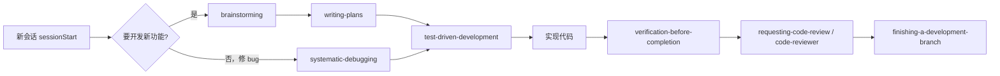

User: <plugin_info kind="matched_installed">
display_name: Superpowers
description: Core skills library: TDD, debugging, collaboration patterns, and proven techniques
skills:
  - brainstorming: You MUST use this before any creative work - creating features, building components, adding functionality, or modifying behavior. Explores user intent, requirements and design before implementation.
  - dispatching-parallel-agents: Use when facing 2+ independent tasks that can be worked on without shared state or sequential dependencies
  - executing-plans: Use when you have a written implementation plan to execute in a separate session with review checkpoints
  - finishing-a-development-branch: Use when implementation is complete, all tests pass, and you need to decide how to integrate the work - guides completion of development work by presenting structured options for merge, PR, or cleanup
  - receiving-code-review: Use when receiving code review feedback, before implementing suggestions, especially if feedback seems unclear or technically questionable - requires technical rigor and verification, not performative agreement or blind implementation
  - requesting-code-review: Use when completing tasks, implementing major features, or before merging to verify work meets requirements
  - subagent-driven-development: Use when executing implementation plans with independent tasks in the current session
  - systematic-debugging: Use when encountering any bug, test failure, or unexpected behavior, before proposing fixes
  - test-driven-development: Use when implementing any feature or bugfix, before writing implementation code
  - using-git-worktrees: Use when starting feature work that needs isolation from current workspace or before executing implementation plans - creates isolated git worktrees with smart directory selection and safety verification
  - using-superpowers: Use when starting any conversation - establishes how to find and use skills, requiring Skill tool invocation before ANY response including clarifying questions
  - verification-before-completion: Use when about to claim work is complete, fixed, or passing, before committing or creating PRs - requires running verification commands and confirming output before making any success claims; evidence before assertions always
  - writing-plans: Use when you have a spec or requirements for a multi-step task, before touching code
  - writing-skills: Use when creating new skills, editing existing skills, or verifying skills work before deployment
subagents:
  - code-reviewer: Use this agent when a major project step has been completed and needs to be reviewed against the original plan and coding standards. Examples: <example>Context: The user is creating a code-review agent that should be called after a logical chunk of code is written. user: "I've finished implementing the user authentication system as outlined in step 3 of our plan" assistant: "Great work! Now let me use the code-reviewer agent to review the implementation against our plan and coding standards" <commentary>Since a major project step has been completed, use the code-reviewer agent to validate the work against the plan and identify any issues.</commentary></example> <example>Context: User has completed a significant feature implementation. user: "The API endpoints for the task management system are now complete - that covers step 2 from our architecture document" assistant: "Excellent! Let me have the code-reviewer agent examine this implementation to ensure it aligns with our plan and follows best practices" <commentary>A numbered step from the planning document has been completed, so the code-reviewer agent should review the work.</commentary></example>
hooks:
  - sessionstart: Hook: sessionStart
commands:
  - brainstorm: Deprecated - use the superpowers:brainstorming skill instead
  - execute-plan: Deprecated - use the superpowers:executing-plans skill instead
  - write-plan: Deprecated - use the superpowers:writing-plans skill instead
</plugin_info>
<user_query>
Show me how the Superpowers plugin works
</user_query>

Assistant: # Superpowers 插件概览

Superpowers 是一套**核心开发技能库**，围绕 TDD、系统化调试、协作流程和经过验证的开发模式，让 Agent 在写代码前后按固定流程工作，而不是直接动手改代码。

---

## 三种使用方式

| 方式 | 说明 |
|------|------|
| **自动触发** | 多数 Skill 会在合适场景下由 Agent 自动调用（例如遇到 bug 时用系统化调试） |
| **手动调用** | 在聊天里输入 `/技能名` 主动启用 |
| **Hooks / Rules** | 会话开始时自动生效，无需你手动操作 |

---

## Skills（技能）

### 规划与设计
- **brainstorming** — 做任何创意/功能开发**之前**必须先做：澄清需求、探索方案、确认设计
- **writing-plans** — 有多步骤任务时，先写实现计划再动代码
- **executing-plans** — 在独立会话中按计划执行，带检查点
- **subagent-driven-development** — 在当前会话里用子任务并行推进计划

### 开发与质量
- **test-driven-development** — 实现功能或修 bug 前先写测试
- **systematic-debugging** — 遇到 bug、测试失败或异常行为时，先系统排查再提修复
- **verification-before-completion** — 声称「完成/修复/通过」之前，必须先跑验证命令并确认输出

### 协作与 Git
- **using-git-worktrees** — 需要隔离开发环境时创建 git worktree
- **requesting-code-review** — 完成功能或合并前请求代码审查
- **receiving-code-review** — 收到审查意见时，先验证再改，不盲目照做
- **finishing-a-development-branch** — 实现完成、测试通过后，指导如何合并、开 PR 或清理

### 并行与元技能
- **dispatching-parallel-agents** — 2 个以上互不依赖的任务时并行处理
- **using-superpowers** — 会话开始时建立如何使用技能的规范
- **writing-skills** — 创建或编辑新技能时使用

---

## Subagents（子代理）

- **code-reviewer** — 完成一个主要开发步骤后，对照原计划与编码规范做审查  
  例如：「用户认证系统第 3 步已完成」→ 自动调用 code-reviewer 检查实现

---

## Hooks（钩子）

- **sessionStart** — 每次新会话开始时自动运行，初始化 Superpowers 工作流

---

## Commands（命令，用 `/` 调用）

以下旧命令已弃用，请改用对应 Skill：

| 旧命令 | 改用 |
|--------|------|
| `/brainstorm` | `/brainstorming` |
| `/write-plan` | `/writing-plans` |
| `/execute-plan` | `/executing-plans` |

---

## 典型工作流

**一句话总结：** Superpowers 把「先想清楚 → 先写计划 → 先写测试 → 再实现 → 验证后再说完成 → 审查后再合并」这套流程固化成技能和钩子，你既可以等 Agent 自动走流程，也可以用 `/技能名` 手动指定。

如果你想试一次，可以说「帮我做一个 XXX 功能」——我会从 **brainstorming** 开始，而不是直接写代码。

[REDACTED]
