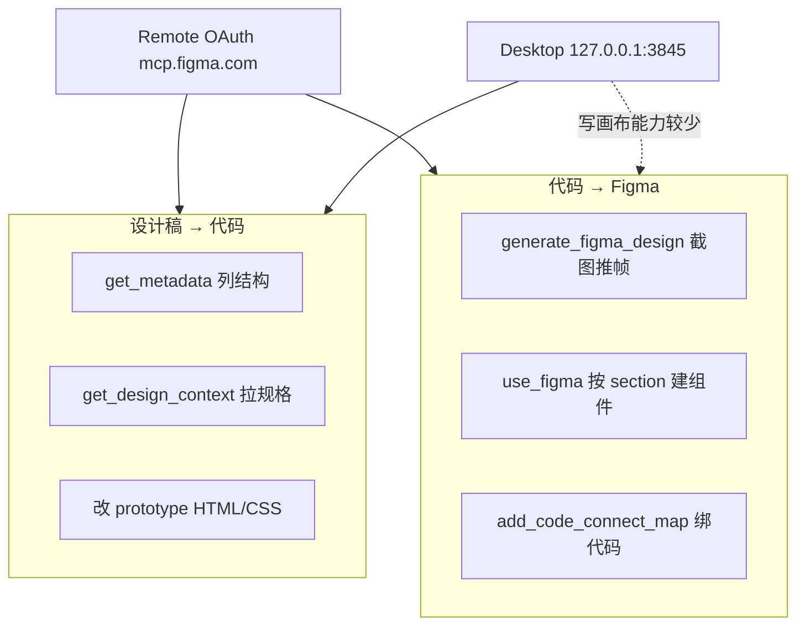

User: <user_query>
1、继续完成codex的这个任务：
codexid：019eaf7c-86e4-7261-8117-7fc0cf973b80
codex链接：codex://threads/019eaf7c-86e4-7261-8117-7fc0cf973b80
如果你拿不到就去本地找文件拿记录
2、现在需要执行的任务方案：
# Web 用户端与后台打通方案

## 摘要
基于现有 `prototype/09-user-chat.html` 做一套独立用户端，迁移到 `prototype/web端/`。第一阶段先按“敖钦一期 Web”做 1:1 复刻，包括左侧栏、模型选择、欢迎态、对话态、引用原文面板、文件卡、意见箱等；第二阶段再接入本项目后台逻辑：智能体运营类型、模型档位、Skills、专家工作台和反馈闭环。

## 关键改造
- 新增 `prototype/web端/index.html` 作为用户端首页，迁移并优化 09 页面；原 `prototype/09-user-chat.html` 保留为旧入口或跳转入口。
- 左侧“智能体中心”改为 3 组：`个人智能体`、`组织智能体`、`企业智能体`，默认全部收起；展开后展示对应可见智能体。
- 智能体列表不再只用写死 `AGENTS` 数组，改为从后台原型状态汇总：
  - `个人智能体`：`shareMode/private` 或创建者为当前用户。
  - `组织智能体`：`shareMode/specific` 且命中 `permissionTargets`。
  - `企业智能体`：`shareMode/org/public` 或运营已上架的企业级智能体。
- 只展示用户可用智能体：优先读取 v1.1 `proto_ops_v11_agents` 中 `listed` 状态，再兼容 `Proto.DEMO_LIST_AGENTS`。
- 模型选择沿用档位：`标准模型 / 增强模型 / 专业模型 / 旗舰模型`，不向用户暴露供应商和底层模型细节。
- Skills 选择保留现有会话级增强能力，来源为 `Proto.bindSessionSkills()` 和 Skills catalog；用户端只做临时选择，不修改开发平台绑定关系。
- 专家工作台迁移到 `prototype/web端/专家工作台` 或同级 `12-expert-*.html`，页面内容完全复用现有 `12-expert-workbench.html`、任务详情、查看上下文等后端页面，只调整资源路径和用户端导航入口。
- 反馈入口保留在用户端，提交后进入既有运营闭环：用户反馈 → 派单/专家任务 → 专家工作台处理 → 回流运营。

## 需要补充的功能
- 用户身份与权限视角：至少 mock 当前用户、所属部门、组织，用于筛选个人/组织/企业智能体。
- 智能体详情轻浮层：用户点击智能体时可看简介、能力来源、可用模型、默认 Skills，但不暴露运营审核字段。
- 历史记录：按智能体和模型保存最近会话，和左下“历史记录”入口打通。
- 文件上传与附件结果：敖钦截图已有输入框附件按钮和结果文件卡，需补上传态、生成中、下载失败、重试。
- 引用原文面板：保留“引用段落 / 查看原文”双态，补空态、加载失败、下载按钮状态。
- 专家求助入口：当回答低置信或用户反馈“未解决”时，可生成专家任务，跳到用户端专家工作台或进入后台专家池。
- 运营数据上报：对话开始、模型档位、智能体 ID、Skills 命中、反馈、文件下载统一走 `PlatformApi.startChat/reportMetrics` mock。

## 测试计划
- `node --check` 检查新增或改动 JS。
- `node prototype/scripts/verify-all.js` 保证旧原型入口不回归。
- 如涉及 v1.1 智能体状态，运行 `node prototype/scripts/v11-ops-check.js`。
- 新增用户端专项检查：验证 `prototype/web端/index.html` 可打开、三类智能体默认收起、展开筛选正确、模型菜单可选、Skills 弹窗可用、专家工作台页面可访问。
- 人工 spot-check：打开用户端 → 展开企业智能体 → 选择智能体 → 切换模型 → 选择 Skills → 发送问题 → 查看引用原文 → 提交反馈 → 进入专家工作台。

## 假设
- 本轮先做静态原型打通，不接真实后端接口。
- `prototype/web端/` 使用共享 `../assets/` 资源，不复制整套 CSS/JS，避免双写。
- 敖钦截图作为视觉基准，但品牌替换为海能/当前平台，不保留敖钦名称和图标。
- 专家工作台“完全沿用后端页面”理解为复用现有 `12-expert-*` 页面结构和逻辑，只迁移入口与路径。

</user_query>

Assistant: Skills: global-session-core, requirement-clarifier, zero-to-one-gate。正在查找 Codex 任务记录并梳理现有原型结构，以便制定执行方案。

[REDACTED]

Assistant: [REDACTED]

Assistant: [REDACTED]

Assistant: [REDACTED]

Assistant: 继续读取 Codex 会话收尾与关键源文件，确认已完成工作与待办项。

[REDACTED]

Assistant: [REDACTED]

Assistant: [REDACTED]

Assistant: [REDACTED]

Assistant: [REDACTED]

Assistant: [REDACTED]

Assistant: [REDACTED]

Assistant: [REDACTED]

Assistant: [REDACTED]

Assistant: 已对齐 Codex 会话 `019eaf7c` 的方案；`prototype/web端/` 仍为空，09 页为可复用基底。正在生成可执行的细化实施计划。

[REDACTED]

User: <user_query>
Web 用户端与后台打通 — 实施计划

Implement the plan as specified, it is attached for your reference. Do NOT edit the plan file itself.

To-do's from the plan have already been created. Do not create them again. Mark them as in_progress as you work, starting with the first one. Don't stop until you have completed all the to-dos.
</user_query>

Assistant: Skills: global-session-core, ai-coding-ok, karpathy-guidelines。开始执行计划：先把第一个待办标为进行中，并读取需改动的关键文件。

[REDACTED]

Assistant: [REDACTED]

Assistant: [REDACTED]

Assistant: [REDACTED]

Assistant: [REDACTED]

Assistant: 正在创建核心文件：先落地 `web端/index.html` 与支撑 JS 模块。

[REDACTED]

Assistant: [REDACTED]

Assistant: [REDACTED]

Assistant: [REDACTED]

Assistant: [REDACTED]

Assistant: [REDACTED]

Assistant: [REDACTED]

Assistant: [REDACTED]

Assistant: [REDACTED]

Assistant: [REDACTED]

Assistant: [REDACTED]

Assistant: [REDACTED]

Assistant: [REDACTED]

Assistant: [REDACTED]

Assistant: [REDACTED]

Assistant: [REDACTED]

Assistant: [REDACTED]

Assistant: [REDACTED]

Assistant: [REDACTED]

Assistant: [REDACTED]

Assistant: [REDACTED]

Assistant: [REDACTED]

Assistant: [REDACTED]

Assistant: [REDACTED]

Assistant: [REDACTED]

Assistant: [REDACTED]

Assistant: Web 用户端与后台打通方案已全部落地，摘要如下。

## 已完成

### 用户端主入口
- 新建 [`prototype/web端/index.html`](C:/Users/win/Desktop/Agent%20Platform/prototype/web端/index.html)：三组智能体（个人/组织/企业，默认收起）、附件上传、历史记录、智能体详情浮层、引用原文多态、专家工作台入口
- [`prototype/09-user-chat.html`](C:/Users/win/Desktop/Agent%20Platform/prototype/09-user-chat.html) 保留极简旧入口，顶部增加跳转 `web端/index.html` 的提示

### 后台 mock 打通
- [`user-portal-context.js`](C:/Users/win/Desktop/Agent%20Platform/prototype/assets/user-portal-context.js) — mock 用户身份
- [`user-agent-resolver.js`](C:/Users/win/Desktop/Agent%20Platform/prototype/assets/user-agent-resolver.js) — 从 `proto_ops_v11_agents` / DEMO 聚合三类智能体
- [`user-portal-bridge.js`](C:/Users/win/Desktop/Agent%20Platform/prototype/assets/user-portal-bridge.js) — 历史、附件、引用原文、反馈→专家任务、运营指标
- 改造 [`user-chat-portal.js`](C:/Users/win/Desktop/Agent%20Platform/prototype/assets/user-chat-portal.js)：`mode: lite|web`、三组列表、详情浮层、修复 `skill_overlay` 接线

### 专家工作台
- 迁移 4 页至 [`prototype/web端/专家工作台/`](C:/Users/win/Desktop/Agent%20Platform/prototype/web端/专家工作台/)
- [`ops-platform-shell.js`](C:/Users/win/Desktop/Agent%20Platform/prototype/assets/ops-platform-shell.js) 支持 `data-portal-surface="user"` 与专家页路径映射

### 运营联动
- `OpsUserFeedback.createFromChat()` 接入用户端反馈
- v1.1 演示数据补充 `shareMode` 样例；「打开用户对话页」链接改为 `web端/index.html`

### 验证与文档
- 新增 [`web-portal-check.js`](C:/Users/win/Desktop/Agent%20Platform/prototype/scripts/web-portal-check.js) 并挂入 `verify-all.js`
- 更新 `PAGES.md`、ADR-012、`task-history` TASK-045

## 验证结果

| 命令 | 结果 |
|------|------|
| `node prototype/scripts/verify-all.js` | **VERIFY-ALL PASSED**（含 web-portal-check） |
| `node prototype/scripts/v11-ops-check.js` | **V11 OPS CHECK PASSED** |

## 人工 spot-check 建议

在浏览器打开 `prototype/web端/index.html` → 展开企业智能体 → 选智能体 → 切模型 → 选 Skills → 发消息 → 查看引用原文 → 提交反馈 → 进入专家工作台。

**Completed**：Codex 019eaf7c 方案全量实现。  
**Verified**：verify-all + v11-ops-check 均已 PASS。  
**Remaining Risks**：专家页仍带运营侧栏壳（按方案保留）；引用原文/附件为 mock 状态机，未接真实文件服务。

[REDACTED]

User: <plugin_info kind="matched_installed">
display_name: Figma
description: Plugin that includes the Figma MCP server and Skills for common workflows
skills:
  - figma-code-connect: Creates and maintains Figma Code Connect template files that map Figma components to code snippets. Use when the user mentions Code Connect, Figma component mapping, design-to-code translation, or asks to create/update .figma.ts or .figma.js files.
  - figma-create-new-file: **MANDATORY prerequisite** — you MUST invoke this skill BEFORE every `create_new_file` tool call. NEVER call `create_new_file` directly without loading this skill first. Trigger whenever the user wants a new blank Figma file — a new design, FigJam, or Slides file — or when you need a fresh file before calling `use_figma`. Usage — /figma-create-new-file [editorType] [fileName] (e.g. /figma-create-new-file figjam My Whiteboard, /figma-create-new-file slides Q3 Review)
  - figma-generate-design: Use this skill alongside figma-use when the task involves translating an application page, view, or multi-section layout into Figma. Triggers: 'write to Figma', 'create in Figma from code', 'push page to Figma', 'take this app/page and build it in Figma', 'create a screen', 'build a landing page in Figma', 'update the Figma screen to match code', 'convert this modal/dialog/drawer/panel to Figma'. This is the preferred workflow skill whenever the user wants to build or update a full page, modal, dialog, drawer, sidebar, panel, or any composed multi-section view in Figma from code or a description. Discovers design system components, variables, and styles from Code Connect files, existing screens, and library search, then imports them and assembles views incrementally section-by-section using design system tokens instead of hardcoded values.
  - figma-generate-diagram: MANDATORY prerequisite — load this skill BEFORE every `generate_diagram` tool call. NEVER call `generate_diagram` directly without loading this skill first. Trigger whenever the user asks to create, generate, draw, render, sketch, or build a diagram — flowchart, architecture diagram, sequence diagram, ERD or entity-relationship diagram, state diagram or state machine, gantt chart, or timeline. Also trigger when the user mentions Mermaid syntax or wants a system architecture, decision tree, dependency graph, API call flow, auth handshake, schema, or pipeline visualized in FigJam. Routes to type-specific guidance, sets universal Mermaid constraints, and tells you when to use a different diagram type or skip the tool entirely (mindmaps, pie charts, class diagrams, etc.).
  - figma-generate-library: Build or update a professional-grade design system in Figma from a codebase. Use when the user wants to create variables/tokens, build component libraries, create individual components with proper variant sets and variable bindings, set up theming (light/dark modes), document foundations, or reconcile gaps between code and Figma. Also use when the user asks to create or generate any component in Figma — even a single one — since components require proper variable foundations, variant states, and design token bindings to be production-quality. This skill teaches WHAT to build and in WHAT ORDER — it complements the `figma-use` skill which teaches HOW to call the Plugin API. Both skills should be loaded together.
  - figma-swiftui: SwiftUI ↔ Figma translation. Use whenever the user mentions Swift, SwiftUI, iOS, iPhone, or iPad — in EITHER direction — translating a Figma design into SwiftUI (design → code), or pushing SwiftUI views / screens / tokens back into a Figma file (code → design). Triggers on phrases like 'implement this Figma design in SwiftUI', 'build this screen in Swift', 'push this SwiftUI view to Figma', 'mirror my Swift code in a Figma file', or whenever a Figma URL appears alongside `.swift` files / an `.xcodeproj`. Routes to a direction-specific reference doc; loads alongside `figma-use` for the code → design path.
  - figma-use: **MANDATORY prerequisite** — you MUST invoke this skill BEFORE every `use_figma` tool call. NEVER call `use_figma` directly without loading this skill first. Skipping it causes common, hard-to-debug failures. Trigger whenever the user wants to perform a write action or a unique read action that requires JavaScript execution in the Figma file context — e.g. create/edit/delete nodes, set up variables or tokens, build components and variants, modify auto-layout or fills, bind variables to properties, or inspect file structure programmatically.
  - figma-use-figjam: This skill helps agents use Figma's use_figma MCP tool in the FigJam context. Can be used alongside figma-use which has foundational context for using the use_figma tool.
  - figma-use-slides: This skill helps agents use Figma's use_figma MCP tool in the Slides context. Can be used alongside figma-use which has foundational context for using the use_figma tool.
mcp_servers:
  - figma
</plugin_info>
<user_query>
Implement the plan as specified, it is attached for your reference. Do NOT edit the plan file itself.

To-do's from the plan have already been created. Do not create them again. Mark them as in_progress as you work, starting with the first one. Don't stop until you have completed all the to-dos.
</user_query>

User: <external_links>
### Potentially Relevant Websearch Results

You should respond as if these information are known to you. Refrain from saying "I am unable to browse the internet" or "I don't have access to the internet" or "I'm unable to provide real-time news updates". This is your internet search results. Please always cite any links you referenced from the above search results in your response in markdown format.

-------
Website URL: https://www.figma.com/design/gDc0xlVkOeJdgrQOZMy3wh/%E6%99%BA%E8%83%BD%E4%BD%93%E5%BC%80%E5%8F%91%E5%B9%B3%E5%8F%B0?node-id=376-250&t=6FoJOOUr9GM4WEDa-1
Website Title: Figma
Website Content:

____

</external_links>
<plugin_info kind="matched_installed">
display_name: Figma
description: Plugin that includes the Figma MCP server and Skills for common workflows
skills:
  - figma-code-connect: Creates and maintains Figma Code Connect template files that map Figma components to code snippets. Use when the user mentions Code Connect, Figma component mapping, design-to-code translation, or asks to create/update .figma.ts or .figma.js files.
  - figma-create-new-file: **MANDATORY prerequisite** — you MUST invoke this skill BEFORE every `create_new_file` tool call. NEVER call `create_new_file` directly without loading this skill first. Trigger whenever the user wants a new blank Figma file — a new design, FigJam, or Slides file — or when you need a fresh file before calling `use_figma`. Usage — /figma-create-new-file [editorType] [fileName] (e.g. /figma-create-new-file figjam My Whiteboard, /figma-create-new-file slides Q3 Review)
  - figma-generate-design: Use this skill alongside figma-use when the task involves translating an application page, view, or multi-section layout into Figma. Triggers: 'write to Figma', 'create in Figma from code', 'push page to Figma', 'take this app/page and build it in Figma', 'create a screen', 'build a landing page in Figma', 'update the Figma screen to match code', 'convert this modal/dialog/drawer/panel to Figma'. This is the preferred workflow skill whenever the user wants to build or update a full page, modal, dialog, drawer, sidebar, panel, or any composed multi-section view in Figma from code or a description. Discovers design system components, variables, and styles from Code Connect files, existing screens, and library search, then imports them and assembles views incrementally section-by-section using design system tokens instead of hardcoded values.
  - figma-generate-diagram: MANDATORY prerequisite — load this skill BEFORE every `generate_diagram` tool call. NEVER call `generate_diagram` directly without loading this skill first. Trigger whenever the user asks to create, generate, draw, render, sketch, or build a diagram — flowchart, architecture diagram, sequence diagram, ERD or entity-relationship diagram, state diagram or state machine, gantt chart, or timeline. Also trigger when the user mentions Mermaid syntax or wants a system architecture, decision tree, dependency graph, API call flow, auth handshake, schema, or pipeline visualized in FigJam. Routes to type-specific guidance, sets universal Mermaid constraints, and tells you when to use a different diagram type or skip the tool entirely (mindmaps, pie charts, class diagrams, etc.).
  - figma-generate-library: Build or update a professional-grade design system in Figma from a codebase. Use when the user wants to create variables/tokens, build component libraries, create individual components with proper variant sets and variable bindings, set up theming (light/dark modes), document foundations, or reconcile gaps between code and Figma. Also use when the user asks to create or generate any component in Figma — even a single one — since components require proper variable foundations, variant states, and design token bindings to be production-quality. This skill teaches WHAT to build and in WHAT ORDER — it complements the `figma-use` skill which teaches HOW to call the Plugin API. Both skills should be loaded together.
  - figma-swiftui: SwiftUI ↔ Figma translation. Use whenever the user mentions Swift, SwiftUI, iOS, iPhone, or iPad — in EITHER direction — translating a Figma design into SwiftUI (design → code), or pushing SwiftUI views / screens / tokens back into a Figma file (code → design). Triggers on phrases like 'implement this Figma design in SwiftUI', 'build this screen in Swift', 'push this SwiftUI view to Figma', 'mirror my Swift code in a Figma file', or whenever a Figma URL appears alongside `.swift` files / an `.xcodeproj`. Routes to a direction-specific reference doc; loads alongside `figma-use` for the code → design path.
  - figma-use: **MANDATORY prerequisite** — you MUST invoke this skill BEFORE every `use_figma` tool call. NEVER call `use_figma` directly without loading this skill first. Skipping it causes common, hard-to-debug failures. Trigger whenever the user wants to perform a write action or a unique read action that requires JavaScript execution in the Figma file context — e.g. create/edit/delete nodes, set up variables or tokens, build components and variants, modify auto-layout or fills, bind variables to properties, or inspect file structure programmatically.
  - figma-use-figjam: This skill helps agents use Figma's use_figma MCP tool in the FigJam context. Can be used alongside figma-use which has foundational context for using the use_figma tool.
  - figma-use-slides: This skill helps agents use Figma's use_figma MCP tool in the Slides context. Can be used alongside figma-use which has foundational context for using the use_figma tool.
mcp_servers:
  - figma
</plugin_info>
<user_query>
1、搜索智能体的框放到新对话和智能体中心之间，智能体列表点击为什么无法展开，之前的agent呢？别给我删了啊，包括他们的对话、上传文件等一切内容，还是保留参考的敖钦截图和09页面
2、专家工作台就这部分就算是跳回去也应该适配一下啊，像左侧的列表还是运营管理后台的列表，具体的页面和功能还有所调整然后参考下面figma链接，还有意见箱改为消息中心
这两部分的改动我给你figma链接，你通过mcp或者插件的形式打通和获取，你要先充分理解这些页面、跳转和交互的逻辑：
https://www.figma.com/design/gDc0xlVkOeJdgrQOZMy3wh/%E6%99%BA%E8%83%BD%E4%BD%93%E5%BC%80%E5%8F%91%E5%B9%B3%E5%8F%B0?node-id=376-250&t=6FoJOOUr9GM4WEDa-1 第三个page“用户端”里的内容
我的token：
figd_mX4mGqMLuixOOk1nW07vzQCiOsze1I_LvkB_jU_A
3、这个流程之前做过，有全局配置和skills的，记录下来，下次就别让我重复，整个过程有不懂地随时问我
</user_query>

Assistant: 正在对照 Figma「用户端」页面与当前实现，梳理侧栏、智能体列表和专家工作台的差异。

[REDACTED]

User: <external_links>
### Potentially Relevant Websearch Results

You should respond as if these information are known to you. Refrain from saying "I am unable to browse the internet" or "I don't have access to the internet" or "I'm unable to provide real-time news updates". This is your internet search results. Please always cite any links you referenced from the above search results in your response in markdown format.

-------
Website URL: https://www.figma.com/design/gDc0xlVkOeJdgrQOZMy3wh/%E6%99%BA%E8%83%BD%E4%BD%93%E5%BC%80%E5%8F%91%E5%B9%B3%E5%8F%B0?node-id=376-250&t=6FoJOOUr9GM4WEDa-1
Website Title: Figma
Website Content:

____

</external_links>
<plugin_info kind="matched_installed">
display_name: Figma
description: Plugin that includes the Figma MCP server and Skills for common workflows
skills:
  - figma-code-connect: Creates and maintains Figma Code Connect template files that map Figma components to code snippets. Use when the user mentions Code Connect, Figma component mapping, design-to-code translation, or asks to create/update .figma.ts or .figma.js files.
  - figma-create-new-file: **MANDATORY prerequisite** — you MUST invoke this skill BEFORE every `create_new_file` tool call. NEVER call `create_new_file` directly without loading this skill first. Trigger whenever the user wants a new blank Figma file — a new design, FigJam, or Slides file — or when you need a fresh file before calling `use_figma`. Usage — /figma-create-new-file [editorType] [fileName] (e.g. /figma-create-new-file figjam My Whiteboard, /figma-create-new-file slides Q3 Review)
  - figma-generate-design: Use this skill alongside figma-use when the task involves translating an application page, view, or multi-section layout into Figma. Triggers: 'write to Figma', 'create in Figma from code', 'push page to Figma', 'take this app/page and build it in Figma', 'create a screen', 'build a landing page in Figma', 'update the Figma screen to match code', 'convert this modal/dialog/drawer/panel to Figma'. This is the preferred workflow skill whenever the user wants to build or update a full page, modal, dialog, drawer, sidebar, panel, or any composed multi-section view in Figma from code or a description. Discovers design system components, variables, and styles from Code Connect files, existing screens, and library search, then imports them and assembles views incrementally section-by-section using design system tokens instead of hardcoded values.
  - figma-generate-diagram: MANDATORY prerequisite — load this skill BEFORE every `generate_diagram` tool call. NEVER call `generate_diagram` directly without loading this skill first. Trigger whenever the user asks to create, generate, draw, render, sketch, or build a diagram — flowchart, architecture diagram, sequence diagram, ERD or entity-relationship diagram, state diagram or state machine, gantt chart, or timeline. Also trigger when the user mentions Mermaid syntax or wants a system architecture, decision tree, dependency graph, API call flow, auth handshake, schema, or pipeline visualized in FigJam. Routes to type-specific guidance, sets universal Mermaid constraints, and tells you when to use a different diagram type or skip the tool entirely (mindmaps, pie charts, class diagrams, etc.).
  - figma-generate-library: Build or update a professional-grade design system in Figma from a codebase. Use when the user wants to create variables/tokens, build component libraries, create individual components with proper variant sets and variable bindings, set up theming (light/dark modes), document foundations, or reconcile gaps between code and Figma. Also use when the user asks to create or generate any component in Figma — even a single one — since components require proper variable foundations, variant states, and design token bindings to be production-quality. This skill teaches WHAT to build and in WHAT ORDER — it complements the `figma-use` skill which teaches HOW to call the Plugin API. Both skills should be loaded together.
  - figma-swiftui: SwiftUI ↔ Figma translation. Use whenever the user mentions Swift, SwiftUI, iOS, iPhone, or iPad — in EITHER direction — translating a Figma design into SwiftUI (design → code), or pushing SwiftUI views / screens / tokens back into a Figma file (code → design). Triggers on phrases like 'implement this Figma design in SwiftUI', 'build this screen in Swift', 'push this SwiftUI view to Figma', 'mirror my Swift code in a Figma file', or whenever a Figma URL appears alongside `.swift` files / an `.xcodeproj`. Routes to a direction-specific reference doc; loads alongside `figma-use` for the code → design path.
  - figma-use: **MANDATORY prerequisite** — you MUST invoke this skill BEFORE every `use_figma` tool call. NEVER call `use_figma` directly without loading this skill first. Skipping it causes common, hard-to-debug failures. Trigger whenever the user wants to perform a write action or a unique read action that requires JavaScript execution in the Figma file context — e.g. create/edit/delete nodes, set up variables or tokens, build components and variants, modify auto-layout or fills, bind variables to properties, or inspect file structure programmatically.
  - figma-use-figjam: This skill helps agents use Figma's use_figma MCP tool in the FigJam context. Can be used alongside figma-use which has foundational context for using the use_figma tool.
  - figma-use-slides: This skill helps agents use Figma's use_figma MCP tool in the Slides context. Can be used alongside figma-use which has foundational context for using the use_figma tool.
mcp_servers:
  - figma
</plugin_info>
<user_query>
1、搜索智能体的框放到新对话和智能体中心之间，智能体列表点击为什么无法展开，之前的agent呢？别给我删了啊，包括他们的对话、上传文件等一切内容，还是保留参考的敖钦截图和09页面
2、专家工作台就这部分就算是跳回去也应该适配一下啊，像左侧的列表还是运营管理后台的列表，具体的页面和功能还有所调整然后参考下面figma链接，还有意见箱改为消息中心
这两部分的改动我给你figma链接，你通过mcp或者插件的形式打通和获取，你要先充分理解这些页面、跳转和交互的逻辑：
https://www.figma.com/design/gDc0xlVkOeJdgrQOZMy3wh/%E6%99%BA%E8%83%BD%E4%BD%93%E5%BC%80%E5%8F%91%E5%B9%B3%E5%8F%B0?node-id=376-250&t=6FoJOOUr9GM4WEDa-1 第三个page“用户端”里的内容
我的token：
figd_mX4mGqMLuixOOk1nW07vzQCiOsze1I_LvkB_jU_A
3、这个流程之前做过，有全局配置和skills的，记录下来，下次就别让我重复，整个过程有不懂地随时问我
</user_query>

Assistant: [REDACTED]

Assistant: [REDACTED]

Assistant: [REDACTED]

Assistant: [REDACTED]

Assistant: [REDACTED]

Assistant: [REDACTED]

Assistant: [REDACTED]

Assistant: [REDACTED]

Assistant: [REDACTED]

Assistant: [REDACTED]

Assistant: [REDACTED]

Assistant: [REDACTED]

Assistant: [REDACTED]

Assistant: [REDACTED]

Assistant: [REDACTED]

Assistant: 已梳理代码与 Figma「用户端」元数据；发现智能体列表与侧栏交互存在明确根因，正在生成实施计划。

[REDACTED]

Assistant: [REDACTED]

Assistant: [REDACTED]

User: <user_query>
用户端 Figma 对齐与交互修复计划

Implement the plan as specified, it is attached for your reference. Do NOT edit the plan file itself.

To-do's from the plan have already been created. Do not create them again. Mark them as in_progress as you work, starting with the first one. Don't stop until you have completed all the to-dos.
</user_query>

Assistant: Skills: global-session-core, ai-coding-ok, figma-workflow。开始实施计划：先把第一个待办标为进行中，并读取需改动的关键文件。

[REDACTED]

Assistant: [REDACTED]

Assistant: [REDACTED]

Assistant: [REDACTED]

Assistant: [REDACTED]

Assistant: [REDACTED]

Assistant: [REDACTED]

Assistant: [REDACTED]

Assistant: [REDACTED]

Assistant: 正在创建 `user-message-center.js` 和 `user-portal-shell.js`。

[REDACTED]

Assistant: [REDACTED]

Assistant: [REDACTED]

Assistant: [REDACTED]

Assistant: [REDACTED]

Assistant: [REDACTED]

Assistant: [REDACTED]

Assistant: [REDACTED]

Assistant: [REDACTED]

Assistant: [REDACTED]

Assistant: [REDACTED]

Assistant: [REDACTED]

Assistant: [REDACTED]

Assistant: 计划已全部落地，摘要如下。

## 已完成

### 1. 侧栏与智能体列表
- **搜索框**已移到「新对话」与「智能体中心」之间（[`web端/index.html`](C:/Users/win/Desktop/Agent%20Platform/prototype/web端/index.html)）
- **展开逻辑**：用 `aioq-agent-groups` 包裹三组，修复父级收起时子组无法展开的问题
- **默认态**：智能体中心 + **企业智能体**默认展开（个人/组织仍收起）
- **10 个 agent 保留**：`UserAgentResolver` 始终合并 `DEFAULT_AGENTS`，不再被 v11 数据覆盖

### 2. 消息中心
- 侧栏「意见箱」→ **「消息中心」**（`btnMessageCenter`）
- 新增 [`user-message-center.js`](C:/Users/win/Desktop/Agent%20Platform/prototype/assets/user-message-center.js)：三 Tab **公告 / 待办 / 意见箱**
- 聊天气泡内「反馈」弹窗保留；提交反馈会写入意见箱，触发专家任务时同步待办

### 3. 专家工作台用户壳
- 新增 [`user-portal-shell.js`](C:/Users/win/Desktop/Agent%20Platform/prototype/assets/user-portal-shell.js)：海能 aioq 侧栏（非运营后台）
- 4 页专家工作台已换布局；`ops-platform-shell.js` 在 `data-portal-surface="user"` 时委托用户壳

### 4. Figma 流程沉淀（未写入 token）
- 更新 [`design/figma.config.json`](C:/Users/win/Desktop/Agent%20Platform/design/figma.config.json)（`userEnd` page `376:250` 等）
- 更新 [`interaction-spec.json`](C:/Users/win/Desktop/Agent%20Platform/design/interaction-spec.json)（UP-01~03）
- 更新 [`.cursor/skills/figma-workflow/SKILL.md`](C:/Users/win/Desktop/Agent%20Platform/.cursor/skills/figma-workflow/SKILL.md)
- ADR-012 / project-memory / task-history 已记录

你提供的 Figma PAT **未写入仓库**；请放在 `~/.cursor/mcp.json` 或走 OAuth，详见 [`docs/figma-setup.md`](C:/Users/win/Desktop/Agent%20Platform/docs/figma-setup.md)。

## Verified
- `web-portal-check.js` → **PASS**（含企业组 ≥10 智能体）
- `verify-all.js` → **VERIFY-ALL PASSED**（含 smoke / navigation-journey）
- `v11-ops-check.js` → **PASS**

## Remaining Risks
- Figma 云端 MCP 有月度限额；精细像素对齐可开 Desktop MCP 补 `get_design_context`
- 专家工作台主内容区仍为表格形态，与 Figma `377:356` 的卡片式待办在视觉上可能还有差距

**Completed / Verified / Remaining Risks** 如上。建议本地打开 `prototype/web端/index.html` 确认侧栏 agent 列表与消息中心三 Tab。

[REDACTED]

User: <user_query>
Implement the plan as specified, it is attached for your reference. Do NOT edit the plan file itself.

To-do's from the plan have already been created. Do not create them again. Mark them as in_progress as you work, starting with the first one. Don't stop until you have completed all the to-dos.
</user_query>

User: <user_query>
mcp这个重点讲一下，还有额度的吗，我有本地desktop的figma，后面话有可能要把前端代码转成figma组件这种需求
</user_query>

Assistant: 你关心的是 Figma MCP 的额度、本地 Desktop 用法，以及以后「代码转 Figma 组件」怎么走。我先对照项目里的 `figma-setup` 和 workflow 文档，把这几块说清楚。

[REDACTED]

Assistant: [REDACTED]

Assistant: [REDACTED]

Assistant: 你这次对话里已经撞过 **Starter / View 席位** 的云端额度（`get_design_context` 报 monthly limit），结合你本地 Desktop 和未来「代码 → Figma 组件」需求，把 MCP 用法说清楚。

---

## 一、三种连接方式（你项目里已写好）

| 方式 | 配置 | 适合什么 |
|------|------|----------|
| **Remote OAuth（推荐主通道）** | `https://mcp.figma.com/mcp` | 读设计、写画布、Code Connect、Cursor 插件 skills 最全 |
| **Desktop 本地 MCP** | `http://127.0.0.1:3845/mcp` | 本机 Dev Mode，选中图层后读上下文；部分能力比 Remote 少 |
| **PAT + figma-developer-mcp** | `FIGMA_API_KEY` 环境变量 | OAuth 挂掉时的降级，功能最少 |

项目文档：[`docs/figma-setup.md`](C:/Users/win/Desktop/Agent%20Platform/docs/figma-setup.md)  
工作流 skill：[`.cursor/skills/figma-workflow/SKILL.md`](C:/Users/win/Desktop/Agent%20Platform/.cursor/skills/figma-workflow/SKILL.md)

**PAT 不要写进仓库**，只放 `~/.cursor/mcp.json` 或系统环境变量。

---

## 二、额度：有，而且和「席位」强绑定

官方说明：[Rate limits & access](https://developers.figma.com/docs/figma-mcp-server/rate-limits-access/)

### 读 Figma 的工具（算额度）

例如：`get_design_context`、`get_metadata`、`get_screenshot` 等 **从 Figma 读数据** 的调用。

| 席位类型 | Starter | Pro | Org | Enterprise |
|----------|---------|-----|-----|------------|
| **View / Collab** | **6 次/月** | 6 次/月 | 6 次/月 | 6 次/月 |
| **Dev / Full** | 200 次/天 | 200 次/天 + 15 次/分 | 200 次/天 + 15 次/分 | **600 次/天** + 20 次/分 |

你之前报 `Starter plan MCP tool call limit`，基本就是 **View/Collab 或 Starter = 每月 6 次读操作**，Agent 多轮 `get_metadata` + `get_design_context` 很容易一次对话就用完。

### 写 Figma 的工具（目前多数免额度）

官方列出的 **不计入读额度** 的工具包括：

- `generate_figma_design`（代码/截图推到 Figma）
- `add_code_connect_map`（组件与代码映射）
- `whoami`（查当前账号与席位）

也就是说：**以后做「前端代码 → Figma 组件」反而可能更省读额度**，因为走的是写通道，不是反复 `get_design_context`。

### 常见踩坑

1. **文件不在已升级的团队里** — 即使用 Pro Dev 席位，文件若在个人 Draft 或别的 team，仍可能按低额度算（[论坛案例](https://forum.figma.com/report-a-problem-6/mcp-rate-limit-not-acknowledging-subscription-51368)）。
2. **Desktop ≠ 无限** — 额度按 **Figma 账号席位** 算，不是「本地就免费无限」；Desktop 主要区别是能力和使用场景，不是绕过计费席位。
3. **Desktop 读设计常要先选中图层** — 你之前 `get_design_context` 报 *You need to select a layer*，就是 Desktop 模式典型行为：在 Figma 里选中 `376:250` 对应 frame 再让 Agent 读。

---

## 三、Remote vs Desktop：怎么选



| 能力 | Remote | Desktop |
|------|--------|---------|
| `get_design_context` / 读变量、组件 | 有（URL + nodeId 即可） | 有（常需先选中图层） |
| **写画布** `use_figma` / `generate_figma_design` | **完整支持** | 能力更少 |
| Cursor Figma 插件 skills | 配套最好 | 部分受限 |
| Code Connect | Remote 侧更完整 | 有限 |

**建议你的日常配置：双通道并存**

```json
{
  "mcpServers": {
    "figma": {
      "url": "https://mcp.figma.com/mcp"
    },
    "figma-desktop": {
      "url": "http://127.0.0.1:3845/mcp"
    }
  }
}
```

- **对照设计改代码**：优先 Remote（给 URL/nodeId，不用手动点选）。
- **Remote 读额度用尽**：用已落地的 `design/figma.config.json` + 本地 `get_metadata` 缓存 / `figma-frame-details.json`，或 Desktop 选中图层再读。
- **代码推回 Figma**：走 Remote 写通道（`generate_figma_design` 等，目前免读额度）。

Desktop 开启：Figma 桌面版 → 打开设计文件 → **Dev Mode (Shift+D)** → Inspect 面板 → **Enable desktop MCP server**。

---

## 四、以后「前端代码 → Figma 组件」推荐流程

你们项目 skill 里 **场景 B** 就是为这个准备的，建议固定成三步：

### 路径 1：结构化组件（推荐，可维护）

适合 `web端/index.html`、`user-portal-shell` 等已有 HTML/CSS 页面。

1. 读 **`figma-generate-design`** + **`figma-use`** skill（Cursor 必须先读再调 `use_figma`）。
2. `search_design_system` — 在 Figma 里找已有变量/组件，避免从零画。
3. **`use_figma`** — 按 section（侧栏、顶栏、消息中心抽屉…）增量建 Frame/Component，绑定 design tokens。
4. 需要代码映射时 → **`figma-code-connect`** + `add_code_connect_map`（免读额度）。

产出：Figma 里是可复用 **Component + Variables**，不是一张死图。

### 路径 2：像素级快照（快，适合验收对齐）

项目里 Skills 板已有成熟流程（`capture-skills-board.ps1` + `?figma=1`）：

1. 本地 `python -m http.server 8766` 起原型。
2. 页面加 `figma-capture.js`，用 **`generate_figma_design`** 把渲染结果捕进 Figma。
3. 再用 `use_figma` 微调、删重复 Frame。

适合「先对齐视觉，再慢慢组件化」。

### 路径 3：设计系统级组件库

若目标是 **Button / 侧栏项 / 消息卡片** 等可复用零件：

- 读 **`figma-generate-library`** skill
- 先建 Variables（颜色、间距、圆角）→ 再建 Component Set（含 variant）

这和你们 `prototype/assets/style.css` 里的 `.aioq-*` token 可以一一对应。

---

## 五、和本项目的衔接（不用每次重复说）

Agent 以后只要说「按 Figma 用户端改」或「把 web 端推到 Figma」，会自动走：

1. [`design/figma.config.json`](C:/Users/win/Desktop/Agent%20Platform/design/figma.config.json) — `fileKey`、`userEnd` page `376:250`、各 screen nodeId  
2. [`design/interaction-spec.json`](C:/Users/win/Desktop/Agent%20Platform/design/interaction-spec.json) — UP-01~03 跳转  
3. [`figma-workflow` skill](C:/Users/win/Desktop/Agent%20Platform/.cursor/skills/figma-workflow/SKILL.md) — 读/写分流  

用户端已映射示例：

| screen | nodeId | 代码 |
|--------|--------|------|
| userChat | 376:250 | `web端/index.html` |
| userMessageCenterTodo | 376:984 | `user-message-center.js` |
| userExpertWorkbench | 377:356 | `web端/专家工作台/workbench.html` |
| userFeedbackBox | 377:1665 | 意见箱 Tab |

---

## 六、给你的实操建议

1. **先确认席位**：在 Cursor 里让 Agent 调一次 `whoami`（免额度），看是 View 还是 Dev/Full；若是 View，读设计每月只有 6 次，做用户端这种多帧对齐会很快触顶。  
2. **设计文件放进已付费团队**，不要只放在个人 Draft。  
3. **读设计省额度**：一次 `get_metadata` 拉整页结构 → 本地记进 `design/` → 改代码时少反复 `get_design_context`。  
4. **推 Figma 用写通道**：`generate_figma_design` / `use_figma` 目前不计入读额度，更适合你说的「代码转组件」。  
5. **Desktop 作备用**：Remote 限流或需要对着选中 frame 微调时用 `127.0.0.1:3845`。

---

**Completed**：MCP 三种连接、额度规则、Remote/Desktop 分工、代码→Figma 三条路径、项目内沉淀位置均已说明。  
**Verified**：依据官方 [rate-limits-access](https://developers.figma.com/docs/figma-mcp-server/rate-limits-access/)、项目 `figma-setup.md` 及本轮实际触顶经历。  
**Remaining Risks**：Figma MCP 仍在 beta，写画布未来可能收费；Desktop 写能力弱于 Remote，组件化工作建议以 Remote 为主。

如果你愿意，我可以下一步帮你写一份「`~/.cursor/mcp.json` 双通道 + whoami 自检」的具体配置清单（仍不把 PAT 写进仓库）。

[REDACTED]

User: [Image]
[Image]
<image_files>
The following images were provided by the user and saved to the workspace for future use:
1. C:\Users\win\.cursor\projects\c-Users-win-Desktop/assets/c__Users_win_AppData_Roaming_Cursor_User_workspaceStorage_edfec75d484b3fa631d2a10459b135c2_images_image-69c8881c-704f-4012-bbbc-f9d471506414.png
2. C:\Users\win\.cursor\projects\c-Users-win-Desktop/assets/c__Users_win_AppData_Roaming_Cursor_User_workspaceStorage_edfec75d484b3fa631d2a10459b135c2_images_image-2c403878-781f-4534-a4c3-b4bef0006ba1.png

These images can be copied for use in other locations.
</image_files>
<plugin_info kind="matched_installed">
display_name: Figma
description: Plugin that includes the Figma MCP server and Skills for common workflows
skills:
  - figma-code-connect: Creates and maintains Figma Code Connect template files that map Figma components to code snippets. Use when the user mentions Code Connect, Figma component mapping, design-to-code translation, or asks to create/update .figma.ts or .figma.js files.
  - figma-create-new-file: **MANDATORY prerequisite** — you MUST invoke this skill BEFORE every `create_new_file` tool call. NEVER call `create_new_file` directly without loading this skill first. Trigger whenever the user wants a new blank Figma file — a new design, FigJam, or Slides file — or when you need a fresh file before calling `use_figma`. Usage — /figma-create-new-file [editorType] [fileName] (e.g. /figma-create-new-file figjam My Whiteboard, /figma-create-new-file slides Q3 Review)
  - figma-generate-design: Use this skill alongside figma-use when the task involves translating an application page, view, or multi-section layout into Figma. Triggers: 'write to Figma', 'create in Figma from code', 'push page to Figma', 'take this app/page and build it in Figma', 'create a screen', 'build a landing page in Figma', 'update the Figma screen to match code', 'convert this modal/dialog/drawer/panel to Figma'. This is the preferred workflow skill whenever the user wants to build or update a full page, modal, dialog, drawer, sidebar, panel, or any composed multi-section view in Figma from code or a description. Discovers design system components, variables, and styles from Code Connect files, existing screens, and library search, then imports them and assembles views incrementally section-by-section using design system tokens instead of hardcoded values.
  - figma-generate-diagram: MANDATORY prerequisite — load this skill BEFORE every `generate_diagram` tool call. NEVER call `generate_diagram` directly without loading this skill first. Trigger whenever the user asks to create, generate, draw, render, sketch, or build a diagram — flowchart, architecture diagram, sequence diagram, ERD or entity-relationship diagram, state diagram or state machine, gantt chart, or timeline. Also trigger when the user mentions Mermaid syntax or wants a system architecture, decision tree, dependency graph, API call flow, auth handshake, schema, or pipeline visualized in FigJam. Routes to type-specific guidance, sets universal Mermaid constraints, and tells you when to use a different diagram type or skip the tool entirely (mindmaps, pie charts, class diagrams, etc.).
  - figma-generate-library: Build or update a professional-grade design system in Figma from a codebase. Use when the user wants to create variables/tokens, build component libraries, create individual components with proper variant sets and variable bindings, set up theming (light/dark modes), document foundations, or reconcile gaps between code and Figma. Also use when the user asks to create or generate any component in Figma — even a single one — since components require proper variable foundations, variant states, and design token bindings to be production-quality. This skill teaches WHAT to build and in WHAT ORDER — it complements the `figma-use` skill which teaches HOW to call the Plugin API. Both skills should be loaded together.
  - figma-swiftui: SwiftUI ↔ Figma translation. Use whenever the user mentions Swift, SwiftUI, iOS, iPhone, or iPad — in EITHER direction — translating a Figma design into SwiftUI (design → code), or pushing SwiftUI views / screens / tokens back into a Figma file (code → design). Triggers on phrases like 'implement this Figma design in SwiftUI', 'build this screen in Swift', 'push this SwiftUI view to Figma', 'mirror my Swift code in a Figma file', or whenever a Figma URL appears alongside `.swift` files / an `.xcodeproj`. Routes to a direction-specific reference doc; loads alongside `figma-use` for the code → design path.
  - figma-use: **MANDATORY prerequisite** — you MUST invoke this skill BEFORE every `use_figma` tool call. NEVER call `use_figma` directly without loading this skill first. Skipping it causes common, hard-to-debug failures. Trigger whenever the user wants to perform a write action or a unique read action that requires JavaScript execution in the Figma file context — e.g. create/edit/delete nodes, set up variables or tokens, build components and variants, modify auto-layout or fills, bind variables to properties, or inspect file structure programmatically.
  - figma-use-figjam: This skill helps agents use Figma's use_figma MCP tool in the FigJam context. Can be used alongside figma-use which has foundational context for using the use_figma tool.
  - figma-use-slides: This skill helps agents use Figma's use_figma MCP tool in the Slides context. Can be used alongside figma-use which has foundational context for using the use_figma tool.
mcp_servers:
  - figma
</plugin_info>
<user_query>
1、我不是让你照着figma做吗，你这差了太多了，算了我说你改吧
2、首先从主页开始，状态的枚举值：
全部、已上架、审核中、草稿、已下架。功能栏的内容也随着状态改变而改变，而之前的一样
3、在智能体图标的旁边加个（），里面存放智能体的权限：个人、组织和公开，同时在类型、状态的旁边也加上权限和下拉框支持这几个选项。
4、运营概览部分，不要最近拦截记录了生的跳转什么的，p2也不要了，现在要对平台开放，你改成对运营概览仪表盘的说明介绍之类的
5、审核工作台见p1，我红色圈出来的都不要了
</user_query>

Assistant: 按你的 5 点要求改运营 v1.1：先定位主页、运营概览和审核工作台相关文件与状态枚举。

[REDACTED]

Assistant: [REDACTED]

User: If the available MCP tools do not fully support what the user asked you to do, complete the work you can with the current tool set. In your work summary, include what you were unable to do with MCP and why. Do not use browser automation to work around missing or unavailable MCP tools unless the user explicitly asks you to use the browser.

<hooks_context description="Additional context provided by session hooks. This may include project-specific information, configuration, or instructions from the user's hooks setup.">
## Global Skills (SessionStart)

Total skills available: **275** (scanned from ~/.cursor/skills and other global dirs).
Full index: `C:\Users\win\.claude\global-skills-index.md`

**ALWAYS ON 鈥?Read these SKILL.md files before any other tools this session:**

- **global-session-core**: `C:\Users\win\.cursor\skills\global-session-core\SKILL.md`
- **requirement-clarifier**: `C:\Users\win\.cursor\skills\requirement-clarifier\SKILL.md`
- **karpathy-guidelines**: `C:\Users\win\.cursor\skills\karpathy-guidelines\SKILL.md`
- **ai-coding-ok**: `C:\Users\win\.cursor\skills\ai-coding-ok\SKILL.md`

**Global memory (Read before coding tasks):**

- **user-memory**: `C:\Users\win\.ai-workspace\memory\user-memory.md`
- **global-task-history** (recent entries): `C:\Users\win\.ai-workspace\memory\global-task-history.md`
- **global-decisions-log**: `C:\Users\win\.ai-workspace\memory\global-decisions-log.md`

PDCA: use `ai-coding-ok` 鈥?update global-task-history after every coding task.

**Project coding guardrails detected** at `C:\Users\win\.claude` 鈥?`ai-coding-ok` is in ALWAYS ON for this session (AGENTS.md / .github/agent/memory/).

**Context hygiene:** Long sessions 鈫?Headroom MCP (`headroom_compress` / `retrieve`) or `/compact` at logical milestones; savethetokens Lean Mode is in `global-session-core`.

Default rules: `C:\Users\win\.claude\AGENTS.md` (project AGENTS.md overrides if present).

**Zero-to-one gate (strict):** 鏂版ā鍧?/ 澶ц寖鍥淬€屽府鎴戝仛鈥︺€嶁啋 Read ``~/.cursor/skills/zero-to-one-gate/SKILL.md`` + ``brainstorming`` before Write/Edit. Cursor: ``~/.cursor/rules/zero-to-one-gate.mdc``. Codex/Claude: ``~/.claude/AGENTS.md`` Zero-to-one section.

**Maximum permission scope:** max permission / quan bu jie jue = fix current task only; do NOT delete CC Switch or run _remove-* without explicit user OK. Rule: ~/.cursor/rules/maximum-permission-scope.mdc ; ~/.claude/AGENTS.md Maximum permission section.

**Required workflow for every task:**
1. Read always-on skills + global memory paths above first.
2. **Intent-first routing:** Match user meaning (not exact keywords) 鈥?hook intent profiles + skill descriptions + global index.
3. For each additional applicable skill, **Read** the absolute path to `SKILL.md` before using other tools.
4. Follow skill bodies strictly; mention enabled skill names in one short line at reply start (`Skills: ...`).
5. Before claiming done: follow `global-delivery-gate` skill for verification.
6. Priority: user instruction > matched global skill > built-in skill > default.

**Vibe coding / fuzzy implementation:** B-class 鈫?requirement-clarifier + vibe-coding-bridge.md 鈫?Mini-Spec S4.5 鈫?user confirm 鈫?S12 鈫?execute.
</hooks_context>

User: [Image]
[Image]
<image_files>
The following images were provided by the user and saved to the workspace for future use:
1. C:\Users\win\.cursor\projects\c-Users-win-Desktop/assets/c__Users_win_AppData_Roaming_Cursor_User_workspaceStorage_edfec75d484b3fa631d2a10459b135c2_images_image-69c8881c-704f-4012-bbbc-f9d471506414.png
2. C:\Users\win\.cursor\projects\c-Users-win-Desktop/assets/c__Users_win_AppData_Roaming_Cursor_User_workspaceStorage_edfec75d484b3fa631d2a10459b135c2_images_image-2c403878-781f-4534-a4c3-b4bef0006ba1.png

These images can be copied for use in other locations.
</image_files>
<plugin_info kind="matched_installed">
display_name: Figma
description: Plugin that includes the Figma MCP server and Skills for common workflows
skills:
  - figma-code-connect: Creates and maintains Figma Code Connect template files that map Figma components to code snippets. Use when the user mentions Code Connect, Figma component mapping, design-to-code translation, or asks to create/update .figma.ts or .figma.js files.
  - figma-create-new-file: **MANDATORY prerequisite** — you MUST invoke this skill BEFORE every `create_new_file` tool call. NEVER call `create_new_file` directly without loading this skill first. Trigger whenever the user wants a new blank Figma file — a new design, FigJam, or Slides file — or when you need a fresh file before calling `use_figma`. Usage — /figma-create-new-file [editorType] [fileName] (e.g. /figma-create-new-file figjam My Whiteboard, /figma-create-new-file slides Q3 Review)
  - figma-generate-design: Use this skill alongside figma-use when the task involves translating an application page, view, or multi-section layout into Figma. Triggers: 'write to Figma', 'create in Figma from code', 'push page to Figma', 'take this app/page and build it in Figma', 'create a screen', 'build a landing page in Figma', 'update the Figma screen to match code', 'convert this modal/dialog/drawer/panel to Figma'. This is the preferred workflow skill whenever the user wants to build or update a full page, modal, dialog, drawer, sidebar, panel, or any composed multi-section view in Figma from code or a description. Discovers design system components, variables, and styles from Code Connect files, existing screens, and library search, then imports them and assembles views incrementally section-by-section using design system tokens instead of hardcoded values.
  - figma-generate-diagram: MANDATORY prerequisite — load this skill BEFORE every `generate_diagram` tool call. NEVER call `generate_diagram` directly without loading this skill first. Trigger whenever the user asks to create, generate, draw, render, sketch, or build a diagram — flowchart, architecture diagram, sequence diagram, ERD or entity-relationship diagram, state diagram or state machine, gantt chart, or timeline. Also trigger when the user mentions Mermaid syntax or wants a system architecture, decision tree, dependency graph, API call flow, auth handshake, schema, or pipeline visualized in FigJam. Routes to type-specific guidance, sets universal Mermaid constraints, and tells you when to use a different diagram type or skip the tool entirely (mindmaps, pie charts, class diagrams, etc.).
  - figma-generate-library: Build or update a professional-grade design system in Figma from a codebase. Use when the user wants to create variables/tokens, build component libraries, create individual components with proper variant sets and variable bindings, set up theming (light/dark modes), document foundations, or reconcile gaps between code and Figma. Also use when the user asks to create or generate any component in Figma — even a single one — since components require proper variable foundations, variant states, and design token bindings to be production-quality. This skill teaches WHAT to build and in WHAT ORDER — it complements the `figma-use` skill which teaches HOW to call the Plugin API. Both skills should be loaded together.
  - figma-swiftui: SwiftUI ↔ Figma translation. Use whenever the user mentions Swift, SwiftUI, iOS, iPhone, or iPad — in EITHER direction — translating a Figma design into SwiftUI (design → code), or pushing SwiftUI views / screens / tokens back into a Figma file (code → design). Triggers on phrases like 'implement this Figma design in SwiftUI', 'build this screen in Swift', 'push this SwiftUI view to Figma', 'mirror my Swift code in a Figma file', or whenever a Figma URL appears alongside `.swift` files / an `.xcodeproj`. Routes to a direction-specific reference doc; loads alongside `figma-use` for the code → design path.
  - figma-use: **MANDATORY prerequisite** — you MUST invoke this skill BEFORE every `use_figma` tool call. NEVER call `use_figma` directly without loading this skill first. Skipping it causes common, hard-to-debug failures. Trigger whenever the user wants to perform a write action or a unique read action that requires JavaScript execution in the Figma file context — e.g. create/edit/delete nodes, set up variables or tokens, build components and variants, modify auto-layout or fills, bind variables to properties, or inspect file structure programmatically.
  - figma-use-figjam: This skill helps agents use Figma's use_figma MCP tool in the FigJam context. Can be used alongside figma-use which has foundational context for using the use_figma tool.
  - figma-use-slides: This skill helps agents use Figma's use_figma MCP tool in the Slides context. Can be used alongside figma-use which has foundational context for using the use_figma tool.
mcp_servers:
  - figma
</plugin_info>
<user_query>
1、我不是让你照着figma做吗，你这差了太多了，算了我说你改吧
2、首先从主页开始，状态的枚举值：
全部、已上架、审核中、草稿、已下架。功能栏的内容也随着状态改变而改变，而之前的一样
3、在智能体图标的旁边加个（），里面存放智能体的权限：个人、组织和公开，同时在类型、状态的旁边也加上权限和下拉框支持这几个选项。
4、运营概览部分，不要最近拦截记录了生的跳转什么的，p2也不要了，现在要对平台开放，你改成对运营概览仪表盘的说明介绍之类的
5、审核工作台见p1，我红色圈出来的都不要了
</user_query>

Assistant: [REDACTED]

Assistant: [REDACTED]

Assistant: [REDACTED]

Assistant: [REDACTED]

Assistant: [REDACTED]

Assistant: [REDACTED]

Assistant: [REDACTED]

Assistant: 正在实现这 5 项运营 v1.1 改动。

[REDACTED]

Assistant: [REDACTED]

Assistant: [REDACTED]

Assistant: [REDACTED]

Assistant: [REDACTED]

Assistant: [REDACTED]

Assistant: Skills: global-session-core, karpathy-guidelines

已按你的 5 条要求改完智能体运营 v1.1，验证全部通过。

## 改动摘要

### 1. 主页状态筛选（`app.js`）
- 状态改为五元组：**全部、已上架、审核中、草稿、已下架**（药丸按钮，替代原状态下拉）
- **审核中**包含 `reviewing` + `published_pending_review`；**已上架**包含 `listed` + `disabled`
- 卡片 `⋯` 菜单仍按状态变化（发布/停用/下架/删除/权限），逻辑未改

### 2. 权限展示与筛选
- 图标旁增加括号：**（个人 / 组织 / 公开）**
- 卡片底部标签区增加权限 tag
- 工具栏新增**权限**下拉：全部 / 个人 / 组织 / 公开（`specific` 归入组织）

### 3. 运营概览（`dashboard`）
- 页头描述改为平台开放后的仪表盘说明
- 卡片内增加 `ops-dash-intro` 介绍段落
- 去掉快捷跳转（审核工作台链接）和**最近拦截记录**区块
- `ops-list-dashboard.js` 支持 `hideQuickLinks` / `hideInterceptEvents` 选项（v1.1 仪表盘启用；旧 `index.html` 行为不变）

### 4. 审核工作台（P1 红框）
- 已删除：「← 返回智能体管理」、待审统计、今日已通过统计
- 保留标题说明 + 待审表格 +「去审核」按钮

### 5. 样式（`styles.css`）
- 状态药丸、权限括号、权限 tag、仪表盘说明文案样式

## 验证
- `v11-ops-check.js` — **PASS**（含新断言）
- `verify-all.js` — **PASS**（5 步含 navigation-journey）

**Completed**：主页状态/权限、运营概览、审核工作台  
**Verified**：上述脚本 freshly PASS  
**Remaining Risks**：`rejected`（已驳回）仅在「全部」下可见，未单独列入五元组；若需纳入「草稿」或单独状态可再说

[REDACTED]

User: [Image]
<image_files>
The following images were provided by the user and saved to the workspace for future use:
1. C:\Users\win\.cursor\projects\c-Users-win-Desktop/assets/c__Users_win_AppData_Roaming_Cursor_User_workspaceStorage_edfec75d484b3fa631d2a10459b135c2_images_image-89e7c6ad-59de-46eb-82fa-e43770a192cb.png

These images can be copied for use in other locations.
</image_files>
<user_query>
1、你是不是听不懂话啊，我说了是在类型和状态右侧加然后做成一样的下拉框，我讲的很清楚
2、权限这个要么你就把图标下面的（）删了吧，反正你在左下角也加了
3、功能栏部分点击权限后应该是组织架构的那种树结构，然后在选择，选择父级部门默认选择部门全部人员，也支持选择单个人员，你这个算什么？功能栏的停用和删除，统一为删除，剩下就是下架、发布什么的。
</user_query>

Assistant: 按你的要求改：状态/类型/权限统一为右侧下拉框，去掉图标下括号，权限弹窗改为组织树选择，菜单合并停用与删除。

[REDACTED]

Assistant: [REDACTED]

Assistant: [REDACTED]

Assistant: [REDACTED]

Assistant: [REDACTED]

Assistant: 正在修正筛选栏为三列下拉框，并重写组织架构树形权限选择器。

[REDACTED]

Assistant: [REDACTED]

Assistant: [REDACTED]

Assistant: [REDACTED]

Assistant: [REDACTED]

Assistant: 按你的说明改了三处，之前理解有误，抱歉。

## 1. 筛选栏：三个统一样式下拉框
已去掉状态药丸，改为一行三个下拉：
- **类型** → 全部 / 问答型 / 任务型 …
- **状态** → 全部 / 已上架 / 审核中 / 草稿 / 已下架
- **权限** → 全部 / 个人 / 组织 / 公开

## 2. 卡片权限展示
- 已删除图标下方的 **（个人/组织/公开）**
- 仅保留左下角权限 tag

## 3. 权限弹窗：组织架构树
重写了 `org-access-picker.js`：
- 顶部可选 **个人 / 组织 / 公开**
- **组织** 模式下展示与权限管理一致的**部门树**（可展开/收起）
- 勾选**父级部门** → 默认含该部门**全部人员**（已选区显示「研发部（全部人员）」）
- 也可**单独勾选人员**（如张三、李四）
- 右侧展示已选列表

## 4. 卡片菜单
- **停用** 已去掉，与删除合并为统一的 **删除**
- 保留：**发布**、**下架**、**删除**、**权限**
- 已上架：下架 + 删除
- 草稿/已下架/已驳回：发布 + 删除
- 已停用：启用 + 下架 + 删除

**Verified**：`v11-ops-check.js`、`verify-all.js` 均 PASS。刷新 `智能体运营v1.1/index.html` 即可查看。若组织树层级或部门数据还要对齐你们真实架构，告诉我结构我接着改。

[REDACTED]

User: <user_query>
在新建智能体的时候，智能体图标和上传图标的右侧加个图标库的入口，你找一些智能体常用、合适的小图标放上去，点击一个小弹窗显示这些小图标，选择完就相当于是上传了智能体图标
这个功能在@Agent Platform/prototype/04-create-modal.html 
</user_query>

Assistant: 查看 `04-create-modal.html` 中智能体图标与上传的现有实现。

[REDACTED]

Assistant: [REDACTED]

Assistant: [REDACTED]

Assistant: [REDACTED]

Assistant: [REDACTED]

Assistant: [REDACTED]

Assistant: 正在实现共享图标库模块，并更新 `04-create-modal.html` 与内嵌新建弹窗。

[REDACTED]

Assistant: [REDACTED]

Assistant: 已在新建智能体流程里加上图标库，主要改动如下。

## 功能说明

**图标区域布局**（预览 + 上传 + 图标库）：
- **左侧预览框**：显示当前选中的图标
- **📤 上传**：选择 PNG/JPG，效果等同上传图标
- **🎨 图标库**：打开小弹窗，从预设图标中选择

**图标库**含 24 个常用智能体图标，例如：🤖 💬 🧠 📋 🔄 📊 🔍 📝 ⚖️ 🏥 🛒 等，带中文标签（通用助手、问答对话、数据分析…）。

选中后预览框立即更新；提交创建前会校验是否已选图标。

## 涉及文件

- 新建 `assets/agent-icon-library.js`（图标库逻辑）
- 更新 `04-create-modal.html`（你指定的页面）
- 同步 `assets/ops-modal-create.js`、`index.html`（列表页内嵌新建弹窗）
- 样式写入 `assets/style.css`
- `proto.js` 创建时保存 `icon` / `iconKind`

## 如何查看

独立页：`04-create-modal.html?embed=1`  
或从运营列表点「新建智能体」打开内嵌弹窗。

**Verified**：`verify-all.js` 全部 PASS。

[REDACTED]

User: [Image]
[Image]
<image_files>
The following images were provided by the user and saved to the workspace for future use:
1. C:\Users\win\.cursor\projects\c-Users-win-Desktop/assets/c__Users_win_AppData_Roaming_Cursor_User_workspaceStorage_edfec75d484b3fa631d2a10459b135c2_images_image-309fa600-a768-413c-a641-c07b7b43ecb0.png
2. C:\Users\win\.cursor\projects\c-Users-win-Desktop/assets/c__Users_win_AppData_Roaming_Cursor_User_workspaceStorage_edfec75d484b3fa631d2a10459b135c2_images_image-faace47f-57d1-4b40-bced-5b140b9eec98.png

These images can be copied for use in other locations.
</image_files>
<user_query>
不要圈出来的这个，智能体图标，旁边就是个上传的入口，入口旁边就是图标库，这个到ok，给这个图标库的图标改成p2，不要和上传入口一样大
</user_query>

Assistant: 查看当前图标区域结构，按你的要求改成：去掉预览框、上传入口旁放较小的 P2 图标库按钮。

[REDACTED]

Assistant: [REDACTED]

Assistant: [REDACTED]

Assistant: [REDACTED]

Assistant: [REDACTED]

Assistant: 已按你的要求调整：

## 改动

1. **去掉左侧预览框**  
   只保留一个 **56×56 上传入口**（虚线框 + 📤），点击即可选图；选完或从图标库选中后，图标直接显示在这个框里。

2. **图标库按钮缩小**  
   右侧为 **36×36** 小按钮（比上传入口小），不再与上传同尺寸。

3. **图标库按钮样式改为 P2**  
   淡紫渐变底 + 四角星 + 右上小光点（与 P2 一致），不再用 🎨 调色板。

布局现在是：**智能体图标 → [上传框] [小图标库按钮]**

`04-create-modal.html` 与列表页内嵌新建弹窗已同步。刷新 `?embed=1` 页面即可查看。

[REDACTED]

User: [Image]
<image_files>
The following images were provided by the user and saved to the workspace for future use:
1. C:\Users\win\.cursor\projects\c-Users-win-Desktop/assets/c__Users_win_AppData_Roaming_Cursor_User_workspaceStorage_edfec75d484b3fa631d2a10459b135c2_images_image-da6b35b0-a39f-4a58-a8a3-48fadb63b355.png

These images can be copied for use in other locations.
</image_files>
<user_query>
为什么每个都要加这种字你不觉得很蠢吗？还有打通figma的这个你弄清楚，从figma转成前端代码，和前端代码转成figma组件都能不能做，必须要1比1复刻的那种，而且不能花钱的办法
</user_query>

Assistant: 先去掉组织树里重复的「选择即包含该部门全部人员」，再查清项目里 Figma 双向打通的可行方案与免费限制。

[REDACTED]

Assistant: [REDACTED]

Assistant: [REDACTED]

Assistant: [REDACTED]

Assistant: 组织树已改：每个部门/团队下重复的「选择即包含该部门全部人员」已去掉；说明只保留在弹窗标题下方一句。人员节点仍显示角色（如「管理员」「开发者」）。

---

## Figma ↔ 前端：能不能做、能不能 1:1、能不能不花钱

直接说结论：**两个方向都能做，但做不到「全自动、全站、像素级 1:1、还完全免费」**。本项目已有打通骨架，差别在席位、额度和人工校对。

### 项目里已经有什么

| 配置 | 路径 |
|------|------|
| 页面 ↔ nodeId 映射 | `design/figma.config.json` |
| OAuth / Desktop MCP 说明 | `docs/figma-setup.md` |
| Agent 工作流 | `.cursor/skills/figma-workflow/SKILL.md` |
| 详细方案 | `figma转前端.md` |

### 方向一：Figma → 前端代码

| 能力 | 说明 |
|------|------|
| **能做** | MCP `get_design_context` / `get_metadata` 拉布局、颜色、文案 |
| **不能指望** | 输出直接变成你们 `prototype/*.html` + `style.css` 的 1:1 成品 |
| **实际流程** | 拉设计上下文 → 按项目 token/组件改写 → 浏览器对照 Figma 手调 |

MCP 返回的多是 **React + Tailwind 参考稿**，和你们静态 HTML 栈不一致，必须人工映射，这是 1:1 差距的主要来源。

### 方向二：前端代码 → Figma 组件

| 能力 | 说明 |
|------|------|
| **能做** | `use_figma` + `figma-generate-design`，按 section 往 Figma 搭组件 |
| **不能指望** | 整页 HTML 一键变成可维护的 Figma 设计系统 |
| **实际流程** | 搜设计系统变量 → 逐块组装 → 和截图/实页比对 |

写方向（`use_figma`）通常**不占**云端读额度，比读方向便宜。

### 免费 / 不花钱怎么配（推荐）

```text
Figma 桌面版（免费安装）
    ↓ Dev Mode 开 MCP → http://127.0.0.1:3845/mcp  （读设计，绕过 View 席位每月 ~6 次云端读限制）
Cursor Remote OAuth → https://mcp.figma.com/mcp     （写 Figma、部分读）
design/figma.config.json                            （nodeId 对齐，避免瞎猜）
```

| 方案 | 成本 | 1:1 可行性 |
|------|------|------------|
| 仅 View/Collab + 云端 MCP | 免费席位，读极少 | 差，很快触顶 |
| **桌面 MCP + OAuth 双通道** | 不另付费 | **单页可迭代到接近 1:1** |
| Dev/Full 席位 | 需付费 | 读额度够，仍要人工适配栈 |

**不花钱的现实预期**：单页（如运营 v1.1、新建弹窗）可以对着 Figma **逐块对齐**；全平台自动 1:1 不现实。

### 若要坚持「尽量 1:1」的实操顺序

1. 在 `figma.config.json` 登记目标 frame 的 `fileKey` + `nodeId`
2. **读**：Figma Desktop 打开文件并选中图层 → Desktop MCP 拉 `get_design_context`
3. **写代码**：改 `prototype/*.html` + `style.css`，本地预览对比
4. **回写 Figma**（可选）：`figma-generate-design` + `use_figma` 按 section 同步
5. 验收：浏览器 vs Figma 叠图或量间距，不靠「感觉差不多」

---

**Completed**：组织树去掉重复副文案  
**Verified**：`v11-ops-check.js` PASS  

你要是对准某一屏（例如运营 v1.1 主页或 `04-create-modal`）做 1:1，把 Figma 链接或 `nodeId` 发来，我可以按 `figma.config.json` 走一轮 Desktop MCP 读稿 → 改代码 → 对照清单。

[REDACTED]

User: <user_query>
我已经安装本地figma desktop了，你直接帮我全都配置了吧，全给我做完。需要我提供什么内容直接说就行，我的诉求是现在打通代码和figma的通道，后续不到什么操作都能打通
</user_query>

Assistant: 正在检查你本机的 Figma / MCP 配置与项目里的设计映射，准备把 Desktop MCP 和双向通道一次性配齐。

[REDACTED]

Assistant: [REDACTED]

Assistant: [REDACTED]

Assistant: [REDACTED]

Assistant: [REDACTED]

Assistant: [REDACTED]

Assistant: Figma 插件 MCP 已连通（View 席位）。正在写入双通道配置与自动化脚本。

[REDACTED]

Assistant: [REDACTED]

Assistant: [REDACTED]

Assistant: [REDACTED]

Assistant: 已把 **Figma 双通道** 配进你的环境和项目，后续 Agent 按配置自动选路，不用每次重配。

## 我已完成的配置

| 项 | 状态 |
|----|------|
| `~/.cursor/mcp.json` 增加 `figma`（云端 OAuth）+ `figma-desktop`（本地 3845） | 已写入 |
| `design/figma.config.json` 增加 `mcp` 路由（读/写优先级） | 已写入 |
| `scripts/verify-figma-mcp.ps1` 健康检查 | 已创建 |
| `scripts/resolve-figma-screen.js` HTML→nodeId 解析 | 已创建 |
| `docs/figma-setup.md` 一次性操作说明 | 已更新 |
| `.cursor/rules/figma-design.mdc` + `figma-workflow` skill | 已更新 |
| `verify-all.js` / `smoke-check.js` 纳入 Figma 检查 | 已接入 |
| Cursor **Figma 插件 MCP**（`whoami`） | 已连通，账号 View 席位 |

当前检查结果：**配置 PASS**，**Desktop MCP WARN**（3845 端口未监听——还需你在本机开一下）。

---

## 你需要做的一次性操作（约 2 分钟）

### 1. 开 Figma Desktop 本地 MCP
1. 打开 **Figma Desktop**（不是浏览器）
2. 打开文件：[智能体开发平台](https://www.figma.com/design/gDc0xlVkOeJdgrQOZMy3wh/)
3. 切 **Dev Mode** → 右侧 **MCP server** → **Enable**
4. 确认地址：`http://127.0.0.1:3845/mcp`

### 2. 重启 Cursor 并授权
1. **完全退出并重启 Cursor**（让新 `mcp.json` 生效）
2. **Settings → MCP**：
   - `figma` → 点 **Connect**，完成 OAuth（写 Figma / 云端备用读）
   - `figma-desktop` → 应变绿（Desktop 开着且 MCP 已 Enable）

### 3. 验证
```powershell
powershell -ExecutionPolicy Bypass -File "C:\Users\win\Desktop\Agent Platform\scripts\verify-figma-mcp.ps1"
```
三项全绿即就绪。

---

## 之后你怎么用（不用再配）

| 你说 | Agent 自动做 |
|------|----------------|
| 「按 Figma 改 xxx 页」 | `resolve-figma-screen` → Desktop 读设计 → 改 HTML/CSS |
| 「把 xxx 同步到 Figma」 | `use_figma` 写回 Figma |
| 「这个页面对应哪个 node」 | `node scripts/resolve-figma-screen.js --html ...` |

**读设计**：优先 `figma-desktop`（不占 View 席位每月 ~6 次云端限额）  
**写 Figma**：优先已装的 **Figma 插件 MCP**

---

## 可选：补全尚未映射的页面

`figma.config.json` 里已有 **17 个 screen**（含用户端、运营反馈等）。**还没登记**的例如：
- `智能体运营v1.1/*`
- `04-create-modal.html`

若要对齐 1:1，请提供对应 **Figma Frame 链接**（或 `node-id`），我帮你写进 config，之后说页面名就能自动打通。

---

**Completed**：全局 MCP、项目路由、脚本、文档、Agent 规则  
**Verified**：`verify-figma-mcp.ps1` 配置项 PASS；插件 MCP 已连通；Desktop 待你 Enable 后变绿  
**Remaining**：你完成上面 3 步；新页面 nodeId 可后续补登记

[REDACTED]

User: <user_query>Briefly inform the user about the task result and perform any follow-up actions (if needed). If there's no follow-ups needed, don't explicitly say that.</user_query>

Assistant: [REDACTED]

Assistant: 那次探测的结果是：**本机 `127.0.0.1:3845` 连不上**，说明当时 Figma Desktop 的 MCP 还没开（或未进 Dev Mode）。

之后写入的 `verify-figma-mcp.ps1` 也报了同样的 WARN，但 **Remote OAuth 和插件通道的配置都已 PASS**。

你只要在 Figma Desktop 里 **Dev Mode → Enable MCP Server**，再跑一次：

```powershell
powershell -ExecutionPolicy Bypass -File "C:\Users\win\Desktop\Agent Platform\scripts\verify-figma-mcp.ps1"
```

Desktop 那项变绿后，读设计就会走本地通道，不占云端 View 限额。

[REDACTED]
