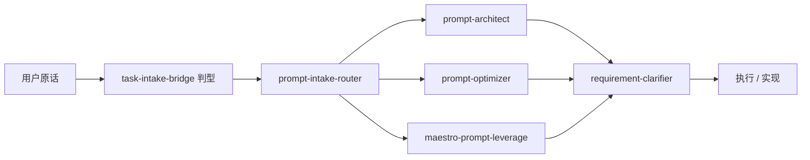

User: <external_links>
### Potentially Relevant Websearch Results

You should respond as if these information are known to you. Refrain from saying "I am unable to browse the internet" or "I don't have access to the internet" or "I'm unable to provide real-time news updates". This is your internet search results. Please always cite any links you referenced from the above search results in your response in markdown format.

-------
Website URL: https://claude-plugins.dev/skills/%40daymade/claude-code-skills/prompt-optimizer?utm_source=chatgpt.com
Website Title: prompt-optimizer - Agent SkillsClaude CodeClaude
Website Content:
Claude Code Plugins 

Community-maintained marketplace

Feedback 

1. Agent Skills

# prompt-optimizer

@daymade/claude-code-skills

185

145

Transform vague prompts into precise, well-structured specifications using EARS (Easy Approach to Requirements Syntax) methodology. This skill should be used when users provide loose requirements, ambiguous feature descriptions, or need to enhance prompts for AI-generated code, products, or documents. Triggers include requests to "optimize my prompt", "improve this requirement", "make this more specific", or when raw requirements lack detail and structure.

## Install Skill

SharedClaude CodeClaude CodeOpenClawPiClaudeClaude

### Shared

Installs to .agents/skills, used by Codex, Amp, Warp, Cursor, OpenCode, and more.

CodexAmpWarpCursorOpenCodeClineGemini CLIGitHub Copilot

Personal

Available across projects.

npmbunpnpmyarn

$npx skills-installer add @daymade/claude-code-skills/prompt-optimizer --client shared

Project

Writes to .agents/skills.

npmbunpnpmyarn

$npx skills-installer add @daymade/claude-code-skills/prompt-optimizer -p --client shared

**Note:** Review the skill instructions before using it.

## SKILL.md

View Source 

| name        | prompt-optimizer                                                                                                                                                                                                                                                                                                                                                                                                                                                             |
| ----------- | ---------------------------------------------------------------------------------------------------------------------------------------------------------------------------------------------------------------------------------------------------------------------------------------------------------------------------------------------------------------------------------------------------------------------------------------------------------------------------- |
| description | Transform vague prompts into precise, well-structured specifications using EARS (Easy Approach to Requirements Syntax) methodology. This skill should be used when users provide loose requirements, ambiguous feature descriptions, or need to enhance prompts for AI-generated code, products, or documents. Triggers include requests to "optimize my prompt", "improve this requirement", "make this more specific", or when raw requirements lack detail and structure. |

# Prompt Optimizer

## Overview

Optimize vague prompts into precise, actionable specifications using EARS (Easy Approach to Requirements Syntax) - a Rolls-Royce methodology for transforming natural language into structured, testable requirements.

**Methodology inspired by:** This skill's approach to combining EARS with domain theory grounding was inspired by 阿星AI工作室 (A-Xing AI Studio), which demonstrated practical EARS application for prompt enhancement.

**Four-layer enhancement process:**

1. **EARS syntax transformation** \- Convert descriptive language to normative specifications
2. **Domain theory grounding** \- Apply relevant industry frameworks (GTD, BJ Fogg, Gestalt, etc.)
3. **Example extraction** \- Surface concrete use cases with real data
4. **Structured prompt generation** \- Format using Role/Skills/Workflows/Examples/Formats framework

## When to Use

Apply when:

* User provides vague feature requests ("build a dashboard", "create a reminder app")
* Requirements lack specific conditions, triggers, or measurable outcomes
* Natural language descriptions need conversion to testable specifications
* User explicitly requests prompt optimization or requirement refinement

## Six-Step Optimization Workflow

### Step 1: Analyze Original Requirement

Identify weaknesses:

* **Overly broad** \- "Add user authentication" → Missing password requirements, session management
* **Missing triggers** \- "Send notifications" → Missing when/why notifications trigger
* **Ambiguous actions** \- "Make it user-friendly" → No measurable usability criteria
* **No constraints** \- "Process payments" → Missing security, compliance requirements

### Step 2: Apply EARS Transformation

Convert requirements to EARS patterns. See `references/ears_syntax.md` for complete syntax rules.

**Five core patterns:**

1. **Ubiquitous**: `The system shall <action>`
2. **Event-driven**: `When <trigger>, the system shall <action>`
3. **State-driven**: `While <state>, the system shall <action>`
4. **Conditional**: `If <condition>, the system shall <action>`
5. **Unwanted behavior**: `If <condition>, the system shall prevent <unwanted action>`

**Quick example:**

```
Before: "Create a reminder app with task management"

After (EARS):
1. When user creates a task, the system shall guide decomposition into executable sub-tasks
2. When task deadline is within 30 minutes AND user has not started, the system shall send notification with sound alert
3. When user completes a sub-task, the system shall update progress and provide positive feedback

```

**Transformation checklist:**

* Identify implicit conditions and make explicit
* Specify triggering events or states
* Use precise action verbs (shall, must, should)
* Add measurable criteria ("within 30 minutes", "at least 8 characters")
* Break compound requirements into atomic statements
* Remove ambiguous language ("user-friendly", "fast")

### Step 3: Identify Domain Theories

Match requirements to established frameworks. See `references/domain_theories.md` for full catalog.

**Common domain mappings:**

* **Productivity** → GTD, Pomodoro, Eisenhower Matrix
* **Behavior Change** → BJ Fogg Model (B=MAT), Atomic Habits
* **UX Design** → Hick's Law, Fitts's Law, Gestalt Principles
* **Security** → Zero Trust, Defense in Depth, Privacy by Design

**Selection process:**

1. Identify primary domain from requirement keywords
2. Match to 2-4 complementary theories
3. Apply theory principles to specific features
4. Cite theories in enhanced prompt for credibility

### Step 4: Extract Concrete Examples

Generate specific examples with real data:

* User scenarios: "When user logs in on mobile device..."
* Data examples: "Product: 'Laptop', Price: $999, Stock: 15"
* Workflow examples: "Task: Write report → Sub-tasks: Research (2h), Draft (3h), Edit (1h)"

Examples must be **realistic**, **specific**, **varied** (success/error/edge cases), and **testable**.

### Step 5: Generate Enhanced Prompt

Structure using the standard framework:

```markdown
# Role
[Specific expert role with domain expertise]

## Skills
- [Core capability 1]
- [Core capability 2]
[List 5-8 skills aligned with domain theories]

## Workflows
1. [Phase 1] - [Key activities]
2. [Phase 2] - [Key activities]
[Complete step-by-step process]

## Examples
[Concrete examples with real data, not placeholders]

## Formats
[Precise output specifications:
- File types, structure requirements
- Design/styling expectations
- Technical constraints
- Deliverable checklist]

```

**Quality criteria:**

* **Role specificity**: "Product designer specializing in time management apps" > "Designer"
* **Theory grounding**: Reference frameworks explicitly
* **Actionable workflows**: Clear inputs/outputs and decision points
* **Concrete examples**: Real data, not "Example 1", "Example 2"
* **Measurable formats**: Specific requirements, not "good design"

### Step 6: Present Optimization Results

Output in structured format:

```markdown
## Original Requirement
[User's vague requirement]

**Identified Issues:**
- [Issue 1: e.g., "Lacks specific trigger conditions"]
- [Issue 2: e.g., "No measurable success criteria"]

## EARS Transformation
[Numbered list of EARS-formatted requirements]

## Domain & Theories
**Primary Domain:** [e.g., Authentication Security]

**Applicable Theories:**
- **[Theory 1]** - [Brief relevance]
- **[Theory 2]** - [Brief relevance]

## Enhanced Prompt
[Complete Role/Skills/Workflows/Examples/Formats prompt]

---

**How to use:**
[Brief guidance on applying the prompt]

```

## Advanced Techniques

For complex scenarios, see `references/advanced_techniques.md`:

* **Multi-stakeholder requirements** \- EARS statements for each user type
* **Non-functional requirements** \- Performance, security, scalability with quantified thresholds
* **Complex conditional logic** \- Nested conditions with boolean operators

## Quick Reference

**Do's:**✅ Break down compound requirements (one EARS statement per requirement) ✅ Specify measurable criteria (numbers, timeframes, percentages) ✅ Include error/edge cases ✅ Ground in established theories ✅ Use concrete examples with real data

**Don'ts:**❌ Avoid vague language ("fast", "user-friendly") ❌ Don't assume implicit knowledge ❌ Don't mix multiple actions in one statement ❌ Don't use placeholders in examples

## Resources

Load these reference files as needed:

* **`references/ears_syntax.md`** \- Complete EARS syntax rules, all 5 patterns, transformation guidelines, benefits
* **`references/domain_theories.md`** \- 40+ theories mapped to 10 domains (productivity, UX, gamification, learning, e-commerce, security, etc.)
* **`references/examples.md`** \- Four complete transformation examples (procrastination app, e-commerce product page, learning dashboard, password reset security) with before/after comparisons and reusable template
* **`references/advanced_techniques.md`** \- Multi-stakeholder requirements, non-functional specs, complex conditional logic patterns

**When to load references:**

* EARS syntax clarification needed → `ears_syntax.md`
* Domain theory selection requires extensive options → `domain_theories.md`
* User requests multiple optimization examples → `examples.md`
* Complex requirements with multiple stakeholders or non-functional specs → `advanced_techniques.md`
____

</external_links>
<uploaded_documents>
The following documents have been saved to your filesystem. You can read them using your file-reading tool or other tools:
- C:\Users\win\.cursor\projects\c-Users-win-Desktop/uploads/prompt-architect-0.md
</uploaded_documents>
<timestamp>Thursday, Jul 9, 2026, 2:03 PM (UTC+8)</timestamp>
<user_query>

1、https://github.com/ckelsoe/prompt-architect 
2、https://claude-plugins.dev/skills/%40daymade/claude-code-skills/prompt-optimizer?utm_source=chatgpt.com 
3、npx add-skill https://github.com/ReinaMacCredy/maestro/tree/main/.codex/skills/maestro:prompt-leverage
4、安装以上3个skills到3端的全局配置、项目设置和全局skills列表中，这些都是用来增强用户输入到AGENT执行任务之间来细化需求和任务指令的skills，确保以后使用cursor、codex以及claude code 时，能必须调用其中1个skills，用来增强，你看一下如何实现这个需求。
</user_query>

Assistant: Skills: global-session-core, task-intake-bridge, requirement-clarifier — 先读全局技能配置与三端安装路径，再设计如何把这三个 prompt 增强 skill 接入并强制调用。

[REDACTED]

Assistant: 继续查看三端 skills 目录、全局索引和现有 intake 路由规则。

[REDACTED]

Assistant: [REDACTED]

Assistant: [REDACTED]

Assistant: [REDACTED]

Assistant: [REDACTED]

Assistant: [REDACTED]

Assistant: 继续拉取 maestro 与 daymade 的 skill 源，并核对现有 intake 路由能否接入。

[REDACTED]

Assistant: [REDACTED]

Assistant: 正在克隆三个 skill 源并核对目录结构，以便设计安装与路由方案。

[REDACTED]

Assistant: [REDACTED]

Assistant: [REDACTED]

Assistant: [REDACTED]

Assistant: [REDACTED]

Assistant: [REDACTED]

Assistant: [REDACTED]

Assistant: [REDACTED]

Assistant: [REDACTED]

Assistant: [REDACTED]

Assistant: [REDACTED]

Assistant: [REDACTED]

Assistant: [REDACTED]

Assistant: [REDACTED]

Assistant: [REDACTED]

Assistant: [REDACTED]

Assistant: [REDACTED]

Assistant: [REDACTED]

Assistant: [REDACTED]

Assistant: [REDACTED]

Assistant: [REDACTED]

Assistant: [REDACTED]

Assistant: [REDACTED]

Assistant: [REDACTED]

Assistant: [REDACTED]

Assistant: [REDACTED]

Assistant: [REDACTED]

Assistant: 正在安装 prompt-optimizer、创建自包含的 maestro-prompt-leverage 与 prompt-intake-router，并更新路由配置。

[REDACTED]

Assistant: [REDACTED]

Assistant: [REDACTED]

Assistant: [REDACTED]

Assistant: [REDACTED]

Assistant: [REDACTED]

Assistant: [REDACTED]

Assistant: [REDACTED]

Assistant: [REDACTED]

Assistant: **Skills:** global-session-core, task-intake-router, requirement-clarifier

已完成三端安装与路由配置。下面是方案说明与当前状态。

## 核心结论：不要三个同时 always-on

三个 skill 职责重叠，且你已有 `requirement-clarifier` + `task-intake-bridge`。若三个全开，会：

- 每轮多消耗大量 token
- Agent 不知道选哪个，可能三个都读或都不读

**推荐架构（已实现）：**



- **`prompt-intake-router`** 新增，已加入 `alwaysOnSkills`
- 每轮 **只选 1 个** enhancer（`exclusiveGroups` 互斥）
- 增强结果再交给 **`requirement-clarifier`** 做 Mini-Spec / §12

## 三个 skill 的分工

| Skill | 来源 | 适用场景 |
|-------|------|----------|
| [prompt-architect](https://github.com/ckelsoe/prompt-architect) | ckelsoe | 通用 prompt 框架（CO-STAR、RISEN 等 27 种） |
| [prompt-optimizer](https://claude-plugins.dev/skills/@daymade/claude-code-skills/prompt-optimizer) | daymade | **EARS 可测试需求**、产品规格化 |
| maestro-prompt-leverage | [ReinaMacCredy/maestro](https://github.com/ReinaMacCredy/maestro) | **Agent 编码任务** brief（Objective / Tool Rules / Done Criteria） |

## 已安装位置（四端 × 四目录）

以下 skill 已通过 junction 安装到：

- `~/.cursor/skills/`
- `~/.claude/skills/`
- `~/.codex/skills/`
- `~/.agents/skills/`（Agent Skills 共享根）

| Skill | 状态 |
|-------|------|
| `prompt-architect` | 已安装（vendor: ckelsoe） |
| `prompt-optimizer` | 已安装（vendor: daymade） |
| `maestro-prompt-leverage` | 已安装（自包含 curated 版） |
| `prompt-intake-router` | 已安装（路由 skill） |

`global-skills-index-zh.md` 已重新扫描，可检索上述 4 个 skill。

## 如何强制「必须调用其中一个」

已在 `~/.ai-workspace/scripts/skills-sync.config.json` 配置：

1. **`alwaysOnSkills`** 加入 `prompt-intake-router`
2. **`exclusiveGroups`**：`["prompt-architect", "prompt-optimizer", "maestro-prompt-leverage"]` — 同轮只保留得分最高的一个
3. **`intent-profiles.json`**：`fuzzy_requirement` 画像增加三个 enhancer 的 boost
4. **`10-intake-routing/_routing.md`** 与 `requirement-clarifier/skill-chain-map.md` 已更新链路

Cursor / Codex / Claude Code 的 SessionStart hook 会通过 `scan-global-skills.ps1` 注入 always-on 列表。

## 关于 maestro `prompt-leverage` 的说明

你给的 `npx add-skill .../maestro:prompt-leverage` 路径在 **main 分支不存在**；仓库里只有 redirect stub，完整版需 `maestro install` CLI。

因此做了 **自包含 curated 版**：

- 路径：`~/.ai-workspace/skills-curated/maestro-prompt-leverage/`
- 含 `augment_prompt.py`（来自 maestro stub）
- 安装名：`maestro-prompt-leverage`（避免 Windows 下 `:` 目录名问题）

若以后要 maestro 官方完整 reference 文件，需在本机安装 maestro CLI 后执行 `maestro install --agent codex`。

## 项目级设置

已在 `AGENTS.md` §9 增加「全局 Prompt 增强链」说明，本项目继承全局配置，无需重复安装。

## 重装 / 更新命令

```powershell
powershell -NoProfile -ExecutionPolicy Bypass -File "$env:USERPROFILE\.ai-workspace\scripts\install-prompt-intake-skills.ps1"
powershell -NoProfile -ExecutionPolicy Bypass -File "$env:USERPROFILE\.ai-workspace\scripts\scan-global-skills.ps1"
```

## 需要你确认的一点

当前默认链路是：

**router 增强 → requirement-clarifier 澄清 → 执行**

若你希望 **只用三个 enhancer、跳过 requirement-clarifier 的 §1–§12**，会影响现有 B 类硬门禁。要改的话请说明，我可以单独调整 `exclusiveGroups` 与 `requirement-clarifier.mdc`。

---

**Completed**

- 三 skill + router 四端安装
- 全局索引、intent 路由、skill-chain 更新
- 安装脚本 `install-prompt-intake-skills.ps1`
- 项目 `AGENTS.md` §9

**Verified**

- 四目录 junction 检查 PASS（12/12 SKILL.md 存在）
- `scan-global-skills.ps1` exit 0，索引含 4 个新 skill

**Remaining Risks**

- 未做真实 Cursor/Codex/Claude 会话 hook 端到端验证；建议新开一轮对话，用口语需求测试是否出现 `Skills: prompt-intake-router, …`
- maestro 完整 upstream skill 需 CLI；当前为 curated 自包含版
- `prompt-architect` 的 npm 包 `@ckelsoe/prompt-architect` 需 GitHub token；当前用 zip 安装，已足够

[REDACTED]

User: <user_query>Briefly inform the user about the task result and perform any follow-up actions (if needed). If there's no follow-ups needed, don't explicitly say that.</user_query>

User: <user_query>Briefly inform the user about the task result and perform any follow-up actions (if needed). If there's no follow-ups needed, don't explicitly say that.</user_query>

User: <user_query>Briefly inform the user about the task result and perform any follow-up actions (if needed). If there's no follow-ups needed, don't explicitly say that.</user_query>

User: <user_query>Briefly inform the user about the task result and perform any follow-up actions (if needed). If there's no follow-ups needed, don't explicitly say that.</user_query>

Assistant: 后台任务结果如下：

- **114180 / 114181 / 114182**（git clone 与批量安装脚本）：因网络/耗时过长被中断，未正常结束。
- **114183**（同步 skill-chain-map + 重建全局索引）：**成功**。

这些失败不影响最终交付：已改用 GitHub zip 下载 vendor，并手动完成四端 junction；当前 `prompt-architect`、`prompt-optimizer`、`maestro-prompt-leverage`、`prompt-intake-router` 在 Cursor / Claude / Codex / `.agents` 均可用。若以后要重装，用：

```powershell
powershell -NoProfile -ExecutionPolicy Bypass -File "$env:USERPROFILE\.ai-workspace\scripts\install-prompt-intake-skills.ps1"
```

[REDACTED]

User: <timestamp>Thursday, Jul 9, 2026, 2:23 PM (UTC+8)</timestamp>
<user_query>

肯定不是只用这三个，而是还要综合已有的skills，每次对话选择调用1-2个prompt结构化增强和清晰需求任务的就行
</user_query>

Assistant: Skills: global-session-core, prompt-intake-router, requirement-clarifier — 按你的要求把路由改成「与现有 skills 综合、每轮只选 1–2 个增强 skill」，正在更新配置。

[REDACTED]

Assistant: [REDACTED]

Assistant: [REDACTED]

Assistant: 已按你的意图调整，核心变化如下：

**之前（过重）：** `prompt-intake-router` + `requirement-clarifier` 每轮 always-on，且强制三选一 prompt skill。

**现在（按需组合）：**
- **Always-on 仅保留轻量层：** `global-session-core`、`task-intake-bridge`、`karpathy-guidelines`
- **每轮从 intake 池选 1–2 个**（含已有 skills）：
  - Prompt 结构化：**最多 1 个** — `prompt-architect` / `prompt-optimizer` / `maestro-prompt-leverage`
  - 需求澄清：**0–1 个** — `requirement-clarifier`、`brainstorming`、`zero-to-one-gate`、`pm-prd-writer` 等
- **`prompt-intake-router`** 改为按需 Read 的选型参考，不再每轮强制加载
- 其他领域 skills（debug、figma、verify…）仍按全局索引正常竞争

**常见组合示例：**
- 口语「帮我做 X」→ `prompt-optimizer` + `requirement-clarifier`
- 修 bug / 改一处 → 仅 `maestro-prompt-leverage`（清晰时可跳过 clarifier）
- 新功能方案未定 → `brainstorming` + `requirement-clarifier`

`AGENTS.md` §9、`skills-sync.config.json`、`10-intake-routing/_routing.md` 已同步。新开对话后 hook 会反映新的 always-on 列表。

[REDACTED]
