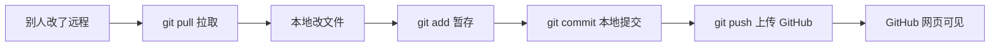

User: <external_links>
### Potentially Relevant Websearch Results

You should respond as if these information are known to you. Refrain from saying "I am unable to browse the internet" or "I don't have access to the internet" or "I'm unable to provide real-time news updates". This is your internet search results. Please always cite any links you referenced from the above search results in your response in markdown format.

-------
Website URL: https://github.com/Metroids048/shuziren
Website Title: Metroids048/shuziren · GitHub
Website Content:
Skip to content 

## Navigation Menu

Toggle navigation 

 Sign in 

Appearance settings 

* Platform  
   * AI CODE CREATION  
         * GitHub CopilotWrite better code with AI  
         * GitHub Copilot appDirect agents from issue to merge  
         * MCP RegistryNewIntegrate external tools  
   * DEVELOPER WORKFLOWS  
         * ActionsAutomate any workflow  
         * CodespacesInstant dev environments  
         * IssuesPlan and track work  
         * Code ReviewManage code changes  
   * APPLICATION SECURITY  
         * GitHub Advanced SecurityFind and fix vulnerabilities  
         * Code securitySecure your code as you build  
         * Secret protectionStop leaks before they start  
   * EXPLORE  
         * Why GitHub  
         * Documentation  
         * Blog  
         * Changelog  
         * Marketplace  
View all features
* Solutions  
   * BY COMPANY SIZE  
         * Enterprises  
         * Small and medium teams  
         * Startups  
         * Nonprofits  
   * BY USE CASE  
         * App Modernization  
         * DevSecOps  
         * DevOps  
         * CI/CD  
         * View all use cases  
   * BY INDUSTRY  
         * Healthcare  
         * Financial services  
         * Manufacturing  
         * Government  
         * View all industries  
View all solutions
* Resources  
   * EXPLORE BY TOPIC  
         * AI  
         * Software Development  
         * DevOps  
         * Security  
         * View all topics  
   * EXPLORE BY TYPE  
         * Customer stories  
         * Events & webinars  
         * Ebooks & reports  
         * Business insights  
         * GitHub Skills  
   * SUPPORT & SERVICES  
         * Documentation  
         * Customer support  
         * Community forum  
         * Trust center  
         * Partners  
View all resources
* Open Source  
   * COMMUNITY  
         * GitHub SponsorsFund open source developers  
   * PROGRAMS  
         * Security Lab  
         * Maintainer Community  
         * Accelerator  
         * GitHub Stars  
         * Archive Program  
   * REPOSITORIES  
         * Topics  
         * Trending  
         * Collections
* Enterprise  
   * ENTERPRISE SOLUTIONS  
         * Enterprise platformAI-powered developer platform  
   * AVAILABLE ADD-ONS  
         * GitHub Advanced SecurityEnterprise-grade security features  
         * Copilot for BusinessEnterprise-grade AI features  
         * Premium SupportEnterprise-grade 24/7 support
* Pricing

Search or jump to... 

# Search code, repositories, users, issues, pull requests...

 Search 

Clear 

Search syntax tips 

#  Provide feedback

We read every piece of feedback, and take your input very seriously.

Include my email address so I can be contacted 

 Cancel  Submit feedback 

#  Saved searches

## Use saved searches to filter your results more quickly

Name 

Query 

 To see all available qualifiers, see our documentation.

 Cancel  Create saved search 

 Sign in 

 Sign up 

Appearance settings 

Resetting focus 

You signed in with another tab or window. Reload to refresh your session. You signed out in another tab or window. Reload to refresh your session. You switched accounts on another tab or window. Reload to refresh your session. Dismiss alert 

{{ message }}

 Metroids048 / **shuziren** Public 

* Notifications You must be signed in to change notification settings
* Fork0
* Star 0

* Code
* Issues 0
* Pull requests 0
* Actions
* Projects
* Security and quality 0
* Insights

Additional navigation options 

* Code
* Issues
* Pull requests
* Actions
* Projects
* Security and quality
* Insights

### This repository is empty.

 Care to check out the GitHub Channel on YouTube while you wait?

## Footer

 © 2026 GitHub, Inc. 

### Footer navigation

* Terms
* Privacy
* Security
* Status
* Community
* Docs
* Contact
* Manage cookies
* Do not share my personal information

 You can’t perform that action at this time.
____

</external_links>
<user_query>

https://github.com/Metroids048/shuziren 
把当前文件夹的内容给我传到这个链接上去，然后教会我怎么用cursor往github传文件和更新文件全流程所涉及到的所有指令。
</user_query>

Assistant: 先把当前目录推送到 GitHub，再整理 Cursor 上传与更新的完整流程。正在检查仓库状态和远程配置。

[REDACTED]

Assistant: [REDACTED]

Assistant: [REDACTED]

Assistant: 远程目前指向别的仓库，且 `gh` 未登录。正在把远程改为 `shuziren`，提交变更并尝试推送。

[REDACTED]

Assistant: [REDACTED]

Assistant: [REDACTED]

Assistant: [REDACTED]

Assistant: [REDACTED]

Assistant: [REDACTED]

Assistant: 提交已成功。正在推送到 GitHub：

[REDACTED]

Assistant: [REDACTED]

Assistant: **已完成上传。** 当前文件夹内容已推送到 [https://github.com/Metroids048/shuziren](https://github.com/Metroids048/shuziren)，远程分支为 `main`。

我做了这些事：
1. 把远程地址改为 `https://github.com/Metroids048/shuziren.git`
2. 提交了需求文档重命名等变更
3. 将本地 `数字人` 分支推送到远程 `main`

---

## 一、Cursor 传文件到 GitHub：两种方式

### 方式 A：图形界面（推荐新手）

```
打开文件夹 → 改文件 → 源代码管理 → 暂存 → 写说明 → 提交 → 推送
```

| 步骤 | 操作 | 快捷键 |
|------|------|--------|
| 1 | 用 Cursor 打开项目文件夹 | `文件 → 打开文件夹` |
| 2 | 修改或新增文件 | 正常编辑 |
| 3 | 打开「源代码管理」面板 | `Ctrl + Shift + G` |
| 4 | 点文件旁的 `+` 暂存（或点「更改」旁的 `+` 全部暂存） | — |
| 5 | 在上方输入框写提交说明 | 如：`更新演示页面` |
| 6 | 点 `✓ 提交` | — |
| 7 | 点 `同步更改` 或 `推送` | 状态栏也有同步按钮 |

左侧「源代码管理」图标是分支形状；有未提交改动时会出现数字角标。

---

### 方式 B：终端命令（完整流程）

在 Cursor 里按 `` Ctrl + ` `` 打开终端，在项目目录执行：

#### 第一次上传（空仓库 / 新项目）

```powershell
# 1. 进入项目目录
cd "C:\Users\win\Desktop\海小南"

# 2. 初始化 Git（已有 .git 可跳过）
git init

# 3. 绑定 GitHub 远程仓库（只需做一次）
git remote add origin https://github.com/Metroids048/shuziren.git
# 若已绑定过，用这条改地址：
# git remote set-url origin https://github.com/Metroids048/shuziren.git

# 4. 查看当前状态
git status

# 5. 把所有文件加入暂存区
git add .

# 6. 提交到本地
git commit -m "首次上传项目"

# 7. 推送到 GitHub（首次加 -u 记住上游分支）
git push -u origin main
```

#### 日常更新（改完文件后）

```powershell
cd "C:\Users\win\Desktop\海小南"

git status              # 看改了什么
git add .               # 暂存全部改动
# git add 某个文件.md   # 或只暂存单个文件

git commit -m "说明这次改了什么"

git push                # 推到 GitHub
```

#### 从 GitHub 拉取别人或别处的更新

```powershell
git pull
```

---

## 二、常用命令速查

| 命令 | 作用 |
|------|------|
| `git status` | 查看哪些文件改了、有没有暂存 |
| `git diff` | 看具体改动内容 |
| `git add .` | 暂存当前目录所有改动 |
| `git add 文件名` | 只暂存指定文件 |
| `git restore 文件名` | 撤销未暂存的修改 |
| `git restore --staged 文件名` | 取消暂存 |
| `git commit -m "说明"` | 提交到本地 |
| `git push` | 推到 GitHub |
| `git pull` | 从 GitHub 拉取并合并 |
| `git log --oneline -5` | 看最近 5 条提交 |
| `git remote -v` | 查看远程仓库地址 |
| `git branch` | 查看本地分支 |

---

## 三、GitHub 登录（推送前必做其一）

你本机 `gh` 未登录，但 Git 凭据管理器已可用，所以本次推送成功了。

以后若推送要账号密码，任选一种：

### 方法 1：GitHub CLI（推荐）

```powershell
gh auth login
```

按提示选：GitHub.com → HTTPS → 浏览器登录。

### 方法 2：Personal Access Token

1. GitHub → Settings → Developer settings → Personal access tokens
2. 生成 token（勾选 `repo`）
3. 推送时密码处粘贴 token（不是 GitHub 登录密码）

### 方法 3：Cursor 内置

推送时 Cursor 可能弹出 GitHub 登录窗口，按提示授权即可。

---

## 四、你当前项目的注意点

1. **本地分支名是 `数字人`，远程是 `main`**  
   已设置跟踪关系，日常直接 `git push` / `git pull` 即可。

2. **若 `git push` 报错分支名不对**，用：
   ```powershell
   git push -u origin HEAD:main
   ```

3. **中文路径**  
   终端乱码时先执行：
   ```powershell
   chcp 65001 | Out-Null
   [Console]::OutputEncoding = [System.Text.Encoding]::UTF8
   ```

4. **大文件**  
   单文件超过约 100MB GitHub 会拒绝；PDF/PPT 一般没问题。

5. **让 Cursor Agent 帮你提交**  
   可以说：「帮我把改动提交并推到 GitHub」，Agent 会执行 `add → commit → push`。

---

## 五、典型工作流（一张图）



**记忆口诀：add → commit → push（上传）；pull（下载）。**

---

## 六、Completed / Verified / Remaining Risks

| 项 | 状态 |
|----|------|
| **Completed** | 远程已指向 shuziren；已提交并推送至 `main` |
| **Verified** | `git ls-remote` 确认远程 `main` 存在，commit `a9a6622` |
| **Remaining Risks** | `gh` 未登录，换机或凭据过期后需重新授权；本地分支名 `数字人` 与远程 `main` 不一致，新手可能困惑 |

打开 [https://github.com/Metroids048/shuziren](https://github.com/Metroids048/shuziren) 应能看到全部项目文件。若要我把本地分支也改成 `main`，或写一份可保存的 `Git使用说明.md` 放进项目里，说一声即可。

[REDACTED]
