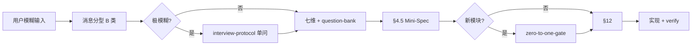

# Vibe Coding Bridge — 模糊需求 → 结构化可执行说明

> **定位**：AI 写代码能力很强，瓶颈在「用户嘴里的一句话」→「Agent 不会跑偏的任务单」。  
> 本文件是 `requirement-clarifier` 在 **B 类模糊实施 + 代码/原型/Agent 实现** 时的**必用附录**。

## 何时必读

满足任一即 Read 本文件 + `output-template.md`：

- 用户口语化描述功能（「帮我做一个…」「优化一下」「整体弄好」「vibe coding」）
- 范围未写清文件/页面/验收
- 要通过 Cursor / Claude Code / Codex Agent **实现**而非只讨论

**不要**用本文件替代 `zero-to-one-gate`：新模块/新子系统/跨页新状态流 → 澄清 scope 后仍须架构门禁。

---

## 核心产物：Mini-Spec（澄清层交付物）

在输出完整 §1–§12 的同时，**必须**在 §4 与 §5 之间插入 **§4.5 Mini-Spec**（见 `mini-spec-template.md`）。

Mini-Spec 是：

- 给用户看的「我们理解一致了吗」
- 给执行 Agent 的「不许再发散」的硬约束摘要
- §12 执行 Prompt 的输入源（禁止 §12 与 Mini-Spec 矛盾）

---

## 七维澄清框架（每维至少 1 条；未知标待确认）

| 维度 | 要问什么 | 坏例子 → 好例子 |
|------|----------|----------------|
| **1. 用户与场景** | 谁在用、在什么情境下用 | 「优化看板」→ 「运营在 PC 上每日查任务积压，移动端只看通知」 |
| **2. 痛点与目标** | 现在哪里难受、做完怎样算更好 | 「不好看」→ 「首屏信息密度低，找待办 >3 次点击」 |
| **3. 可验收结果** | 可观察、可测试、可演示 | 「更专业」→ 「index 首屏有 KPI 三卡 + 待办 Top5，verify-all 仍 PASS」 |
| **4. 范围边界** | 做哪些页/文件/模块；明确不做 | 「做」：index.html + style.css；「不做」：不改 proto.js 导航契约 |
| **5. 约束与依赖** | 技术栈、设计稿、门禁、现有 ADR | 「须跑 verify-all」「对照 Figma 帧 X」「遵守 ADR-003」 |
| **6. MVP 第一刀** | 若时间不够先交付什么 | 「先只改 index 壳层与 DEMO 数据，不动 ops-*.js 业务逻辑」 |
| **7. 未知与假设** | 待确认 + 默认建议（可推翻） | 待确认：是否动 05 页？默认：仅 index |

---

## 提问梯（先问影响方向的，≤5 个）

**必读** `question-bank-zh.md`，按场景选题。优先级：

1. **方向类**（不问清会做错产品）：目标用户、成功样子、做/不做边界  
2. **范围类**：哪些页面/文件、是否新模块  
3. **约束类**：原型还是生产、验证命令、设计稿  
4. **顺序类**：MVP 第一刀  
5. **细节类**（可后置）：配色、文案、动效  

禁止一次抛 10+ 问题；其余放进 §8 默认建议。

---

## Vibe Coding 标准链路

详见 [skill-chain-map.md](skill-chain-map.md)。摘要：

多文件/高风险时并行启用 [clarification-guardrails.md](clarification-guardrails.md)。

| 阶段 | 产出 | 用户动作 |
|------|------|----------|
| 澄清 | §4.5 Mini-Spec + §7 待确认 | 确认 / 补充 / 否决默认建议 |
| 0→1（若触发） | 2–3 方案 + ADR 摘要 | 选一个方案 |
| 执行 | §12 Prompt → 代码/原型 | 「按澄清结果执行」 |
| 交付 | 变更说明 + 验证证据 | 验收 |

---

## §12 与 Mini-Spec 的一致性规则

1. §12 的【任务范围】【验收标准】必须从 Mini-Spec **原文拷贝或收紧**，不得扩写新功能。  
2. §12 须写明 **验证命令**（如 `node prototype/scripts/verify-all.js`）。  
3. §12 须写明 **禁止事项**（从 §4「不做什么」拷贝）。  
4. 执行 Agent **不得**重新开头脑风暴；待确认项未关闭则标注「按默认建议处理」并列出假设。

---

## 与 pm-prd-writer / zero-to-one-gate 的分工

| 用户要的是 | 澄清后交给 |
|------------|------------|
| 可评审 PRD 文档 | `pm-prd-writer`，澄清产出文档 Agent Prompt |
| 新子系统 / 大范围从 0 做 | `zero-to-one-gate` → `brainstorming` → plan skill |
| 在现有原型/项目里改/加 | Mini-Spec → §12 → 执行 Agent |
| 只要讨论想法 | A 类，不产出 Mini-Spec |

---

## Agent Platform 项目速查（澄清时主动带上）

| 区域 | 路径 | 澄清时常见约束 |
|------|------|----------------|
| 原型壳层 | `prototype/index.html`, `prototype/assets/style.css` | 视觉/DEMO 数据 |
| 共享导航/状态 | `prototype/assets/proto.js` | 改前 cite ADR-003；须 navigation-journey |
| 运营页 | `prototype/11-*.html`, `ops-*.js` | 新页需壳层一致 |
| 交付门禁 | `prototype/scripts/verify-all.js` | 声称完成前必跑 5 步 |

澄清时 Agent **应主动 Read** `project-memory.md` / `decisions-log.md` 发现缺 ADR、模块重叠，写入 §6 影响范围，**不要等用户懂技术**。
